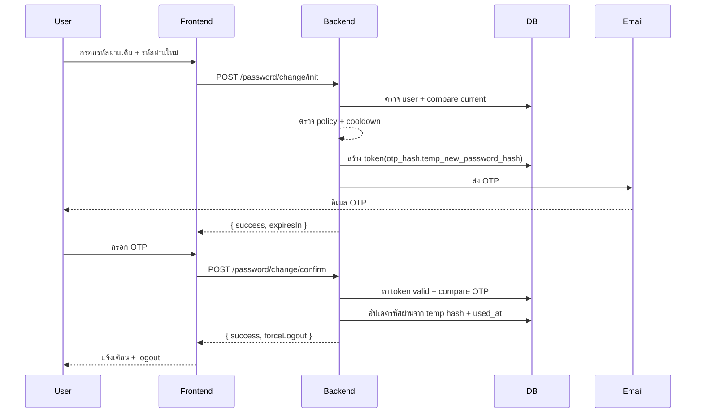

# CS Logbook – ระบบเปลี่ยนรหัสผ่าน (Two-Step Current Password + OTP)

เอกสารฉบับปรับปรุง (หลังลบ endpoint legacy ทั้งหมด) – ใช้เป็นแหล่งอ้างอิงหลักให้ทีมพัฒนา Backend / Frontend / QA / Sec Review

## 1. เป้าหมาย (Objective)
บังคับใช้กระบวนการเปลี่ยนรหัสผ่านที่ปลอดภัย: ผู้ใช้ต้อง (1) ยืนยันรหัสผ่านปัจจุบัน + ระบุรหัสผ่านใหม่ แล้ว (2) ยืนยัน OTP ที่ส่งไปทางอีเมล จึงจะเปลี่ยนรหัสผ่านสำเร็จ และระบบบังคับ logout หลังสำเร็จเพื่อตัด session เก่า

สิ่งที่ยกเลิก: In-Session Change เดี่ยว ๆ และ OTP-only แบบกรอกรหัสผ่านใหม่พร้อม OTP ในคำขอเดียว (legacy ถูกลบ)

## 2. สรุป Endpoint ปัจจุบัน
| ขั้น | Method & Path | Auth | Body | Response หลัก |
|------|---------------|------|------|----------------|
| เริ่มขั้นตอน | POST /api/auth/password/change/init | JWT | { currentPassword, newPassword } | { success, message, expiresIn } |
| ยืนยัน OTP | POST /api/auth/password/change/confirm | JWT | { otp } | { success, message, forceLogout } |

หมายเหตุ: หาก `forceLogout = true` ฝั่ง FE ต้องล้าง token และพาผู้ใช้ไปหน้า Login

## 3. นโยบายและการตรวจสอบ (Validation & Policy)
### 3.1 Password Policy (ปรับแล้ว)
เงื่อนไขบังคับ (ปัจจุบัน):
- ความยาว 8–64 ตัวอักษร
- ต้องมีอย่างน้อย: ตัวพิมพ์เล็ก (a–z), ตัวพิมพ์ใหญ่ (A–Z), ตัวเลข (0–9)
- ไม่จำเป็นต้องมีอักขระพิเศษ (ผ่อนปรนเพื่อ UX)
- ต้องไม่เหมือน “รหัสผ่านปัจจุบัน” 100% (ยังไม่บังคับ password history)

หมายเหตุ: ยังไม่ได้ป้องกันการ reuse รหัสผ่านเก่า ๆ (history) — หากต้องการเพิ่มให้เก็บ hash รหัสผ่านเก่า N รายการ และตรวจไม่ให้ตรงกัน (ดู Roadmap)

Regex ใช้จริง: `^(?=.*[a-z])(?=.*[A-Z])(?=.*\d).{8,64}$`

แนวคิดเพิ่มเติม (ยังไม่ทำ): blacklist, password history (N รายการล่าสุด), entropy check

### 3.2 OTP Policy
- รูปแบบ: ตัวเลข 6 หลัก (zero-padded)
- อายุ (TTL): 10 นาที (ปรับผ่าน .env)
- เก็บเฉพาะ hash (bcrypt) – ไม่เก็บ OTP plain
- Attempt limit: 5 ครั้ง/โทเคน เกินให้ตอบ error เดิม (รวมกับ invalid)
- Cooldown การเริ่ม flow ใหม่: 60 วินาที นับจาก token ล่าสุด (จัดการใน service)

### 3.3 Two-Step Logic
1. init: ตรวจ currentPassword + policy → สร้าง token + เก็บ temp_new_password_hash + ส่ง OTP
2. confirm: ตรวจ OTP + attempt + expiry → นำ temp hash ไปเป็นรหัสผ่านจริง → used_at → response forceLogout

### 3.4 Error Handling (ข้อความมาตรฐาน)
- ข้อมูลไม่ครบถ้วน → 400 "ข้อมูลไม่ครบถ้วน"
- current password ผิด → 400 "ข้อมูลไม่ถูกต้อง" (ไม่บอกว่าผิดส่วนไหน)
- รหัสผ่านใหม่ไม่ผ่าน policy → 400 "รหัสผ่านใหม่ไม่เป็นไปตามนโยบายความปลอดภัย"
- Cooldown → 429 "โปรดลองใหม่ใน X วินาที"
- OTP ไม่ถูกต้อง / หมดอายุ / เกิน attempt → 400 "OTP ไม่ถูกต้องหรือหมดอายุ"
- ส่งอีเมลล้มเหลว → 500 "ไม่สามารถส่ง OTP ได้"

## 4. โครงสร้างข้อมูล (Data Model)
ตาราง: `password_reset_tokens`
| Field | Type | หมายเหตุ |
|-------|------|----------|
| id | INT PK | auto increment |
| user_id | INT FK(users.user_id) | cascade delete |
| purpose | ENUM('PASSWORD_CHANGE') | สำรองรองรับ purpose อื่นในอนาคต |
| otp_hash | VARCHAR(255) | เก็บ bcrypt ของ OTP |
| temp_new_password_hash | VARCHAR(255) NULL | เก็บ hash ของรหัสผ่านใหม่ระหว่างรอ OTP |
| attempt_count | INT | เริ่ม 0 เพิ่มเมื่อ OTP ผิด |
| expires_at | DATETIME | เวลาหมดอายุ OTP |
| used_at | DATETIME NULL | เซ็ตเมื่อสำเร็จ |
| created_at / updated_at | DATETIME | timestamps |

Associations:
- User.hasMany(PasswordResetToken)
- PasswordResetToken.belongsTo(User)

## 5. ลำดับเหตุการณ์ (Sequence Diagrams)
### 5.1 Two-Step Flow (Active)


## 6. ตัวอย่าง Request / Response
### 6.1 Init
Request:
```json
POST /api/auth/password/change/init
{ "currentPassword": "OldPass123", "newPassword": "NewPass123" }
```
Response (สำเร็จ):
```json
{ "success": true, "message": "ส่งรหัส OTP ไปยังอีเมลแล้ว", "expiresIn": 600 }
```
### 6.2 Confirm
Request:
```json
POST /api/auth/password/change/confirm
{ "otp": "123456" }
```
Response (สำเร็จ):
```json
{ "success": true, "message": "เปลี่ยนรหัสผ่านสำเร็จ กรุณาเข้าสู่ระบบอีกครั้ง", "forceLogout": true }
```
Failure (OTP ผิด):
```json
{ "success": false, "message": "OTP ไม่ถูกต้องหรือหมดอายุ" }
```

## 7. Security Notes (สำคัญ)
- เก็บเฉพาะ hash (ทั้ง OTP และรหัสผ่านใหม่ชั่วคราว)
- Timing mitigation: ทำ bcrypt dummy เมื่อ token ไม่พบ
- บังคับ logout หลังเปลี่ยน เพื่อลด session fixation / token reuse
- ไม่ log ค่า sensitive (OTP / newPassword)
- ใช้ attempt_count จำกัด brute force
- Cooldown ป้องกัน spam OTP
- ใช้ provider อีเมลผ่าน abstraction (`emailTransport.js`) รองรับ sendgrid / smtp / ethereal (dev) / console

## 8. ตัวแปร .env ที่เกี่ยวข้อง
```
PASSWORD_OTP_LENGTH=6
PASSWORD_OTP_TTL_MINUTES=10
PASSWORD_OTP_REQUEST_COOLDOWN_SECONDS=60
PASSWORD_OTP_MAX_ATTEMPTS=5
PASSWORD_MIN_LENGTH=8
BCRYPT_SALT_ROUNDS=10
EMAIL_PROVIDER=sendgrid|smtp|ethereal|console
SENDGRID_API_KEY=...
SMTP_HOST=...
SMTP_PORT=587
SMTP_SECURE=false
SMTP_USER=...
SMTP_PASS=...
EMAIL_SENDER=no-reply@domain.tld
```

## 9. Logging Events (ตามโค้ดปัจจุบัน)
| Level | Event | ความหมาย |
|-------|-------|-----------|
| INFO | otp_sent_two_step | ส่ง OTP สำเร็จ (ไม่ log ค่า OTP) |
| INFO | two_step_password_change_success | เปลี่ยนรหัสผ่านสำเร็จ |
| WARN | wrong_current_password | current password ไม่ตรง |
| WARN | otp_invalid_attempt_two_step | OTP ผิด (เพิ่ม attempt) |
| WARN | otp_attempt_limit_reached | เกินจำนวนครั้งที่กำหนด |
| ERROR | otp_send_failed_two_step | ส่งอีเมลล้มเหลว |

## 10. Best Practices แนะนำทีม
1. แยกรหัสผ่านใหม่ hashing ทันที (อย่าเก็บ plaintext)
2. อย่า reuse token: token 1 ชุด = 1 flow (used_at แล้วใช้ไม่ได้)
3. ตอบ error generic สำหรับ OTP (รวมหมดอายุ + ผิด) ลด enumeration attack
4. ตรวจ policy ทั้ง FE (UX) + BE (ความถูกต้อง) – BE เป็น source of truth
5. Log ให้พอ trace แต่ไม่เผยข้อมูลลับ
6. แยก cooldown logic ฝั่ง service ไม่ให้ FE ควบคุมเอง
7. บังคับ logout หลังสำเร็จเสมอ (ลดความเสี่ยง token เก่า)
8. ใช้ Order by PK (id) แทน createdAt หาก mapping underscored มีปัญหา
9. Monitor อัตรา failure (ผิดหลายครั้งอาจบอก brute force)
10. รองรับ provider อีเมลหลายแบบเพื่อความยืดหยุ่น deployment

## 11. ข้อจำกัดปัจจุบัน (Limitations)
- ยังไม่มี endpoint resend OTP แยก (ต้องเริ่ม flow ใหม่ หรือรอ cooldown)
- ไม่มี Forgot Password (public) – ยังต้องล็อกอินก่อนถึงเปลี่ยนได้
- ไม่มี Password History ป้องกัน reuse
- ไม่มี blacklist (เช่น "Password123")
- Attempt limit ผูกกับ token ไม่ใช่ต่อผู้ใช้ต่อช่วงเวลา (รวม logic ได้ในอนาคต)
- ไม่มีหน้า UI สำหรับ admin monitor ความพยายามผิด

## 12. แนวทางปรับปรุงในอนาคต (Roadmap)
- Resend OTP endpoint (นับแยก / จำกัดความถี่ซ้ำ)
- Forgot Password ผ่าน signed link / token JWT สั้นอายุ
- Password history (เก็บ hash N รายการท้าย) – บังคับ “รหัสผ่านใหม่ต้องแตกต่างจากรหัสผ่านที่เคยใช้” จริง ๆ
- Policy ที่ dynamic ต่อกลุ่มผู้ใช้ / enforcement complexity score
- แจ้งเตือน security (email / webhook) หากมีความพยายามผิดเกิน threshold
- MFA (TOTP / WebAuthn) สำหรับการเปลี่ยนรหัสผ่านสำคัญ

## 13. Checklist สำหรับ QA
- ✅ Init: current password ถูก + new ผ่าน policy → 200 + ส่ง OTP (log)
- ✅ Init: current password ผิด → 400 "ข้อมูลไม่ถูกต้อง"
- ✅ Init: new = old → 400
- ✅ Init: policy ไม่ผ่าน → 400
- ✅ Cooldown: ยิงซ้ำภายใน 60s → 429
- ✅ Confirm: OTP ถูก → success + forceLogout
- ✅ Confirm: OTP ผิด 5 ครั้ง → ยัง 400 (สถานะสุดท้ายยังคงข้อความ generic) และ token หมดสิทธิ์
- ✅ Confirm: OTP หมดอายุ (หลัง 10 นาที) → 400 generic
- ✅ หลัง success ล็อกอินใหม่ใช้รหัสใหม่ได้ รหัสเก่าใช้ไม่ได้

## 14. ตัวอย่างโค้ด Frontend (ย่อ)
```js
await passwordService.initChange({ currentPassword, newPassword });
// จากนั้นรอกรอก OTP
await passwordService.confirmChange({ otp }); // ถ้า forceLogout ให้ context.logout()
```

## 15. ประเด็น Security Review ควรตรวจ
- bcrypt rounds เพียงพอ (>=10) และไม่ช้าเกินไปใน environment จริง
- ไม่มี log ข้อมูลอ่อนไหว
- Rate limiting รวมกับ layer อื่น (เช่น global login rate limit)
- ควรมี Alert ถ้าผิดติดต่อกันจำนวนมากในช่วงสั้น
- ตรวจสอบ email provider fallback ไม่ทำให้ข้อมูลหลุด (console / ethereal ใช้เฉพาะ dev)

---
อัปเดตไฟล์นี้เมื่อมีการเปลี่ยนแปลง flow / policy ใหม่ เพื่อให้ Agent สามารถ sync โค้ดตามได้ถูกต้อง
