# CSLogbook System - Key Business Process Flow Diagrams

## 📋 ภาพรวม Key Business Processes

เอกสารนี้แสดง User Flow Diagrams สำหรับกระบวนการทางธุรกิจหลักของระบบ CSLogbook

---

## 🎓 1. Internship Lifecycle Flow

### 1.1 Complete Internship Process Flow
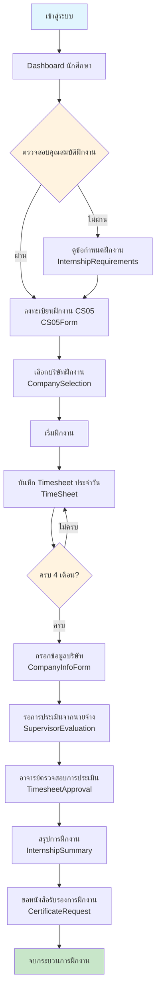

### 1.2 Internship Document Approval Flow
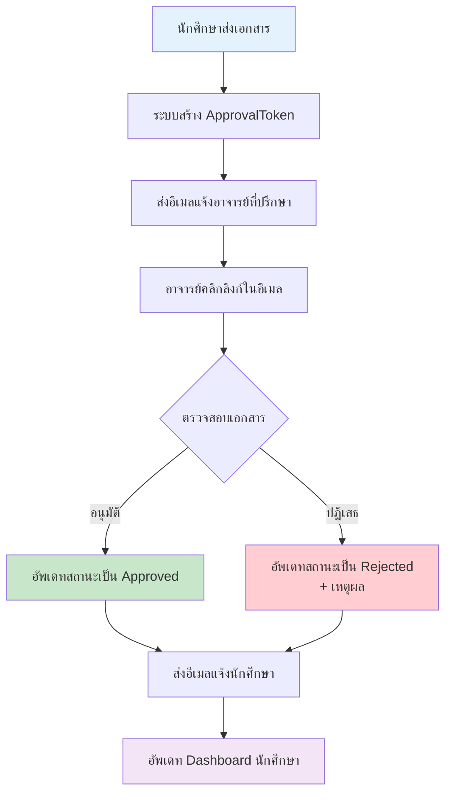

---

## 🎯 2. Project Lifecycle Flow

### 2.1 Complete Project Process Flow
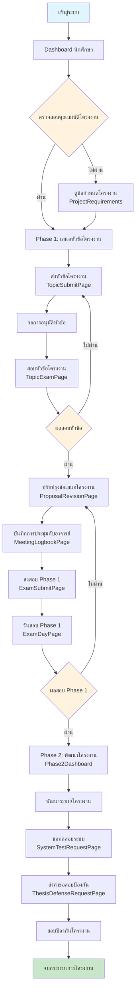

### 2.2 Project Meeting Approval Flow
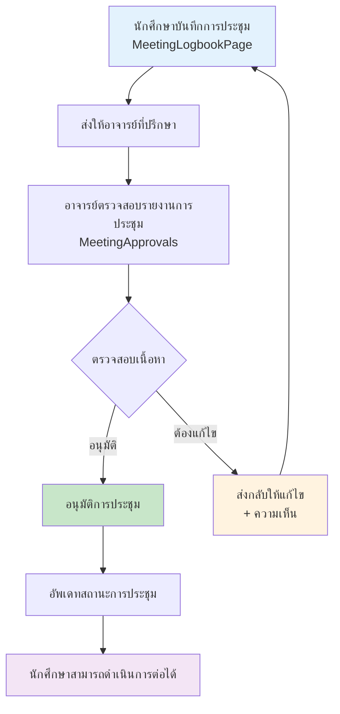

### 2.3 Project Defense Request Flow
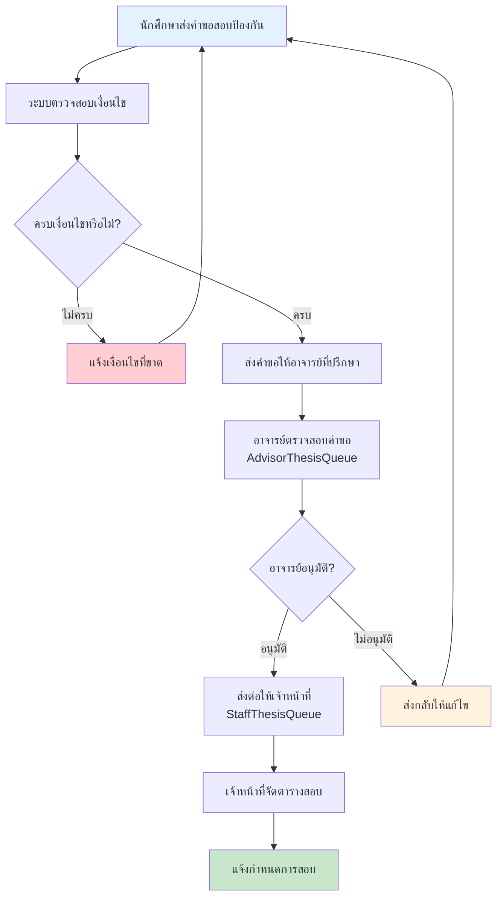

---

## 📋 3. Document Approval Workflow

### 3.1 General Document Approval Process
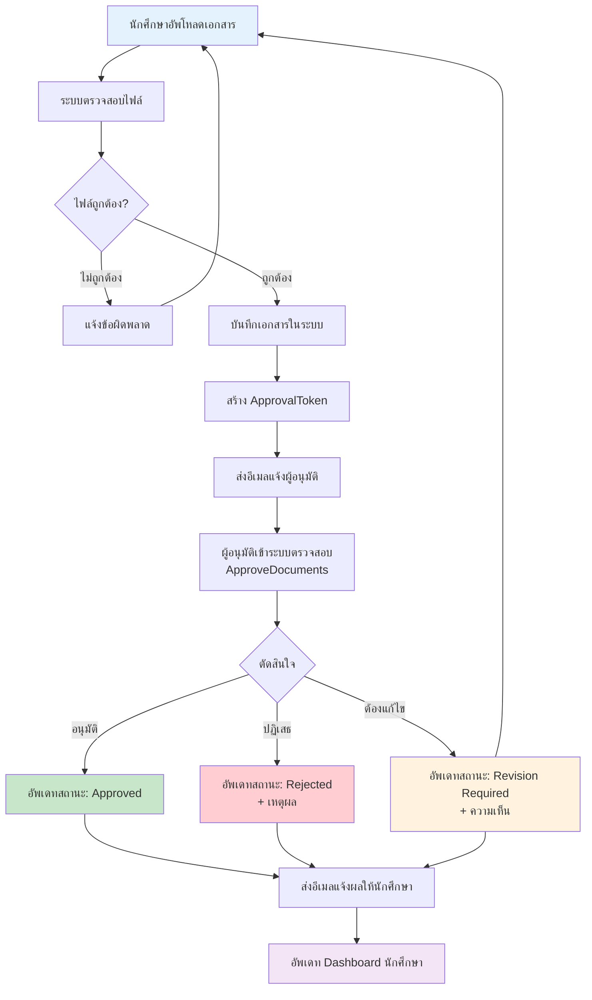

### 3.2 Multi-level Approval Process
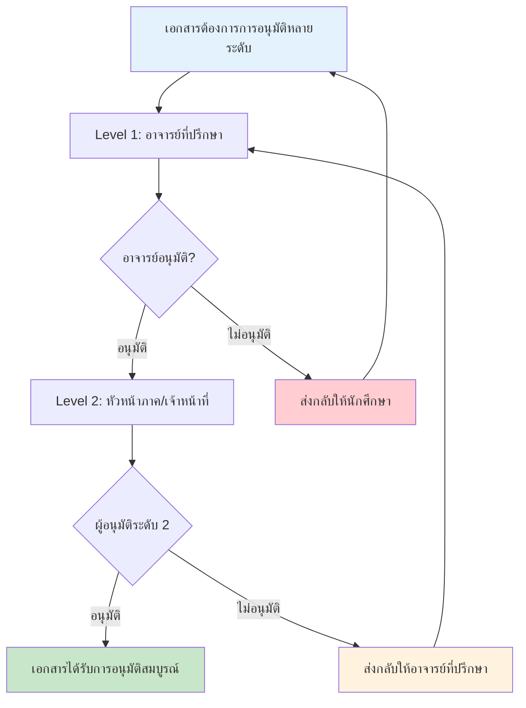

---

## 👨‍🏫 4. Teacher Workflow Processes

### 4.1 Academic Teacher Daily Workflow
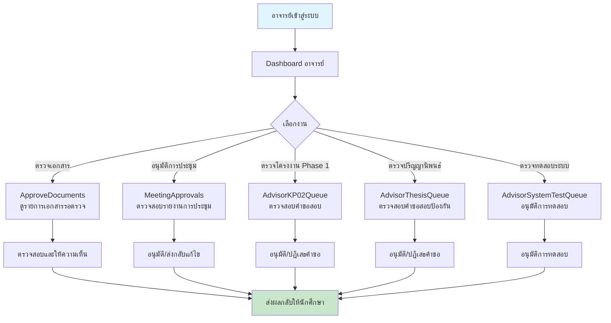

### 4.2 Support Teacher Administrative Workflow
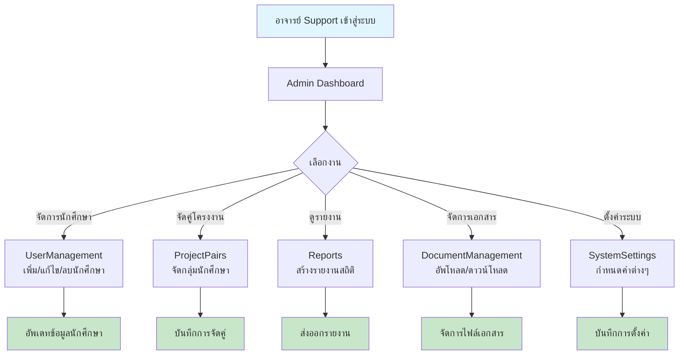

---

## 🔧 5. Admin System Management Processes

### 5.1 User Management Process
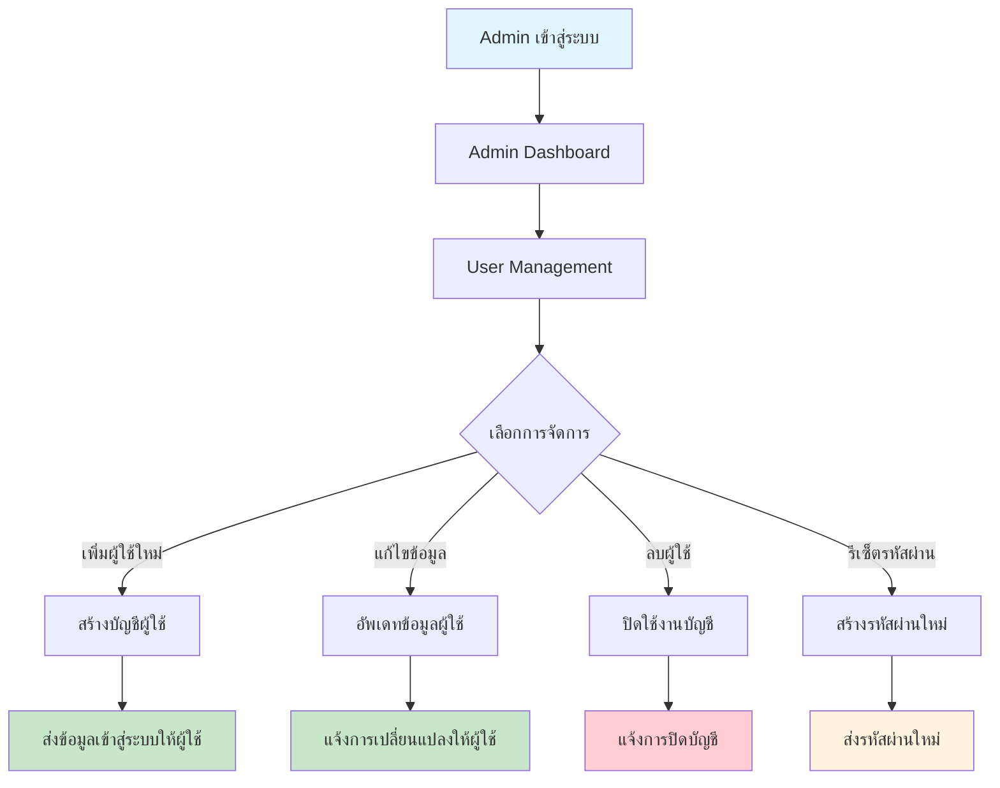

### 5.2 System Configuration Process
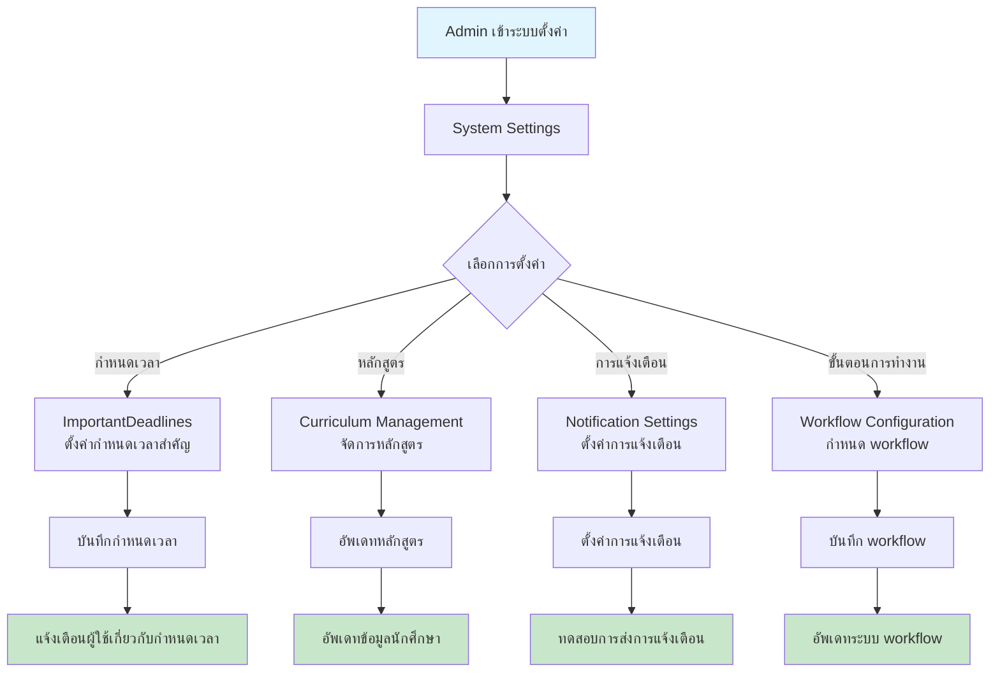

---

## 🤖 6. Agent & Automation Processes

### 6.1 Automated Deadline Reminder Process
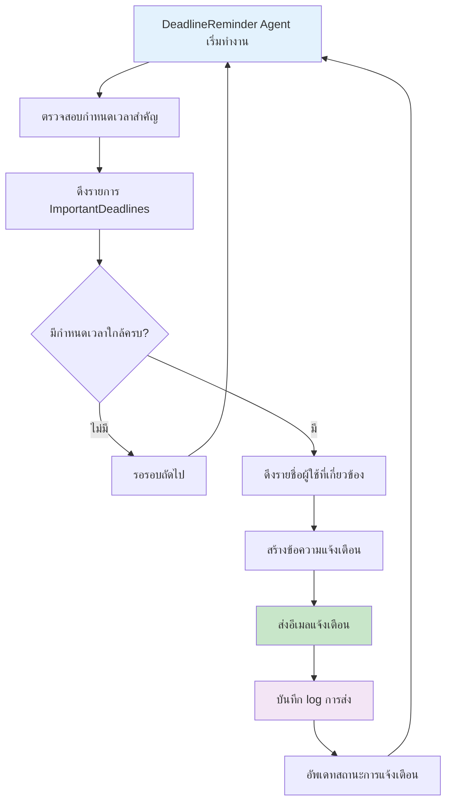

### 6.2 Document Status Monitor Process
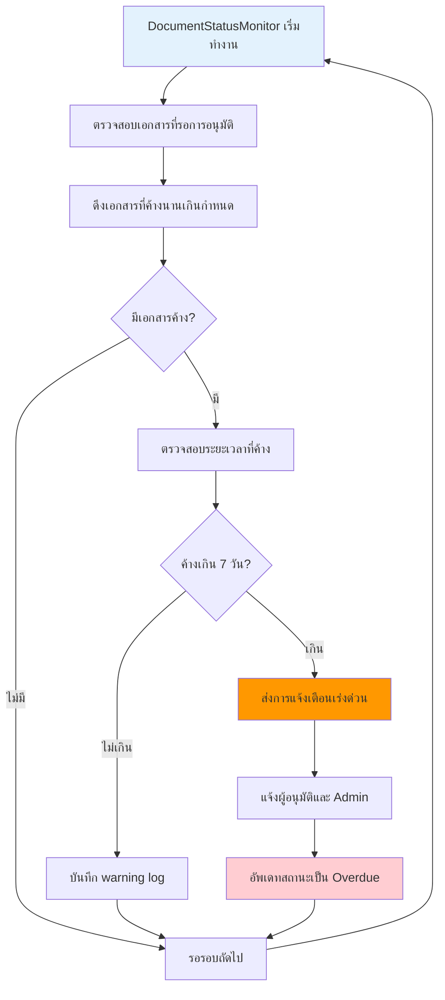

---

## 📊 7. Reporting & Analytics Processes

### 7.1 Statistical Report Generation
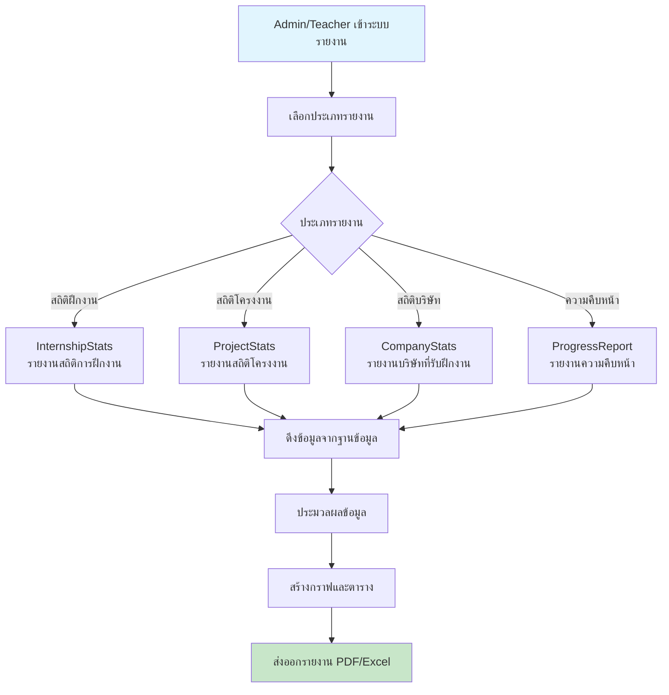

---

## 🔔 8. Notification & Communication Flow

### 8.1 Email Notification Process
```mermaid
flowchart TD
    A[เหตุการณ์ที่ต้องแจ้งเตือนเกิดขึ้น] --> B[ระบบตรวจสอบ NotificationSettings]
    B --> C{ผู้ใช้เปิดการแจ้งเตือน?}
    
    C -->|ปิด| D[ไม่ส่งการแจ้งเตือน]
    C -->|เปิด| E[เลือก Email Template ที่เหมาะสม]
    
    E --> F[แทนที่ข้อมูลใน Template]
    F --> G[ส่งอีเมลผ่าน SendGrid]
    G --> H{ส่งสำเร็จ?}
    
    H -->|สำเร็จ| I[บันทึก log การส่ง]
    H -->|ไม่สำเร็จ| J[บันทึก error log]
    
    J --> K[ลองส่งใหม่ (retry)]
    K --> G
    
    I --> L[อัพเดทสถานะการแจ้งเตือน]
    
    style A fill:#e3f2fd
    style I fill:#c8e6c9
    style J fill:#ffcdd2
    style L fill:#f3e5f5
```

---

## 🎯 สรุป Key Integration Points

### การเชื่อมต่อระหว่างระบบ
1. **Frontend ↔ Backend**: React Components → API Services → Express Routes → Controllers → Services → Models
2. **Authentication Flow**: JWT Token → Middleware → Role Checking → Component Access
3. **File Upload**: Frontend Upload → multer Middleware → File Storage → Database Record
4. **Email System**: Event Trigger → NotificationService → SendGrid → Email Delivery
5. **Agent System**: Scheduled Tasks → Database Queries → Business Logic → Notifications

### ข้อมูลสำคัญ
- **User Roles**: Student, Teacher (Academic/Support), Admin
- **Document States**: Draft, Submitted, Under Review, Approved, Rejected, Revision Required
- **Workflow States**: Not Started, In Progress, Completed, Overdue
- **Notification Types**: Deadline Reminders, Approval Notifications, Status Updates

---

*เอกสารนี้แสดง User Flow Diagrams ที่ครอบคลุมกระบวนการทางธุรกิจหลักทั้งหมดของระบบ CSLogbook*