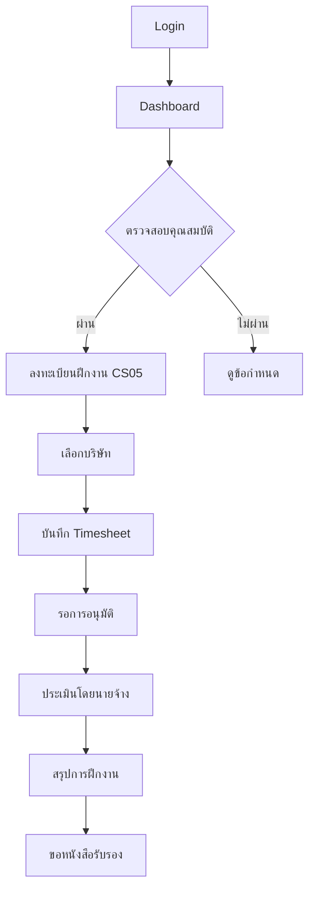
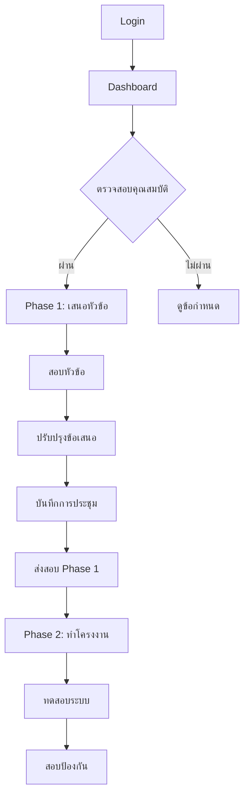
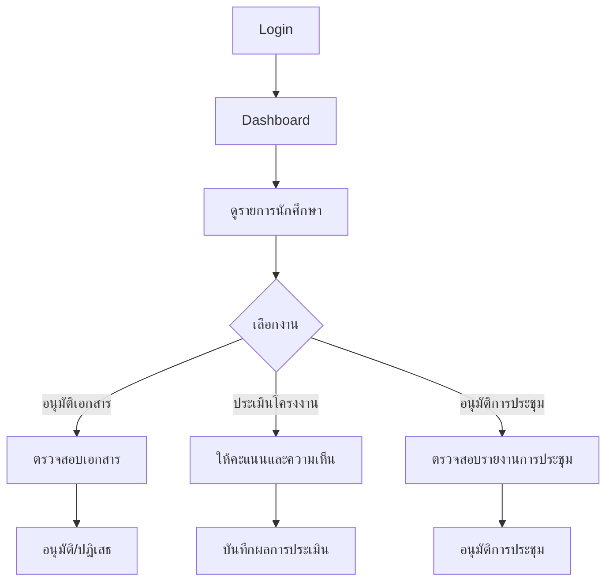
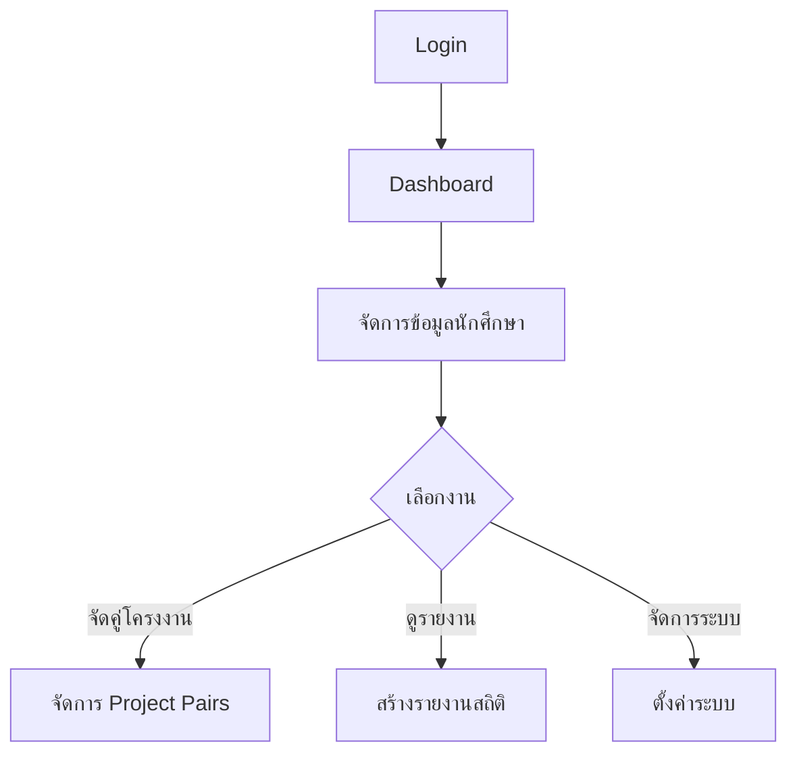
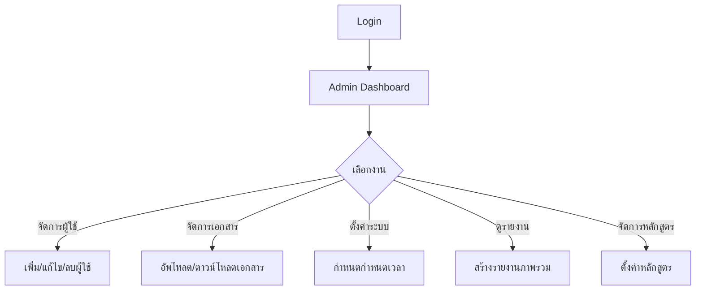

# CSLogbook System - User Flow Analysis และการจำแนกระบบ

## 📋 ภาพรวมระบบ CSLogbook

ระบบ CSLogbook เป็นระบบบันทึกและติดตามการฝึกงาน โครงงานพิเศษ และปริญญานิพนธ์ของภาควิชาวิทยาการคอมพิวเตอร์และสารสนเทศ มหาวิทยาลัยเทคโนโลยีพระจอมเกล้าพระนครเหนือ

---

## 🏗️ สถาปัตยกรรมระบบ

### Backend Architecture
```
cslogbook/backend/
├── agents/           # Background processes & automation
├── controllers/      # API request handlers (บาง)
├── services/         # Business logic หลัก (หนัก)
├── models/           # Database models (Sequelize ORM)
├── middleware/       # Authentication & security
├── routes/           # API routing
└── utils/            # Utilities & helpers
```

### Frontend Architecture
```
cslogbook/frontend/src/
├── components/       # UI Components
│   ├── admin/        # Admin-specific components
│   ├── teacher/      # Teacher-specific components
│   ├── student/      # Student-specific components
│   ├── internship/   # Internship workflow
│   ├── project/      # Project workflow
│   └── layout/       # Layout & navigation
├── services/         # API communication
├── contexts/         # Global state management
└── hooks/            # Custom React hooks
```

---

## 👥 User Roles และสิทธิ์การเข้าถึง

### 1. Student (นักศึกษา)
- **หน้าที่หลัก**: ดำเนินการตามขั้นตอนการฝึกงานและโครงงาน
- **สิทธิ์**: อ่าน/เขียนข้อมูลของตนเอง, ส่งเอกสาร, บันทึก logbook

### 2. Teacher (อาจารย์)
- **Academic Teacher**: อาจารย์ที่ปรึกษา, ตรวจสอบและอนุมัติเอกสาร
- **Support Teacher**: อาจารย์สนับสนุน, จัดการระบบและข้อมูล

### 3. Admin (ผู้ดูแลระบบ)
- **หน้าที่หลัก**: จัดการระบบ, ผู้ใช้, และการตั้งค่าต่างๆ
- **สิทธิ์**: เข้าถึงข้อมูลทั้งหมด, จัดการผู้ใช้, ตั้งค่าระบบ

---

## 🔄 User Flow Diagrams

### 🎓 Student User Flow

#### A. Internship Flow (การฝึกงาน)


#### B. Project Flow (โครงงานพิเศษ)


### 👨‍🏫 Teacher User Flow

#### A. Academic Teacher Flow


#### B. Support Teacher Flow


### 🔧 Admin User Flow


---

## 🏢 การจำแนกระบบตามหน้าที่

### 1. 🔐 Authentication & Authorization System
**หน้าที่**: จัดการการเข้าสู่ระบบและสิทธิ์การเข้าถึง
- **Components**: AuthContext, LoginForm, ProtectedRoute
- **Backend**: authService, authController, authMiddleware
- **Features**: JWT Authentication, Role-based access, Password reset

### 2. 📚 Internship Management System
**หน้าที่**: จัดการกระบวนการฝึกงานตั้งแต่ลงทะเบียนจนจบ
- **Components**: 
  - Registration: CS05Form, InternshipRegistrationFlow
  - Logbook: TimeSheet, CompanyInfoForm
  - Evaluation: SupervisorEvaluation
  - Certificate: InternshipCertificateRequest
- **Backend**: internshipService, internshipLogbookService
- **Features**: Company selection, Daily logging, Supervisor evaluation

### 3. 🎯 Project Management System
**หน้าที่**: จัดการโครงงานพิเศษและปริญญานิพนธ์
- **Components**:
  - Phase1: TopicSubmit, TopicExam, ProposalRevision
  - Phase2: SystemTest, ThesisDefense
  - Common: MeetingLogbook, ProjectDashboard
- **Backend**: projectService, projectDocumentService, projectMilestoneService
- **Features**: Topic submission, Exam scheduling, Defense requests

### 4. 📋 Document Management System
**หน้าที่**: จัดการเอกสารและการอนุมัติ
- **Components**: ApproveDocuments, AdminUpload, PDFViewer
- **Backend**: documentService, emailApprovalService
- **Features**: Document upload, Approval workflow, PDF generation

### 5. 📊 Reporting & Analytics System
**หน้าที่**: สร้างรายงานและสถิติต่างๆ
- **Components**: Dashboard, CompanyStats, AdminReports
- **Backend**: reportService, adminService
- **Features**: Statistical reports, Progress tracking, Deadline monitoring

### 6. ⚙️ Administration System
**หน้าที่**: จัดการระบบและผู้ใช้
- **Components**: AdminRoutes, UserManagement, SystemSettings
- **Backend**: adminService, userService, curriculumService
- **Features**: User management, System configuration, Curriculum setup

### 7. 🔔 Notification & Communication System
**หน้าที่**: แจ้งเตือนและการสื่อสาร
- **Components**: DeadlineBadge, NotificationSettings
- **Backend**: NotificationService (in agents), emailService
- **Features**: Email notifications, Deadline reminders, Status updates

### 8. 🤖 Agent & Automation System
**หน้าที่**: ระบบอัตโนมัติและ background processes
- **Backend**: 
  - DeadlineReminder: แจ้งเตือนกำหนดเวลา
  - DocumentStatusMonitor: ติดตามสถานะเอกสาร
  - SecurityMonitor: ตรวจสอบความปลอดภัย
  - LogbookQualityMonitor: ตรวจสอบคุณภาพ logbook
- **Features**: Automated reminders, Status monitoring, Quality checks

---

## 🔗 Data Flow และ Integration Points

### API Integration Pattern
```
Frontend Service → API Client → Backend Route → Controller → Service → Model → Database
```

### Key Integration Points
1. **Authentication Flow**: AuthContext ↔ authService ↔ JWT middleware
2. **Document Approval**: EmailApproval ↔ ApprovalToken ↔ Document status update
3. **Agent System**: Background agents ↔ NotificationService ↔ Email templates
4. **File Upload**: Frontend upload ↔ uploadController ↔ File storage

---

## 📈 System Scalability & Performance

### Performance Considerations
- **Database**: Sequelize ORM with MySQL, proper indexing
- **File Storage**: Local file system with organized directory structure
- **Caching**: Context-based state management in frontend
- **Background Processing**: Agent system for heavy operations

### Security Features
- JWT-based authentication
- Role-based access control
- Input validation and sanitization
- File upload restrictions
- Rate limiting middleware

---

## 🎯 Key Business Processes

### 1. Internship Lifecycle
1. **Eligibility Check** → 2. **Registration (CS05)** → 3. **Company Selection** → 4. **Daily Logging** → 5. **Supervisor Evaluation** → 6. **Summary Report** → 7. **Certificate Request**

### 2. Project Lifecycle
1. **Eligibility Check** → 2. **Topic Submission** → 3. **Topic Exam** → 4. **Proposal Revision** → 5. **Meeting Logs** → 6. **Phase 1 Exam** → 7. **System Development** → 8. **System Test** → 9. **Thesis Defense**

### 3. Document Approval Workflow
1. **Student Upload** → 2. **Teacher Review** → 3. **Email Notification** → 4. **Approval/Rejection** → 5. **Status Update** → 6. **Student Notification**

---

*เอกสารนี้สร้างขึ้นเพื่อให้เข้าใจ User Flow และการจำแนกระบบ CSLogbook อย่างครอบคลุม*