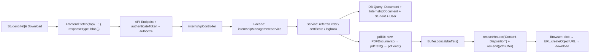
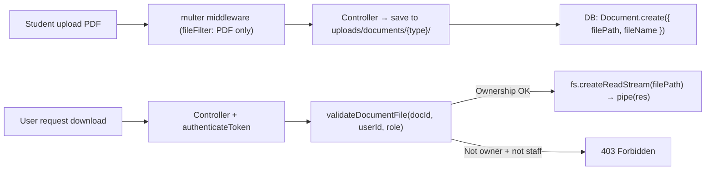
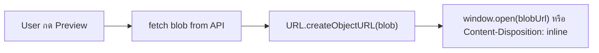

# PDF System Audit Report — CS Logbook

> **Audit Date:** 2026-03-09
> **Auditor:** Claude Code + Man (Developer)
> **Scope:** ระบบ PDF generation, preview, download, upload ทั้งหมด
> **Branch:** `claude/claude-md-mm56ik11ksjo6flh-JgWXL`

---

## 1. Executive Summary

### ภาพรวมระบบ PDF

| ประเภท | จำนวน | รายละเอียด |
|--------|-------|-----------|
| **PDF Generation** (server-side) | 3 เอกสาร | หนังสือส่งตัว, หนังสือรับรอง, สรุป Logbook |
| **PDF Upload** (user upload) | 3 ประเภท | หนังสือตอบรับ, Transcript, เอกสารโครงงาน/ปริญญานิพนธ์ |
| **Static Template** | 1 ไฟล์ | แบบฟอร์มหนังสือตอบรับ (blank PDF) |

**Library:** pdfkit v0.17.1, Thai font Loma.otf / Loma-Bold.otf
**Architecture:** Controller → Facade (internshipManagementService) → Specialized Service → pdfkit → Buffer → HTTP Response

### Issues พบทั้งหมด

| Severity | พบ | แก้แล้ว | เหลือ |
|----------|---:|--------:|------:|
| **CRITICAL** | 1 | 1 | 0 |
| **HIGH** | 4 | 4 | 0 |
| **MEDIUM** | 8 | 4 | 4 |
| **LOW** | 5 | 1 | 4 |
| **รวม** | **18** | **10** | **8** |

---

## 2. Document Inventory

| # | เอกสาร | Type | Service File | Endpoint | Role | Status |
|---|--------|------|-------------|----------|------|--------|
| 1 | หนังสือส่งตัวนักศึกษา | Generate | `internship/referralLetter.service.js` | `GET /api/documents/internship/download-referral-letter/:docId` | Student (เจ้าของ) | Active |
| 2 | หนังสือรับรองการฝึกงาน | Generate | `internship/certificate.service.js` | `GET /api/documents/internship/certificate/download` | Student (เจ้าของ) | Active |
| 3 | สรุป Logbook ฝึกงาน | Generate | `internshipLogbookService.js` | `GET /api/admin/internships/:id/logbook-summary/pdf/download` | Admin | Active |
| 4 | หนังสือตอบรับ (upload) | Upload | `internship/acceptanceLetter.service.js` | `POST /api/documents/internship/upload-acceptance-letter` | Student | Active |
| 5 | Transcript (upload) | Upload | Inline handler in routes | `POST /api/documents/internship/upload-transcript` | Student | Active |
| 6 | เอกสารโครงงาน (upload) | Upload | `projectDocumentService.js` | `POST /api/documents/project/submit` | Student | Active |
| 7 | แบบฟอร์มตอบรับ (template) | Static | N/A (direct file serve) | `GET /api/documents/internship/acceptance-letter-template` | Public | Active |

> **หมายเหตุ:** หนังสือขอความอนุเคราะห์ (cooperationLetter) ถูกอ้างอิงใน Session 38 แต่ไม่พบ service file ในโปรเจค — อาจยังไม่ commit หรือถูกลบ ต้องตรวจสอบเพิ่มเติม

---

## 3. Architecture

### 3.1 PDF Generation Flow



### 3.2 Upload / Download Flow



### 3.3 Preview Flow



---

## 4. Data Source Matrix

| DB Table / Model | หนังสือส่งตัว | หนังสือรับรอง | สรุป Logbook |
|------------------|:---:|:---:|:---:|
| **Document** | ✅ query (CS05 + ACCEPTANCE_LETTER) | ✅ query (CS05) | ✅ query (CS05) |
| **InternshipDocument** | ✅ include (company info) | ✅ include (company info) | ✅ include (company info) |
| **Student** | ✅ query (studentCode, year) | ✅ query (studentCode) | ✅ query (studentCode) |
| **User** | ✅ include (firstName, lastName) | ✅ include (firstName, lastName) | ✅ include (firstName, lastName) |
| **InternshipLogbook** | | ✅ query (totalHours) | ✅ query (entries, hours) |
| **InternshipLogbookReflection** | | ✅ query (reflection) | ✅ query (reflection) |
| **InternshipEvaluation** | | ✅ query (supervisor score) | |
| **InternshipCertificateRequest** | | ✅ query (approval status) | |
| **Academic** | | | ✅ query (academic year) |
| **Total Models** | **4** | **8** | **6** |
| **Total Queries** | **3** | **10+** | **4** |

---

## 5. Issues Found & Fixes Applied

### 5.1 Issues ที่แก้แล้ว (10 items)

| # | Issue | Source | Severity | Fix | ไฟล์ที่แก้ |
|---|-------|--------|----------|-----|-----------|
| 1 | **IDOR — view/download เอกสารคนอื่นได้** | P5 | CRITICAL | เพิ่ม ownership check ใน `validateDocumentFile(docId, userId, role)` | `documentService.js`, `documentController.js` |
| 2 | **Public endpoint เปิดข้อมูลเอกสาร** (`GET /:id` ไม่มี auth) | P5 | HIGH | เพิ่ม `authenticateToken` middleware + ownership check ใน controller | `documentsRoutes.js`, `documentController.js` |
| 3 | **List documents ไม่ filter by role** — student เห็นเอกสารทุกคน | P5 | HIGH | เพิ่ม userId/role filter ใน `getDocuments()` | `documentService.js`, `documentController.js` |
| 4 | **Date format ไม่ consistent** — หนังสือส่งตัวใช้ `toLocaleDateString` | P3 | HIGH | ใช้ Thai date format function ที่ถูกต้อง | `referralLetter.service.js` |
| 5 | **เลขที่เอกสารหนังสือส่งตัว ใช้ปี ค.ศ.** แทน พ.ศ. | P3 | HIGH | แก้ปีเป็น Buddhist era | `referralLetter.service.js` |
| 6 | **Filename ไม่ sanitize** — ชื่อนักศึกษาใน filename โดยตรง | P5 | MEDIUM | สร้าง `sanitizeFilename()` utility | `sanitizeFilename.js` (new), `referralLetter.service.js` |
| 7 | **Content-Disposition ไม่ encode** — filename header ไม่ผ่าน `encodeURIComponent` | P5 | MEDIUM | เพิ่ม `encodeURIComponent()` ใน viewDocument + downloadDocument | `documentController.js` |
| 8 | **Upload multer ไม่ check file type** — general route รับไฟล์ทุกประเภท | P5 | LOW | เพิ่ม `fileFilter` รับเฉพาะ `application/pdf` | `documentsRoutes.js` |
| 9 | **Project doc filename ขาด .pdf** | P4 | MEDIUM | เพิ่ม `.pdf` extension | Project document service |
| 10 | **Certificate download ไม่มี Content-Disposition** | P4 | MEDIUM | เพิ่ม Content-Disposition header | internshipController.js |

### 5.2 Issues ที่ยังไม่แก้ (8 items)

| # | Issue | Source | Severity | เหตุผลที่ยังไม่แก้ | แนะนำ |
|---|-------|--------|----------|--------------------|------|
| 1 | Certificate hardcoded department strings (6 จุด) | P3 | MEDIUM | ไม่ใช่ security issue, cosmetic | ย้ายไปใช้ `DEPARTMENT_INFO` config |
| 2 | PDF Author hardcoded ในแต่ละ service | P3 | MEDIUM | Low impact | ใช้ config กลางแทน |
| 3 | Logbook summary: date ไม่ format เป็นภาษาไทย | P3 | MEDIUM | Cosmetic | ใช้ `formatThaiDate()` |
| 4 | Title fontSize inconsistent ระหว่างเอกสาร | P3 | MEDIUM | Cosmetic | ปรับเป็น 18/12 ให้เหมือนกันทุกเอกสาร |
| 5 | Logbook margin inconsistent | P3 | LOW | Cosmetic | ปรับเป็น 50 ให้เหมือนเอกสารอื่น |
| 6 | Logbook ไม่มี PDF metadata (info object) | P3 | LOW | No functional impact | เพิ่ม `info: { Title, Author }` |
| 7 | ไม่มี logo/ตราสัญลักษณ์มหาวิทยาลัย | P3 | LOW | ต้องหา asset | เพิ่มเมื่อมีไฟล์ logo |
| 8 | เลขที่/วันที่ layout ไม่อยู่บรรทัดเดียว | P3 | LOW | Cosmetic | ใช้ column layout |

---

## 6. Security Assessment

### 6.1 ช่องโหว่ที่พบและแก้แล้ว

| # | Vulnerability | Severity | Before Fix | After Fix |
|---|-------------|----------|------------|-----------|
| 1 | **IDOR: Student A download เอกสาร Student B** | CRITICAL | `validateDocumentFile(docId)` — ไม่เช็ค ownership | `validateDocumentFile(docId, userId, role)` — เช็ค ownership, staff bypass |
| 2 | **Public metadata endpoint** | HIGH | `GET /:id` ไม่มี auth → ใครก็ดูข้อมูลบริษัท/ชื่อนักศึกษาได้ | เพิ่ม `authenticateToken` + ownership check |
| 3 | **Document enumeration** | HIGH | `GET /` student เห็นเอกสารทุกคน | student filter by `userId`, staff/admin เห็นทั้งหมด |
| 4 | **Filename injection** | MEDIUM | ชื่อนักศึกษาใน filename ไม่ sanitize | `sanitizeFilename()` ลบ unsafe chars |
| 5 | **Header injection** | MEDIUM | Content-Disposition ไม่ encode | `encodeURIComponent(fileName)` |
| 6 | **Unrestricted upload** | LOW | multer ไม่มี fileFilter | fileFilter รับเฉพาะ `application/pdf` |

### 6.2 สิ่งที่ปลอดภัยอยู่แล้ว (ไม่ต้องแก้)

- **Internship PDF endpoints:** ทุก service เช็ค `userId` ใน WHERE clause (`Document.findOne({ where: { documentId, userId } })`)
- **Token-based auth:** supervisor evaluation + email approval ใช้ crypto token + expiry ไม่ต้องมี JWT
- **PDFKit v0.17.1:** ไม่มี known critical vulnerability, text render ตรงๆ ไม่มี injection risk
- **File serving:** ใช้ `path.resolve()` ป้องกัน path traversal, file path มาจาก DB ไม่ใช่ user input
- **CS05 ownership:** `getCS05ById()` มี role + ownership check ใน service layer
- **Upload config:** internship routes มี fileFilter + file size limit อยู่แล้ว

### 6.3 Endpoint Security Matrix (หลัง Fix)

#### General Document Routes (`/api/documents/`)

| Endpoint | Method | Auth | Role Check | Ownership Check | Status |
|----------|--------|:----:|:----------:|:---------------:|:------:|
| `/` | GET | ✅ | ✅ (implicit via service) | ✅ student filter by userId | FIXED |
| `/my` | GET | ✅ | — | ✅ userId from token | OK |
| `/student-overview` | GET | ✅ | — | ✅ userId from token | OK |
| `/:id/view` | GET | ✅ | — | ✅ validateDocumentFile | FIXED |
| `/:id/download` | GET | ✅ | — | ✅ validateDocumentFile | FIXED |
| `/:id` | GET | ✅ | — | ✅ controller check | FIXED |
| `/submit` | POST | ✅ | — | ✅ userId from token | OK |
| `/:id/approve` | POST | ✅ | ✅ staffReview | — (staff only) | OK |
| `/:id/reject` | POST | ✅ | ✅ staffReview | — (staff only) | OK |

#### Internship Document Routes (`/api/documents/internship/`) — PDF Related

| Endpoint | Method | Auth | Role Check | Ownership Check | Status |
|----------|--------|:----:|:----------:|:---------------:|:------:|
| `/acceptance-letter-template` | GET | — | — | — (public template) | OK |
| `/certificate/preview` | GET | ✅ | ✅ student + eligibility | ✅ userId ใน service | OK |
| `/certificate/download` | GET | ✅ | ✅ student + eligibility | ✅ userId ใน service | OK |
| `/download-acceptance-letter/:docId` | GET | ✅ | ✅ student + eligibility | ✅ userId ใน controller | OK |
| `/download-referral-letter/:docId` | GET | ✅ | ✅ student + eligibility | ✅ userId ใน service | OK |
| `/upload-acceptance-letter` | POST | ✅ | ✅ student + eligibility | ✅ userId from token | OK |
| `/upload-transcript` | POST | ✅ | ✅ student + eligibility | ✅ userId from token | OK |
| `/supervisor/evaluation/:token/details` | GET | — | — (token-based) | ✅ token validation | OK |
| `/supervisor/evaluation/:token` | POST | — | — (token-based) | ✅ token validation | OK |

#### Admin Document Routes (`/api/admin/`)

| Endpoint | Method | Auth | Role Check | Ownership Check | Status |
|----------|--------|:----:|:----------:|:---------------:|:------:|
| `/documents/:id/view` | GET | ✅ | ✅ admin | — (admin can view all) | OK |
| `/documents/:id/download` | GET | ✅ | ✅ admin | — (admin can view all) | OK |
| `/certificate-requests/:id/download` | GET | ✅ | ✅ admin | — (admin can view all) | OK |
| `/internships/:id/logbook-summary/pdf` | GET | ✅ | ✅ admin | — (admin can view all) | OK |
| `/internships/:id/logbook-summary/pdf/download` | GET | ✅ | ✅ admin | — (admin can view all) | OK |

---

## 7. Files Changed

### 7.1 ไฟล์ที่สร้างใหม่

| ไฟล์ | เหตุผล |
|------|-------|
| `backend/utils/sanitizeFilename.js` | Utility สำหรับ sanitize filename ที่มี user input |

### 7.2 ไฟล์ที่แก้ไข

| ไฟล์ | Prompt # | สิ่งที่แก้ |
|------|----------|-----------|
| `backend/services/documentService.js` | P5 | `validateDocumentFile()` เพิ่ม ownership check, `getDocuments()` เพิ่ม role-based filter |
| `backend/controllers/documents/documentController.js` | P5 | viewDocument/downloadDocument ส่ง userId+role, getDocumentById เพิ่ม ownership check, encodeURIComponent filename |
| `backend/routes/documents/documentsRoutes.js` | P5 | เพิ่ม authenticateToken ให้ `GET /:id`, เพิ่ม fileFilter ใน multer |
| `backend/services/internship/referralLetter.service.js` | P3, P5 | แก้ date format, เลขที่เอกสารปี พ.ศ., sanitize filename |

---

## 8. Recommendations

### Quick Wins (แก้ง่าย ผลกระทบสูง)

1. **Certificate hardcoded strings** → ย้ายไปใช้ `DEPARTMENT_INFO` จาก `config/departmentInfo.js` (6 จุดใน certificate.service.js)
2. **PDF Author** → สร้าง constant กลาง `PDF_AUTHOR = DEPARTMENT_INFO.departmentName`
3. **Logbook date format** → ใช้ `formatThaiDate()` จาก dateUtils
4. **Logbook margin** → ปรับเป็น `margin: 50` ให้เหมือนเอกสารอื่น
5. **Logbook PDF metadata** → เพิ่ม `info: { Title: 'สรุปบันทึกการฝึกงาน', Author: PDF_AUTHOR }`

### Medium Effort

6. **Certificate fontSize** → ปรับให้ consistent (title: 18, body: 12) เหมือนหนังสือส่งตัว
7. **เลขที่/วันที่ layout** → ใช้ column layout ให้อยู่บรรทัดเดียว
8. **Certificate query optimization** → `getCertificateData()` มี query ซ้ำ 10+ ครั้ง ลดได้ด้วย eager loading
9. **Content-Length header** → เพิ่มให้ครบทุก endpoint (ช่วย browser แสดง progress bar)

### Nice to Have

10. **เพิ่ม logo** — ตราสัญลักษณ์มหาวิทยาลัยในหัวเอกสาร
11. **Logbook Summary PDF สำหรับ Student** — ตอนนี้ admin-only
12. **PDF caching** — ไม่ generate ซ้ำถ้าข้อมูลไม่เปลี่ยน (ใช้ hash ตรวจ)
13. **cooperationLetter.service.js** — ตรวจสอบว่า commit เข้า repo แล้วหรือยัง (อ้างอิง Session 38)

---

## 9. UAT Test Cases

| TC# | ประเภท | Test Case | Expected Result |
|-----|--------|----------|----------------|
| TC01 | Security | Student A ลอง `GET /api/documents/{studentB_docId}/download` | 403 Forbidden — ไม่มีสิทธิ์เข้าถึงเอกสารนี้ |
| TC02 | Security | เรียก `GET /api/documents/{id}` โดยไม่มี token | 401 Unauthorized |
| TC03 | Security | Student เรียก `GET /api/documents/` | เห็นเฉพาะเอกสารตัวเอง ไม่เห็นของคนอื่น |
| TC04 | Security | Admin เรียก `GET /api/admin/documents/{id}/download` | Download ได้ทุกเอกสาร |
| TC05 | Security | Upload ไฟล์ .txt ที่ `POST /api/documents/submit` | Error: อนุญาตเฉพาะไฟล์ PDF เท่านั้น |
| TC06 | PDF Gen | Student download หนังสือส่งตัว (มี CS05 approved + acceptance letter approved) | PDF สร้างสำเร็จ, filename sanitized, Content-Disposition encoded |
| TC07 | PDF Gen | Student preview หนังสือรับรอง (มี certificate request approved + ชั่วโมงครบ 240) | PDF แสดง inline ใน browser |
| TC08 | PDF Gen | Admin download สรุป Logbook PDF | PDF สร้างสำเร็จ, ข้อมูลครบถ้วน |
| TC09 | Upload | Student upload หนังสือตอบรับ (PDF ขนาด < 10MB) | Upload สำเร็จ, file path บันทึกใน DB |
| TC10 | Regression | Student download หนังสือตอบรับที่ upload ไว้ (เจ้าของเอกสาร) | Download สำเร็จ |

---

## Appendix: Ownership Check Pattern

ทุก endpoint ที่ student เรียกได้ ต้องเช็ค ownership ดังนี้:

```javascript
// Service layer (validateDocumentFile)
const staffRoles = ['admin', 'teacher', 'head', 'staff'];
if (!staffRoles.includes(userRole) && document.userId !== userId) {
    throw new Error('ไม่มีสิทธิ์เข้าถึงเอกสารนี้');
}

// Controller layer (getDocumentById)
if (!staffRoles.includes(req.user.role) && documentData.userId !== req.user.userId) {
    return res.status(403).json({ success: false, message: 'ไม่มีสิทธิ์เข้าถึงเอกสารนี้' });
}
```

**Error response mapping:**
| Error Message | HTTP Status |
|--------------|-------------|
| ไม่มีสิทธิ์เข้าถึงเอกสารนี้ | 403 Forbidden |
| ไม่พบเอกสาร | 404 Not Found |
| ไม่พบไฟล์เอกสาร | 404 Not Found |
| ต้องระบุ ID ของเอกสาร | 400 Bad Request |
