# WORKFLOW_STATES.md — Complete State Map

> สร้างจากการ audit Prompt 1-4 (2026-03-08)
> ครอบคลุม: Database ENUMs, Backend Services/Controllers/Agents, Frontend Mappings

---

## สารบัญ

1. [State Diagrams](#1-state-diagrams)
2. [Master State Tables](#2-master-state-tables)
3. [Inconsistency Report](#3-inconsistency-report)
4. [Unlock Conditions Matrix](#4-unlock-conditions-matrix)
5. [Architecture Notes](#5-architecture-notes)

---

## 1. State Diagrams

### 1.1 ฝึกงาน (Internship)

#### 1.1.1 Student Internship Status (`students.internship_status`)

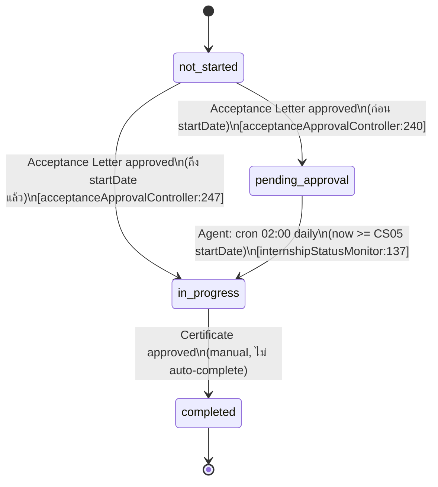

#### 1.1.2 Internship Documents (`documents.status`)

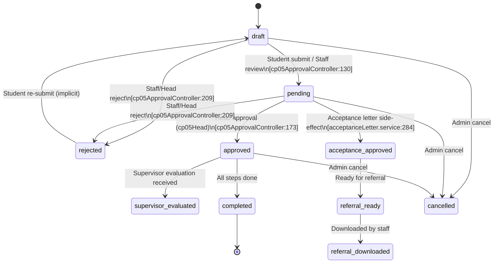

#### 1.1.3 Internship Workflow Steps (`student_workflow_activities`)

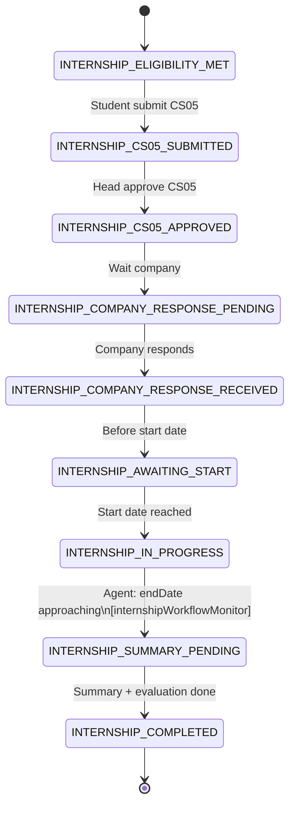

#### 1.1.4 Logbook Approval (`internship_logbooks`)

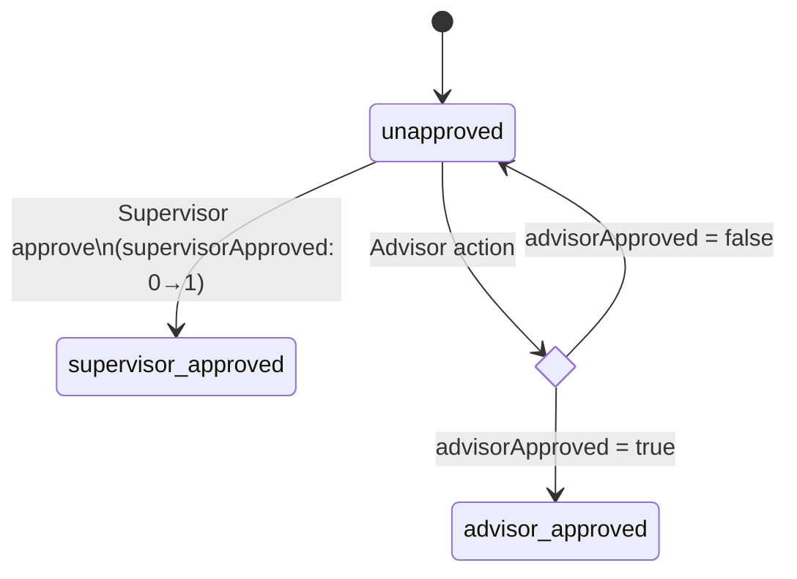

#### 1.1.5 Meeting Log Approval (`meeting_logs.approval_status`)

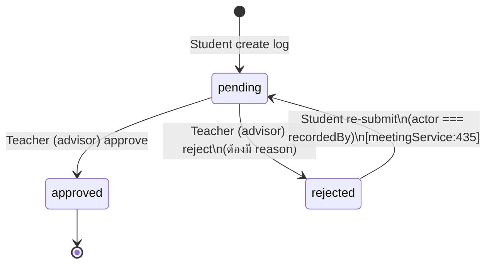

---

### 1.2 โครงงานพิเศษ 1 (Project 1)

#### 1.2.1 Project Document (`project_documents.status`)

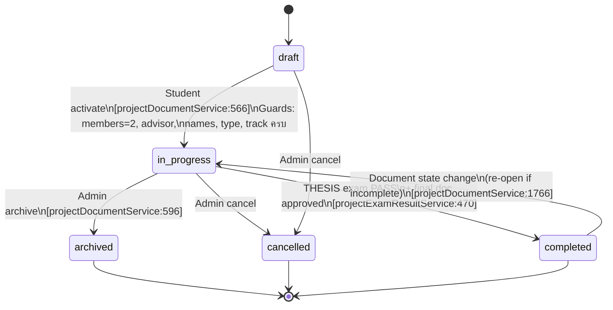

#### 1.2.2 Project Workflow Phase (`project_workflow_states.current_phase`)

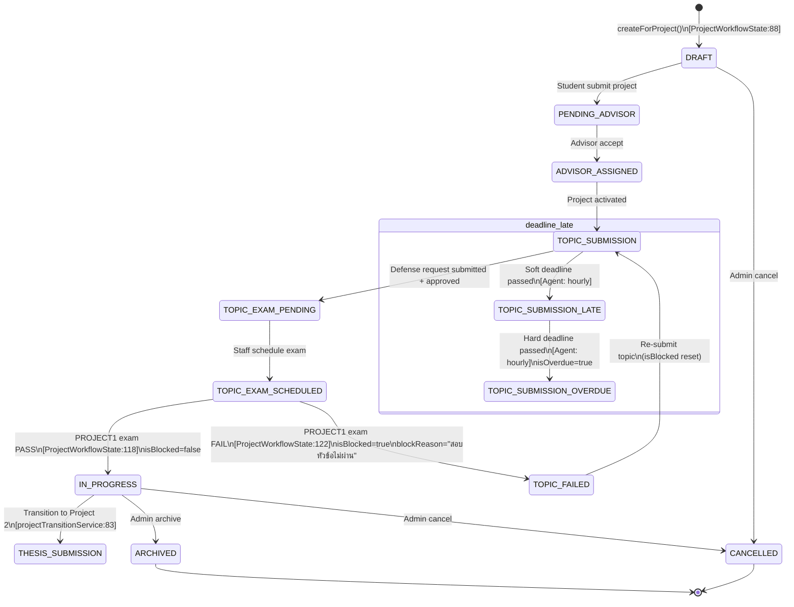

#### 1.2.3 Defense Request — Project 1 (`project_defense_requests.status`)

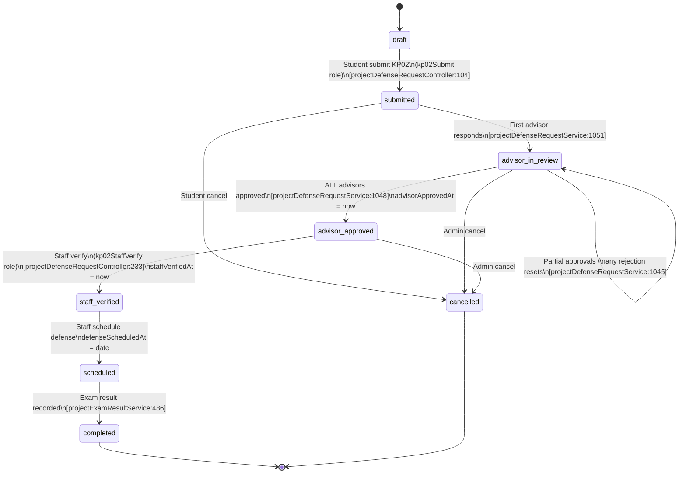

#### 1.2.4 Advisor Approval per Request (`project_defense_request_approvals.status`)

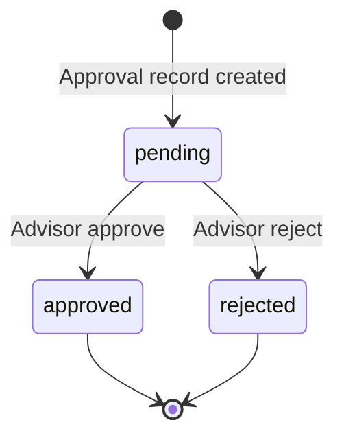

#### 1.2.5 System Test Request (`project_test_requests.status`)

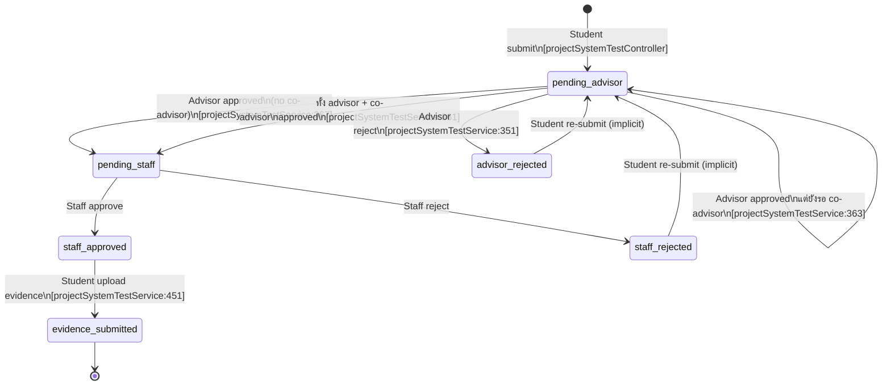

---

### 1.3 ปริญญานิพนธ์ (Thesis / Project 2)

#### 1.3.1 Thesis Workflow Phase (`project_workflow_states.current_phase` — ต่อจาก IN_PROGRESS)

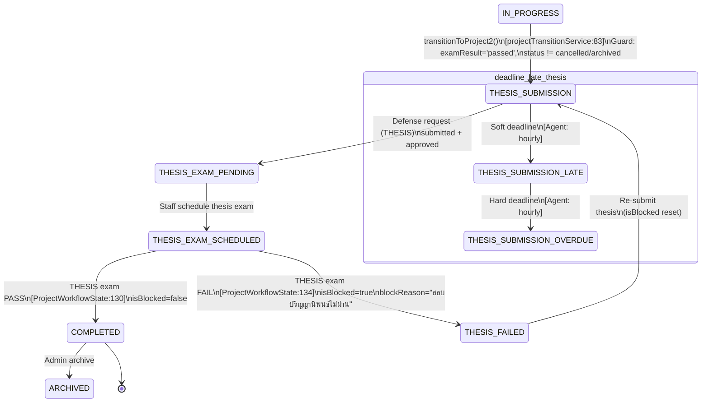

#### 1.3.2 Defense Request — Thesis (`project_defense_requests.status` where `defense_type = 'THESIS'`)

> เหมือนกับ Project 1 Defense Request (Section 1.2.3) ทุกประการ
> แตกต่างที่ `defenseType = 'THESIS'` และ exam result leads to COMPLETED/THESIS_FAILED

#### 1.3.3 Exam Results (`project_exam_results`)

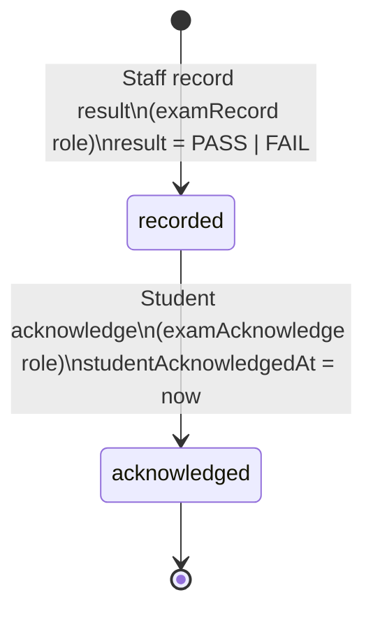

---

### 1.4 Cross-Track: Deadline-Based Auto-Transitions

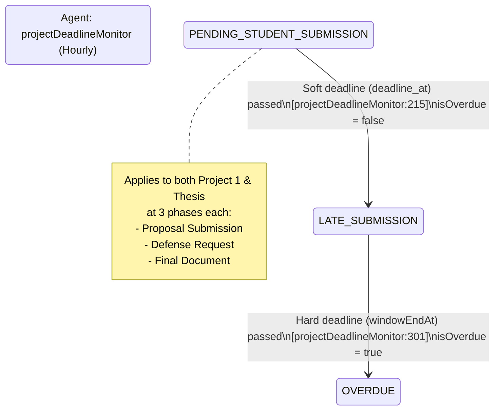

---

## 2. Master State Tables

### 2.1 Internship — Student Status

| State ID | DB Value | Thai Label | English Label | Tone | Triggered By | Next States | Conditions |
|----------|----------|-----------|---------------|------|-------------|-------------|------------|
| IS-1 | `not_started` | ยังไม่เริ่ม | Not Started | muted | Default | `pending_approval`, `in_progress` | — |
| IS-2 | `pending_approval` | รอการอนุมัติ | Pending Approval | warning | Acceptance approved (ก่อน startDate) | `in_progress` | CS05 startDate reached |
| IS-3 | `in_progress` | กำลังดำเนินการ | In Progress | warning | Agent daily 02:00 / Acceptance approved (ถึง startDate) | `completed` | Certificate approved |
| IS-4 | `completed` | เสร็จสิ้น | Completed | success | Manual (certificate approval) | — | — |

### 2.2 Internship — Document Status

| State ID | DB Value | Thai Label | English Label | Tone | Triggered By | Next States | Conditions |
|----------|----------|-----------|---------------|------|-------------|-------------|------------|
| ID-1 | `draft` | ร่าง | Draft | info | Student create | `pending`, `rejected`, `cancelled` | — |
| ID-2 | `pending` | รอดำเนินการ | Pending | warning | Staff review | `approved`, `rejected`, `acceptance_approved`, `cancelled` | — |
| ID-3 | `approved` | อนุมัติแล้ว | Approved | success | Head approve (cp05Head) | `supervisor_evaluated`, `completed`, `cancelled` | — |
| ID-4 | `rejected` | ไม่อนุมัติ | Rejected | danger | Staff/Head reject | `draft` (re-submit) | ต้องมี reason |
| ID-5 | `supervisor_evaluated` | หัวหน้าภาคตรวจแล้ว | Supervisor Evaluated | — | Supervisor evaluation | `completed` | — |
| ID-6 | `acceptance_approved` | อนุมัติให้รับเล่ม | Acceptance Approved | — | Acceptance letter flow | `referral_ready` | — |
| ID-7 | `referral_ready` | พร้อมส่งต่อ | Referral Ready | — | System | `referral_downloaded` | — |
| ID-8 | `referral_downloaded` | ดาวน์โหลดแล้ว | Referral Downloaded | — | Staff download | — | — |
| ID-9 | `completed` | เสร็จสิ้น | Completed | success | All steps done | — | — |
| ID-10 | `cancelled` | ยกเลิก | Cancelled | danger | Admin cancel | — | — |

### 2.3 Project — Document Status

| State ID | DB Value | Thai Label | English Label | Tone | Triggered By | Next States | Conditions |
|----------|----------|-----------|---------------|------|-------------|-------------|------------|
| PD-1 | `draft` | ร่าง | Draft | info | Student create | `in_progress`, `cancelled` | — |
| PD-2 | `advisor_assigned` | มีอาจารย์ที่ปรึกษาแล้ว | Advisor Assigned | — | Advisor accept | `in_progress` | — |
| PD-3 | `in_progress` | กำลังดำเนินการ | In Progress | warning | Student activate | `completed`, `archived`, `cancelled` | members=2, advisor, names, type, track |
| PD-4 | `completed` | เสร็จสิ้น | Completed | success | THESIS PASS + final doc | `in_progress` (re-open) | _isFinalDocumentApproved() |
| PD-5 | `archived` | เก็บถาวร | Archived | muted | Admin archive | — | — |
| PD-6 | `cancelled` | ยกเลิก | Cancelled | danger | Admin cancel | — | — |

### 2.4 Project — Workflow Phase

| State ID | DB Value | Thai Label | English Label | Tone | Triggered By | Next States | Conditions |
|----------|----------|-----------|---------------|------|-------------|-------------|------------|
| WF-1 | `DRAFT` | ร่าง | Draft | info | createForProject() | `PENDING_ADVISOR`, `CANCELLED` | — |
| WF-2 | `PENDING_ADVISOR` | รอที่ปรึกษา | Pending Advisor | info | Student submit | `ADVISOR_ASSIGNED` | — |
| WF-3 | `ADVISOR_ASSIGNED` | มีที่ปรึกษาแล้ว | Advisor Assigned | info | Advisor accept | `TOPIC_SUBMISSION` | — |
| WF-4 | `TOPIC_SUBMISSION` | ยื่นหัวข้อ | Topic Submission | info | Project activated | `TOPIC_EXAM_PENDING` | — |
| WF-5 | `TOPIC_EXAM_PENDING` | รอสอบหัวข้อ | Topic Exam Pending | warning | Defense approved | `TOPIC_EXAM_SCHEDULED` | — |
| WF-6 | `TOPIC_EXAM_SCHEDULED` | นัดสอบหัวข้อแล้ว | Topic Exam Scheduled | info | Staff schedule | `IN_PROGRESS`, `TOPIC_FAILED` | — |
| WF-7 | `TOPIC_FAILED` | สอบหัวข้อไม่ผ่าน | Topic Failed | danger | Exam FAIL | `TOPIC_SUBMISSION` | isBlocked=true, blockReason |
| WF-8 | `IN_PROGRESS` | กำลังดำเนินการ | In Progress | warning | Exam PASS (PROJECT1) | `THESIS_SUBMISSION`, `ARCHIVED`, `CANCELLED` | isBlocked=false |
| WF-9 | `THESIS_SUBMISSION` | ยื่นปริญญานิพนธ์ | Thesis Submission | info | transitionToProject2() | `THESIS_EXAM_PENDING` | examResult='passed' |
| WF-10 | `THESIS_EXAM_PENDING` | รอสอบปริญญานิพนธ์ | Thesis Exam Pending | warning | Defense (THESIS) approved | `THESIS_EXAM_SCHEDULED` | — |
| WF-11 | `THESIS_EXAM_SCHEDULED` | นัดสอบปริญญานิพนธ์แล้ว | Thesis Exam Scheduled | info | Staff schedule | `COMPLETED`, `THESIS_FAILED` | — |
| WF-12 | `THESIS_FAILED` | สอบปริญญานิพนธ์ไม่ผ่าน | Thesis Failed | danger | Exam FAIL | `THESIS_SUBMISSION` | isBlocked=true, blockReason |
| WF-13 | `COMPLETED` | เสร็จสิ้น | Completed | success | Exam PASS (THESIS) | `ARCHIVED` | isBlocked=false |
| WF-14 | `ARCHIVED` | เก็บถาวร | Archived | muted | Admin archive | — | — |
| WF-15 | `CANCELLED` | ยกเลิก | Cancelled | danger | Admin cancel | — | — |

### 2.5 Defense Request Status

| State ID | DB Value | Thai Label | English Label | Tone | Triggered By | Next States | Conditions |
|----------|----------|-----------|---------------|------|-------------|-------------|------------|
| DR-1 | `draft` | แบบร่าง | Draft | info | Student create | `submitted`, `cancelled` | — |
| DR-2 | `submitted` | ยื่นคำขอแล้ว | Submitted | info | Student submit (kp02Submit) | `advisor_in_review`, `cancelled` | deadline check middleware |
| DR-3 | `advisor_in_review` | รออาจารย์อนุมัติครบ | Advisor In Review | info | First advisor responds | `advisor_approved`, `advisor_in_review`, `cancelled` | — |
| DR-4 | `advisor_approved` | อาจารย์อนุมัติ | Advisor Approved | warning | ALL advisors approved | `staff_verified`, `cancelled` | advisorApprovedAt set |
| DR-5 | `staff_verified` | เจ้าหน้าที่ตรวจแล้ว | Staff Verified | success | Staff verify (kp02StaffVerify) | `scheduled` | staffVerifiedAt set |
| DR-6 | `scheduled` | นัดสอบแล้ว | Scheduled | info | Staff schedule defense | `completed` | defenseScheduledAt set |
| DR-7 | `completed` | บันทึกผลสอบแล้ว | Completed | success | Exam result recorded | — | — |
| DR-8 | `cancelled` | ยกเลิก | Cancelled | danger | Student/Admin cancel | — | — |

### 2.6 System Test Request Status

| State ID | DB Value | Thai Label | English Label | Tone | Triggered By | Next States | Conditions |
|----------|----------|-----------|---------------|------|-------------|-------------|------------|
| ST-1 | `pending_advisor` | รออาจารย์อนุมัติ | Pending Advisor | warning | Student submit | `pending_staff`, `advisor_rejected` | deadline check |
| ST-2 | `advisor_rejected` | อาจารย์ส่งกลับ | Advisor Rejected | danger | Advisor/co-advisor reject | `pending_advisor` (re-submit) | — |
| ST-3 | `pending_staff` | รอเจ้าหน้าที่ตรวจสอบ | Pending Staff | warning | All advisors approved | `staff_approved`, `staff_rejected` | advisor + co-advisor (if exists) |
| ST-4 | `staff_rejected` | เจ้าหน้าที่ส่งกลับ | Staff Rejected | danger | Staff reject | `pending_advisor` (re-submit) | — |
| ST-5 | `staff_approved` | อนุมัติ (รอหลักฐาน) | Staff Approved | success | Staff approve | `evidence_submitted` | — |
| ST-6 | `evidence_submitted` | ส่งหลักฐานแล้ว | Evidence Submitted | success | Student upload evidence | — | status must be staff_approved, file required |

### 2.7 Meeting Log Approval

| State ID | DB Value | Thai Label | English Label | Tone | Triggered By | Next States | Conditions |
|----------|----------|-----------|---------------|------|-------------|-------------|------------|
| ML-1 | `pending` | รออนุมัติ | Pending | warning | Student create | `approved`, `rejected` | — |
| ML-2 | `approved` | อนุมัติแล้ว | Approved | success | Teacher approve | — | — |
| ML-3 | `rejected` | ปฏิเสธ | Rejected | danger | Teacher reject | `pending` (re-submit) | actor === recordedBy |

### 2.8 Exam Results

| State ID | DB Value | Thai Label | English Label | Tone | Triggered By | Conditions |
|----------|----------|-----------|---------------|------|-------------|------------|
| ER-1 | `PASS` | ผ่าน | Pass | success | Staff record (examRecord) | score >= PASS_SCORE (70) |
| ER-2 | `FAIL` | ไม่ผ่าน | Fail | danger | Staff record (examRecord) | score < PASS_SCORE |

> Note: `project_documents.exam_result` ใช้ lowercase (`passed`/`failed`) — service layer normalize, ดู Session 29

### 2.9 Approval Tokens

| State ID | DB Value | Thai Label | English Label | Tone | Triggered By | Next States | Conditions |
|----------|----------|-----------|---------------|------|-------------|-------------|------------|
| AT-1 | `pending` | รออนุมัติ | Pending | warning | Token generated | `approved`, `rejected` | valid + not expired |
| AT-2 | `approved` | อนุมัติแล้ว | Approved | success | External approve | `used` | — |
| AT-3 | `rejected` | ปฏิเสธแล้ว | Rejected | danger | External reject | `used` | — |
| AT-4 | `used` | ใช้แล้ว | Used | muted | Token consumed | — | one-time |

### 2.10 Certificate Request

| State ID | DB Value | Thai Label | English Label | Tone | Triggered By | Next States | Conditions |
|----------|----------|-----------|---------------|------|-------------|-------------|------------|
| CR-1 | `pending` | รอดำเนินการ | Pending | warning | Student request | `approved`, `rejected` | — |
| CR-2 | `approved` | อนุมัติแล้ว | Approved | success | Admin approve | — | — |
| CR-3 | `rejected` | ไม่อนุมัติ | Rejected | danger | Admin reject | — | — |

---

## 3. Inconsistency Report

### 3.1 Status ที่อยู่ใน DB ENUM แต่ไม่มีใน Backend Logic (Phantom States)

| Table | DB Value | สถานะ | หมายเหตุ |
|-------|----------|--------|----------|
| `project_defense_requests` | `draft` | Low risk | ENUM มี `draft` แต่ service สร้างด้วย `submitted` เสมอ (default) — `draft` ไม่ถูกใช้จริงใน flow ปัจจุบัน |
| `student_workflow_activities` | `eligible` | Low risk | อยู่ใน ENUM แต่ไม่พบ code ที่ set ค่านี้โดยตรง — อาจใช้เฉพาะ seeder |
| `student_workflow_activities` | `enrolled` | Low risk | อยู่ใน ENUM แต่ไม่พบ code ที่ set ค่านี้โดยตรง — อาจใช้เฉพาะ seeder |

### 3.2 Status ที่อยู่ใน Backend แต่ Frontend ไม่ Handle โดยตรง

| Table | DB Value | เหตุผล | Risk |
|-------|----------|--------|------|
| `project_workflow_states.current_phase` | ทั้ง 15 ค่า | **Intentional** — internal state, ไม่โชว์ให้ user เห็น | None |
| `project_workflow_states.topic_exam_result` | `PENDING` | ใช้ `project_documents.exam_result` (lowercase) แทน | None |
| `project_workflow_states.thesis_exam_result` | `PENDING` | เช่นเดียวกัน | None |
| `internship_evaluations.status` | `submitted_by_supervisor`, `completed` | ใช้ conditional logic ไม่ใช่ badge | None |
| `documents.download_status` | `not_downloaded`, `downloaded` | ใช้ internally, ไม่โชว์เป็น badge | None |
| `meeting_participants.attendance_status` | `present`, `absent`, `late` | ไม่มี explicit label ใน statusLabels.ts แต่ handle ใน component | Low |

### 3.3 Status ที่ Frontend Handle แต่ไม่มีใน DB ENUM

| Frontend Value | อยู่ที่ | หมายเหตุ | Risk |
|---------------|--------|----------|------|
| ~~`evidence_submitted`~~ | ~~statusLabels.ts + SystemTest pages~~ | **แก้แล้ว Session 31** — เพิ่มเข้า ENUM + backend set จริงใน `uploadEvidence()` | Resolved |
| `uploaded` | statusLabels.ts | Compound UI state สำหรับ certificate | None — UI only |
| `not_uploaded` | statusLabels.ts | Compound UI state | None — UI only |
| `not_requested` | statusLabels.ts | Compound UI state | None — UI only |
| `not_eligible` | statusLabels.ts | Computed from eligibility checks | None — UI only |
| `eligible` | statusLabels.ts | Computed from eligibility checks | None — UI only |
| `in_progress_internship` | statusLabels.ts | Dashboard compound state | None — UI only |
| `in_progress_project` | statusLabels.ts | Dashboard compound state | None — UI only |
| `open`, `closed`, `in_window`, `locked` | statusLabels.ts | Deadline computed states | None — UI only |

### 3.4 Transitions ที่เป็นไปได้ตาม Code แต่ไม่มี Validation

| Transition | Table | ปัญหา | Risk | File |
|-----------|-------|--------|------|------|
| ANY → `archived` | `project_documents` | `archiveProject()` ไม่เช็ค current status — archive ได้จากทุก state | Low — มี idempotent guard | projectDocumentService:596 |
| ANY → `cancelled` | `project_documents` | ไม่พบ explicit guard ว่า status ไหนถึง cancel ได้ | Medium | — |
| `completed` → `in_progress` | `project_documents` | Re-open เมื่อ document incomplete — อาจไม่ตั้งใจ | Low — มี logic check | projectDocumentService:1766 |
| ANY status → `updateStatus()` | `documents` | `documentService.updateStatus()` รับ status จาก parameter โดยไม่ validate ว่า transition ถูก | Medium | documentService:245 |
| ANY → `approved`/`rejected` | `approval_tokens` | Token ที่ `used` แล้วไม่มี guard ชัดเจนว่าจะ approve/reject ซ้ำไม่ได้ (อาจอยู่ที่ token validation) | Low | — |

### 3.5 Label ต่างกันระหว่าง Centralized vs Local

| Status | statusLabels.ts | Local Override | File | ปัญหา |
|--------|----------------|----------------|------|--------|
| `advisor_in_review` | "อาจารย์กำลังตรวจ" | "รออาจารย์อนุมัติครบ" | DefenseStaffQueuePage | Context-specific — acceptable |
| `advisor_approved` | "อาจารย์อนุมัติ" | "รอเจ้าหน้าที่ตรวจสอบ" | DefenseStaffQueuePage | Context-specific — acceptable |
| `staff_approved` | "อนุมัติ (รอหลักฐาน)" | "อนุมัติครบ (รอหลักฐาน)" | DefenseStaffQueuePage | Minor wording difference |
| `pending` (internship) | "รอดำเนินการ" | "รอตรวจสอบ"/"รอหัวหน้าภาค" | admin/documents/internship | Context-specific (แยก reviewerId) — acceptable |

---

## 4. Unlock Conditions Matrix

### 4.1 Internship Track

| เงื่อนไข | ตรวจที่ไฟล์ | Logic จริง | ตรงกับ flow? |
|----------|------------|-----------|-------------|
| Student eligible for internship | `studentUtils.js:600-620` | Year >= 3 AND totalCredits >= CONSTANTS.INTERNSHIP.MIN_TOTAL_CREDITS | Yes |
| CS05 submit allowed | `deadlineEnforcementMiddleware.js` | Deadline not locked/past grace period | Yes |
| CS05 → pending (staff review) | `cp05ApprovalController.js:130` | Document exists + not approved yet | Yes |
| CS05 → approved (head) | `cp05ApprovalController.js:173` | status === 'pending' + head role | Yes |
| pending_approval → in_progress | `internshipStatusMonitor.js:137` | now >= CS05 startDate | Yes |
| Internship → completed | Manual trigger | Certificate approved | Yes — ไม่ auto-complete เมื่อ endDate ผ่าน |
| Logbook update allowed | `internshipLogbookController.js:98-102` | Entry NOT already approved | Yes |
| Meeting log re-submit | `meetingService.js:434-435` | approvalStatus === 'rejected' AND actor === recordedBy | Yes |

### 4.2 Project Track (Project 1 + Thesis)

| เงื่อนไข | ตรวจที่ไฟล์ | Logic จริง | ตรงกับ flow? |
|----------|------------|-----------|-------------|
| Student eligible for project | `studentUtils.js:620-654` | Year >= 4 AND totalCredits >= MIN AND majorCredits >= MIN | Yes |
| Project activate | `projectDocumentService.js:566-572` | members === 2, advisorId exists, projectNameTh && projectNameEn, projectType && track | Yes |
| Project activate idempotent | `projectDocumentService.js:566` | status already 'in_progress' → return early; status 'completed'/'archived' → blocked | Yes |
| Defense request submit | `projectDefenseRequestController.js:104` | deadline check middleware passes + kp02Submit role | Yes |
| Defense: all advisors approved | `projectDefenseRequestService.js:1035-1048` | Loop all approvals: `!hasRejected && allApproved` | Yes |
| Staff verify defense | `projectDefenseRequestController.js:233` | kp02StaffVerify role + request in advisor_approved | Yes |
| Record exam result | `projectExamResultController.js:178` | examRecord role + valid examType + valid result | Yes |
| PROJECT1 PASS → IN_PROGRESS | `ProjectWorkflowState.js:118-120` | result === 'PASS' && examType === 'PROJECT1' | Yes |
| PROJECT1 FAIL → TOPIC_FAILED | `ProjectWorkflowState.js:122-126` | result === 'FAIL', sets isBlocked=true + blockReason | Yes |
| Transition to Project 2 | `projectTransitionService.js:42-50` | examResult === 'passed' AND status !== 'cancelled'/'archived' AND !transitioned_to_project2 | Yes |
| THESIS PASS → COMPLETED | `ProjectWorkflowState.js:130-132` | result === 'PASS' && examType === 'THESIS' | Yes |
| THESIS PASS → project completed | `projectExamResultService.js:470-475` | THESIS PASS + `_isFinalDocumentApproved()` | Yes — only if final doc approved |
| System test: advisor decision | `projectSystemTestService.js:349-369` | Checks both advisor + co-advisor DecidedAt timestamps | Yes |
| System test: need co-advisor | `projectSystemTestService.js:355-363` | hasCoAdvisor → both must approve for pending_staff | Yes |
| Archive project | `projectDocumentService.js:596` | Idempotent — if already archived → return | Yes — ไม่เช็ค current status |
| Deadline: soft → late | `projectDeadlineMonitor.js:160-219` | deadline_at passed within 24h + matching WorkflowStepDefinition | Yes |
| Deadline: hard → overdue | `projectDeadlineMonitor.js:243-305` | windowEndAt passed within 24h | Yes |

### 4.3 Auto-Transition Conditions (Agents)

| เงื่อนไข | Agent / Schedule | Logic จริง | Guard |
|----------|-----------------|-----------|-------|
| internship_status: pending → in_progress | internshipStatusMonitor / 02:00 daily | now >= startDate AND status !== 'completed'/'in_progress' | Yes — skips already transitioned |
| workflow step → SUMMARY_PENDING | internshipWorkflowMonitor / 02:00 daily | currentStepKey === 'INTERNSHIP_IN_PROGRESS' + endDate approaching | Yes |
| workflow_step_id: pending → late | projectDeadlineMonitor / Hourly | deadline_at passed + matching step definition exists | Yes |
| workflow_step_id: late → overdue | projectDeadlineMonitor / Hourly | windowEndAt passed + isOverdue !== true | Yes — idempotent |
| Student eligibility flags | eligibilityUpdater / 1st of month | checkInternshipEligibility() + checkProjectEligibility() | Yes |
| Academic semester | academicSemesterScheduler / 00:05 daily | currentDate within semester range | Yes — idempotent |

---

## 5. Architecture Notes

### 5.1 State Management Pattern

```
ไม่มี centralized state machine library
แต่ละ service จัดการ transitions เอง

Pattern ที่ใช้:
1. Idempotent guards (เช็ค current state → return early ถ้า already in target)
2. Cascading updates (exam result → WorkflowState + Document + DefenseRequest ใน transaction)
3. Side-effect sync (ProjectDocument change → syncProjectWorkflowState())
4. Agent auto-transitions (cron-based, ไม่ใช่ event-based)
```

### 5.2 Three-Layer Status System (Project)

```
Layer 1: project_workflow_states.current_phase (UPPERCASE, 15 phases)
         → Master workflow state, internal only
         → เปลี่ยนจาก: exam result, agent deadline, admin actions

Layer 2: project_documents.status (lowercase, 6 states)
         → Document lifecycle, visible to users
         → เปลี่ยนจาก: student activate, exam result + final doc, admin archive/cancel

Layer 3: student_workflow_activities (9+9 states)
         → Per-step tracking, used for progress display
         → เปลี่ยนจาก: workflowService.updateStudentWorkflowActivity()
```

### 5.3 Convention Differences (Intentional)

| Entity | Case | Example | เหตุผล |
|--------|------|---------|--------|
| `project_workflow_states.current_phase` | UPPERCASE | `DRAFT`, `IN_PROGRESS` | Internal workflow, distinguish from document status |
| `project_documents.status` | lowercase | `draft`, `in_progress` | User-facing document status |
| `project_exam_results.result` | UPPERCASE | `PASS`, `FAIL` | Exam-specific convention |
| `project_documents.exam_result` | lowercase | `passed`, `failed` | Document-level, service normalizes |
| `project_defense_requests.defense_type` | UPPERCASE | `PROJECT1`, `THESIS` | Type discriminator |

### 5.4 Audit Trail Coverage

| Table | มี Audit Log? | วิธี | File |
|-------|--------------|------|------|
| `documents` | Yes | DocumentLog (previousStatus → newStatus) | documentService.js |
| `project_documents` | Partial | lastActivityAt + lastActivityType ใน WorkflowState | ProjectWorkflowState.js |
| `project_defense_requests` | Partial | advisorApprovedAt, staffVerifiedAt timestamps | projectDefenseRequestService.js |
| `meeting_logs` | Partial | approvedAt, approvedBy | meetingService.js |
| อื่น ๆ | No | ไม่มี centralized audit log | — |

### 5.5 Critical Files Index

| Purpose | File |
|---------|------|
| Centralized status labels (frontend) | `src/lib/utils/statusLabels.ts` |
| Workflow phase state machine | `backend/models/ProjectWorkflowState.js` |
| Project document lifecycle | `backend/services/projectDocumentService.js` |
| Defense request workflow | `backend/services/projectDefenseRequestService.js` |
| System test multi-actor approval | `backend/services/projectSystemTestService.js` |
| Exam result → cascading updates | `backend/services/projectExamResultService.js` |
| Project 1→2 transition | `backend/services/projectTransitionService.js` |
| Internship status auto-update | `backend/agents/internshipStatusMonitor.js` |
| Project deadline auto-transition | `backend/agents/projectDeadlineMonitor.js` |
| Deadline → phase mapping | `backend/constants/deadlineStateMapping.js` |
| Phase → deadline mapping | `backend/constants/workflowDeadlineMapping.js` |
| Generic workflow activity | `backend/services/workflowService.js` |
| Document approval (internship) | `backend/controllers/documents/cp05ApprovalController.js` |
| Meeting log approval | `backend/services/meetingService.js` |

---

> Last updated: 2026-03-08 | Generated from Prompt 1-4 audit
