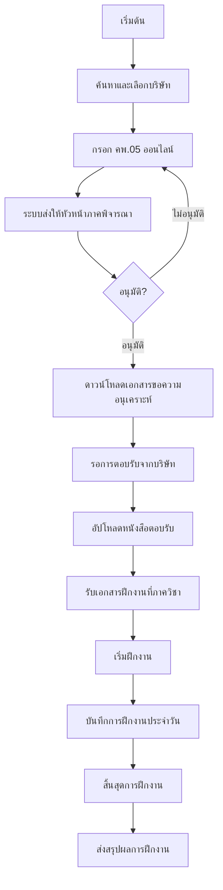

# Flow การทำงานของระบบฝึกงานบนเว็บไซต์

## 1. ปรับปรุง Sidebar สำหรับระบบฝึกงาน

````javascript
children: canAccessInternship ? [
  {
    key: '/internship-registration',
    label: 'ลงทะเบียนฝึกงาน',
    icon: <FormOutlined />,
    children: [
      {
        key: '/internship-registration/cs05',
        label: 'คพ.05 - คำร้องขอฝึกงาน',
      },
      {
        key: '/internship-registration/company-info',
        label: 'ข้อมูลสถานประกอบการ',
      }
    ]
  },
  {
    key: '/internship-logbook',
    label: 'บันทึกการฝึกงาน',
    icon: <BookOutlined />,
    children: [
      {
        key: '/internship-logbook/timesheet',
        label: 'ใบลงเวลาและบันทึกประจำวัน',
      }
    ]
  },
  {
    key: '/internship-summary',
    label: 'สรุปผลการฝึกงาน',
    icon: <FileDoneOutlined />,
  }
] : []
````

## 2. Flow การทำงานบนเว็บไซต์



## 3. รายละเอียดแต่ละขั้นตอน

### ขั้นตอนที่ 1-2: การลงทะเบียนฝึกงาน
- ค้นหาและเลือกบริษัทจากฐานข้อมูล
- กรอกแบบฟอร์ม คพ.05 ออนไลน์
- แนบผลการเรียนในรูปแบบ PDF

### ขั้นตอนที่ 3-4: การอนุมัติ
- ระบบส่งต่อให้หัวหน้าภาคพิจารณา
- แจ้งเตือนผลการพิจารณาทางอีเมล
- กรณีไม่อนุมัติ สามารถแก้ไขและส่งใหม่

### ขั้นตอนที่ 5-7: การประสานงานกับบริษัท
- ดาวน์โหลดเอกสารที่ได้รับการอนุมัติ
- ติดต่อบริษัทด้วยตนเอง (offline)
- อัปโหลดหนังสือตอบรับจากบริษัท

### ขั้นตอนที่ 8: การบันทึกการฝึกงาน
- บันทึกเวลาเข้า-ออก
- บันทึกงานที่ได้รับมอบหมาย
- บันทึกปัญหาและการแก้ไข

### ขั้นตอนที่ 9: การสรุปผล
- สรุปชั่วโมงการฝึกงานทั้งหมด
- อัปโหลดใบประเมินจากพี่เลี้ยง
- ส่งรายงานสรุปการฝึกงาน

## 4. สถานะที่ต้องแสดงในระบบ
1. รอการอนุมัติ คพ.05
2. รอหนังสือตอบรับ
3. รอเริ่มฝึกงาน
4. อยู่ระหว่างฝึกงาน
5. รอส่งเอกสารสรุป
6. เสร็จสิ้นการฝึกงาน