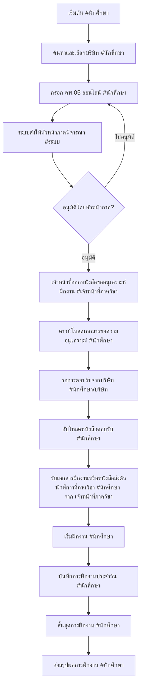

# Flow การทำงานของระบบฝึกงานบนเว็บไซต์

## 2. Flow การทำงานบนเว็บไซต์ (พร้อมระบุผู้ดำเนินการ)

## 3. รายละเอียดแต่ละขั้นตอน

### ขั้นตอนที่ 1-2: การลงทะเบียนฝึกงาน
- ค้นหาและเลือกบริษัท โดยทำการติดต่อกับบริษัทด้วยตนเอง
- กรอกแบบฟอร์ม คพ.05 ออนไลน์
- แนบผลการเรียนในรูปแบบ PDF

### ขั้นตอนที่ 3-4: การอนุมัติ และการออกเอกสารขอความอนุเคราะห์
- ระบบส่งต่อให้หัวหน้าภาคพิจารณาคำร้อง คพ.05 ของนักศึกษา
- หัวหน้าภาคดำเนินการพิจารณาและอนุมัติ (หรือแจ้งให้แก้ไข) ผ่านระบบ
- ระบบแจ้งเตือนผลการพิจารณาให้นักศึกษาทราบทางอีเมล
- **กรณีอนุมัติ:** หลังจากหัวหน้าภาคอนุมัติแล้ว เจ้าหน้าที่จะดำเนินการออกหนังสือขอความอนุเคราะห์ฝึกงานในระบบ (หรือจัดเตรียมเอกสารเพื่อให้พร้อมสำหรับการดาวน์โหลดของนักศึกษา)
- **กรณีไม่อนุมัติ:** นักศึกษาสามารถตรวจสอบเหตุผลและดำเนินการแก้ไขข้อมูลในระบบ แล้วส่งคำร้อง คพ.05 เพื่อพิจารณาใหม่ได้

### ขั้นตอนที่ 5-7: การประสานงานกับบริษัท
- นักศึกษาดาวน์โหลดเอกสารขอความอนุเคราะห์ฝึกงาน (ที่ผ่านการอนุมัติจากหัวหน้าภาคและออกโดยเจ้าหน้าที่แล้ว) จากระบบ
- ติดต่อบริษัทด้วยตนเอง (offline)
- อัปโหลดหนังสือตอบรับจากบริษัท

### ขั้นตอนที่ 8: การบันทึกการฝึกงาน
- บันทึกเวลาเข้า-ออก
- บันทึกงานที่ได้รับมอบหมาย
- บันทึกปัญหาและการแก้ไข

### ขั้นตอนที่ 9: การสรุปผล
- สรุปชั่วโมงการฝึกงานทั้งหมด
- อัปโหลดใบประเมินจากพี่เลี้ยง
- ส่งรายงานสรุปการฝึกงาน

## 4. สถานะที่ต้องแสดงในระบบ
1. รอการอนุมัติ คพ.05
2. รอหนังสือตอบรับ
3. รอเริ่มฝึกงาน
4. อยู่ระหว่างฝึกงาน
5. รอส่งเอกสารสรุป
6. เสร็จสิ้นการฝึกงาน