# Flow การทำงานของระบบฝึกงาน - สถานะปัจจุบัน

## ระบบที่พัฒนาแล้ว

```mermaid
flowchart TD
    %% ขั้นตอนที่พัฒนาแล้ว
    A[เริ่มต้น - นักศึกษาเข้าสู่ระบบ] --> B[📋 กรอก คพ.05 ออนไลน์<br/>✅ ทำแล้ว]
    B --> C[📤 ระบบส่งให้เจ้าหน้าที่ภาคพิจารณา<br/>✅ ทำแล้ว]
    C --> C1[📤 ระบบส่งให้หัวหน้าภาคพิจารณา<br/>❌ ยังไม่ได้ทำ]
    C1 --> D{🔍 หัวหน้าภาคอนุมัติ?<br/>✅ ทำแล้ว}
    
    %% การไม่อนุมัติ
    D -->|❌ ไม่อนุมัติ| D1[📧 แจ้งเตือนนักศึกษา<br/>✅ ทำแล้ว]
    D1 --> B
    
    %% การอนุมัติ - ส่วนที่ยังไม่ได้ทำ
    D -->|✅ อนุมัติ| E[📧 แจ้งเตือนนักศึกษาและเจ้าหน้าที่<br/>✅ ทำแล้ว]
    E --> F[📄 เจ้าหน้าที่ออกหนังสือขอความอนุเคราะห์การฝึกงาน<br/>❌ ยังไม่ได้ทำ]
    F --> G[📥 ดาวน์โหลดหนังสือรองรับการฝึกงาน<br/>❌ ยังไม่ได้ทำ]
    G --> H[🏢 ส่งหนังสือไปต่อบริษัทผ่านอีเมล<br/>❌ ยังไม่ได้ทำ]
    H --> I[⏳ รอการตอบรับจากบริษัท<br/>❌ ยังไม่ได้ทำ]
    I --> J[📤 อัปโหลดหนังสือตอบรับจากบริษัท<br/>❌ ยังไม่ได้ทำ]
    J --> K[📋 รับหนังสือส่งตัวที่ภาควิชา<br/>❌ ยังไม่ได้ทำ]
    
    %% การเริ่มฝึกงาน
    K --> L[🎯 เริ่มฝึกงาน<br/>✅ ทำแล้ว]
    L --> M[📝 บันทึกการฝึกงานประจำวัน<br/>✅ ทำแล้ว - Logbook System]
    M --> N[📊 สิ้นสุดและส่งเอกสารสรุปผลการฝึกงาน<br/>✅ ทำแล้ว]
    
    %% ขั้นตอนหลังการสรุปผล - ยังไม่ได้ทำ
    N --> O[🔍 เจ้าหน้าที่ตรวจสอบเอกสารสรุปผล<br/>❌ ยังไม่ได้ทำ]
    O --> P{📋 เอกสารครบถ้วนและถูกต้อง?<br/>❌ ยังไม่ได้ทำ}
    P -->|❌ ไม่ครบถ้วน| P1[📧 แจ้งให้นักศึกษาแก้ไข<br/>❌ ยังไม่ได้ทำ]
    P1 --> N
    P -->|✅ ครบถ้วน| Q[✅ อนุมัติผลการฝึกงาน<br/>❌ ยังไม่ได้ทำ]
    Q --> R[💾 ระบบบันทึกผลการฝึกงานเข้าฐานข้อมูล<br/>❌ ยังไม่ได้ทำ]
    R --> S[📜 ออกใบรับรองการฝึกงาน<br/>❌ ยังไม่ได้ทำ]
    S --> T[📥 นักศึกษาดาวน์โหลดใบรับรองการฝึกงาน<br/>❌ ยังไม่ได้ทำ]
    T --> U[🎉 เสร็จสิ้นกระบวนการฝึกงานทั้งหมด<br/>❌ ยังไม่ได้ทำ]
    
    %% สีของ nodes
    classDef implemented fill:#d4edda,stroke:#28a745,stroke-width:2px
    classDef notImplemented fill:#f8d7da,stroke:#dc3545,stroke-width:2px
    classDef outsideSystem fill:#fff3cd,stroke:#ffc107,stroke-width:2px

    class A,B,C,D,D1,E,M,N,L implemented
    class C1,F,G,J,O,P,P1,Q,R,S,T,U notImplemented
    class H,I,K notImplemented
```



## สถานะการพัฒนารายละเอียด

### ✅ ส่วนที่พัฒนาเสร็จแล้ว

#### 1. **ระบบกรอกและอนุมัติ คพ.05**
```javascript
// Backend: InternshipService.handleCS05Approval()
// ✅ มีระบบ workflow การอนุมัติ
// ✅ มีการส่งอีเมลแจ้งเตือนนักศึกษา
// ✅ มีการส่งแจ้งเตือนเจ้าหน้าที่ (ต้องเพิ่ม)
// ✅ มีการอัปเดตสถานะอัตโนมัติ
```

#### 2. **ระบบบันทึกการฝึกงาน (Logbook)**
```javascript
// ✅ ระบบบันทึกกิจกรรมประจำวัน
// ✅ การบันทึกเวลาเข้า-ออก
// ✅ การบันทึกงานและปัญหา
// ✅ ระบบส่งอนุมัติผ่านอีเมล
// ✅ ระบบสรุปผลการฝึกงาน
```

#### 3. **ระบบการแจ้งเตือน**
```javascript
// ✅ อีเมลแจ้งผลการอนุมัติให้นักศึกษา
// ✅ การแจ้งเตือนสถานะต่างๆ
// ✅ ระบบจัดการ notification
// ❌ การแจ้งเตือนเจ้าหน้าที่เมื่อมีงานรออกเอกสาร (ต้องเพิ่ม)
```

### ❌ ส่วนที่ยังต้องพัฒนาเร่งด่วน

#### 1. **ระบบจัดการเอกสารสำหรับเจ้าหน้าที่**
```javascript
// ❌ หน้าจอรายการคำร้องที่รออกหนังสือรองรับ
// ❌ ระบบสร้างหนังสือรองรับการฝึกงานแบบอัตโนมัติ
// ❌ การจัดเก็บและจัดการไฟล์เอกสาร
// ❌ ระบบติดตามสถานะการดำเนินงานของเจ้าหน้าที่

// ต้องพัฒนา:
// - StaffDocumentManagementController
// - InternshipLetterGenerationService  
// - DocumentQueueManagementSystem
// - StaffWorkflowInterface
```

#### 2. **ระบบดาวน์โหลดหนังสือรองรับสำหรับนักศึกษา**
```javascript
// ❌ API endpoint สำหรับดาวน์โหลดหนังสือรองรับ
// ❌ หน้าจอแสดงสถานะและลิงก์ดาวน์โหลด
// ❌ ระบบตรวจสอบสิทธิ์การเข้าถึงเอกสาร
// ❌ การติดตามการดาวน์โหลดและการใช้งาน

// ต้องพัฒนา:
// - DocumentDownloadController
// - DocumentAccessControlService
// - StudentDocumentInterface
// - DownloadTrackingSystem
```

#### 3. **ระบบอัปโหลดหนังสือตอบรับจากบริษัท**
```javascript
// ❌ หน้าจออัปโหลดไฟล์หนังสือตอบรับ
// ❌ ระบบตรวจสอบประเภทและขนาดไฟล์
// ❌ การอัปเดต workflow status เมื่ออัปโหลดสำเร็จ
// ❌ การแจ้งเตือนเจ้าหน้าที่เมื่อมีการอัปโหลด

// ต้องพัฒนา:
// - CompanyResponseUploadController
// - FileValidationService
// - WorkflowStatusUpdateService
// - StaffNotificationService
```

#### 4. **ระบบตรวจสอบและอนุมัติผลการฝึกงาน** 🆕
```javascript
// ❌ หน้าจอสำหรับเจ้าหน้าที่ตรวจสอบเอกสารสรุปผล
// ❌ ระบบตรวจสอบความครบถ้วนของเอกสาร
// ❌ ระบบแจ้งให้นักศึกษาแก้ไขเอกสาร
// ❌ ระบบอนุมัติผลการฝึกงาน

// ต้องพัฒนา:
// - InternshipResultReviewController
// - DocumentCompletionCheckService
// - StudentCorrectionRequestService
// - InternshipApprovalService
```

#### 5. **ระบบออกใบรับรองการฝึกงาน** 🆕
```javascript
// ❌ ระบบสร้างใบรับรองการฝึกงานแบบอัตโนมัติ
// ❌ ระบบบันทึกผลการฝึกงานเข้าฐานข้อมูล
// ❌ หน้าจอดาวน์โหลดใบรับรองสำหรับนักศึกษา
// ❌ ระบบเก็บประวัติการฝึกงาน

// ต้องพัฒนา:
// - CertificateGenerationService
// - InternshipRecordService
// - CertificateDownloadController
// - InternshipHistoryService
```

### ⚠️ กระบวนการนอกระบบ (Outside System)

#### ขั้นตอนที่ไม่สามารถดิจิทัลไฟได้
```javascript
// ⚠️ การนำหนังสือไปยื่นต่อบริษัท - กระบวนการแบบ Physical
// ⚠️ การรอตอบรับจากบริษัท - ขึ้นอยู่กับบริษัท  
// ⚠️ การรับเอกสารการฝึกงานที่ภาควิชา - ต้องมาที่ภาควิชา
// ⚠️ การเริ่มฝึกงานจริงที่บริษัท - กระบวนการภายนอก

// ระบบสามารถทำได้:
// - ติดตามสถานะของขั้นตอนเหล่านี้
// - แจ้งเตือนนักศึกษาเมื่อถึงเวลาดำเนินการ
// - บันทึกผลการดำเนินการของแต่ละขั้นตอน
```

## สถานะการดำเนินงานปัจจุบัน

### Phase 1: เสร็จสิ้นแล้ว (100%) ✅
- ระบบ Authentication & Authorization
- ระบบกรอกแบบฟอร์ม คพ.05
- ระบบอนุมัติของหัวหน้าภาค
- ระบบแจ้งเตือนทางอีเมลพื้นฐาน

### Phase 2: เสร็จสิ้นแล้ว (100%) ✅
- ระบบ Logbook สำหรับบันทึกการฝึกงาน
- ระบบติดตามความก้าวหน้า
- ระบบสรุปผลการฝึกงาน

### Phase 3: ยังไม่เริ่มพัฒนา (0%) ❌ **>> ขั้นตอนปัจจุบันที่ต้องพัฒนา <<**
- ระบบจัดการเอกสารสำหรับเจ้าหน้าที่ (หนังสือรองรับการฝึกงาน)
- ระบบดาวน์โหลดหนังสือรองรับ
- ระบบอัปโหลดหนังสือตอบรับจากบริษัท

### Phase 4: ยังไม่เริ่มพัฒนา (0%) ❌ **>> ขั้นตอนใหม่ที่ต้องพัฒนา <<**
- ระบบตรวจสอบและอนุมัติผลการฝึกงาน
- ระบบออกใบรับรองการฝึกงาน
- ระบบเก็บประวัติการฝึกงาน

## แผนการพัฒนาต่อไป (ตามลำดับความสำคัญ)

### Priority 1: ระบบจัดการหนังสือรองรับการฝึกงาน 🔥
```javascript
// 1.1 Database Schema สำหรับจัดเก็บเอกสาร
// - ตาราง internship_documents
// - ตาราง document_templates  
// - ตาราง staff_queues

// 1.2 Document Generation Service
// - InternshipLetterGenerationService
// - TemplateProcessingService
// - PDFGenerationService

// 1.3 Staff Interface
// - StaffDashboard - รายการงานที่รอดำเนินการ
// - DocumentGenerationInterface
// - QueueManagementSystem
```

### Priority 2: ระบบดาวน์โหลดและการติดตาม 📥
```javascript
// 2.1 Student Download Interface
// - DocumentDownloadPage
// - DownloadHistoryTracking
// - StatusDisplaySystem

// 2.2 File Management API
// - SecureFileDownloadEndpoint
// - AccessControlService
// - DownloadLoggingService
```

### Priority 3: ระบบอัปโหลดเอกสารตอบรับ 📤
```javascript
// 3.1 Upload Interface
// - CompanyResponseUploadPage
// - FileValidationSystem
// - ProgressTrackingSystem

// 3.2 Workflow Integration
// - WorkflowStatusUpdate
// - AutoNotificationService
// - DocumentVerificationSystem
```

### Priority 4: ระบบตรวจสอบผลการฝึกงาน 🔍 **🆕**
```javascript
// 4.1 Result Review Interface
// - InternshipResultReviewPage
// - DocumentCompletenessChecker
// - CorrectionRequestSystem

// 4.2 Approval Workflow
// - ResultApprovalService
// - StudentNotificationService
// - DocumentRevisionTracking
```

### Priority 5: ระบบออกใบรับรองการฝึกงาน 📜 **🆕**
```javascript
// 5.1 Certificate Generation
// - CertificateTemplateService
// - AutoCertificateGeneration
// - DigitalSignatureIntegration

// 5.2 Record Management
// - InternshipRecordDatabase
// - CertificateDownloadSystem
// - HistoryTrackingService
```

### Priority 6: ระบบแจ้งเตือนขั้นสูง 🔔
```javascript
// 6.1 Enhanced Notification System
// - RealTimeNotification
// - MultiChannelNotification (Email + In-App)
// - NotificationPreferences

// 6.2 Automated Reminders
// - DeadlineReminders
// - StatusChangeNotifications
// - EscalationAlerts
```

## ข้อกำหนดเทคนิคสำหรับการพัฒนา (อัปเดต)

### Backend Requirements
```javascript
// Database Extensions
- เพิ่มตาราง document_templates
- เพิ่มตาราง internship_documents  
- เพิ่มตาราง staff_work_queues
- เพิ่มตาราง internship_results 🆕
- เพิ่มตาราง internship_certificates 🆕
- เพิ่ม fields ใน internship_applications

// New Services
- DocumentGenerationService
- TemplateProcessingService  
- FileManagementService
- StaffWorkflowService
- InternshipResultReviewService 🆕
- CertificateGenerationService 🆕

// API Endpoints
- /api/staff/pending-documents
- /api/documents/generate-letter
- /api/documents/download/:id
- /api/upload/company-response
- /api/staff/review-results 🆕
- /api/certificates/generate 🆕
- /api/certificates/download/:id 🆕
```

### Frontend Requirements
```javascript
// New Components
- StaffDashboard
- DocumentGenerationForm
- FileDownloadInterface
- FileUploadComponent
- ResultReviewInterface 🆕
- CertificateManagementPage 🆕

// State Management
- documentManagement store
- staffWorkflow store
- fileManagement store
- resultReview store 🆕
- certificateManagement store 🆕

// Navigation Updates
- Staff navigation menu
- Document status pages
- File management pages
- Result review pages 🆕
- Certificate download pages 🆕
```

## เป้าหมายการพัฒนา (อัปเดต)

### Sprint 1 (2 สัปดาห์): ระบบจัดการเอกสารเจ้าหน้าที่
- สร้าง Database Schema
- พัฒนา Document Generation Service
- สร้างหน้าจอ Staff Dashboard

### Sprint 2 (2 สัปดาห์): ระบบดาวน์โหลดนักศึกษา  
- พัฒนา Download API
- สร้างหน้าจอดาวน์โหลดสำหรับนักศึกษา
- เชื่อมต่อกับ Workflow System

### Sprint 3 (2 สัปดาห์): ระบบอัปโหลดเอกสารตอบรับ
- พัฒนา Upload System
- สร้างหน้าจออัปโหลดสำหรับนักศึกษา
- ทดสอบ End-to-End Flow (Phase 1-3)

### Sprint 4 (2 สัปดาห์): ระบบตรวจสอบผลการฝึกงาน 🆕
- พัฒนา Result Review System
- สร้างหน้าจอตรวจสอบสำหรับเจ้าหน้าที่
- ระบบแจ้งให้แก้ไขเอกสาร

### Sprint 5 (2 สัปดาห์): ระบบออกใบรับรองการฝึกงาน 🆕
- พัฒนา Certificate Generation System
- สร้างหน้าจอดาวน์โหลดใบรับรอง
- ระบบเก็บประวัติการฝึกงาน

### Sprint 6 (1 สัปดาห์): Testing & Deployment 🔧
- Integration Testing ทั้งระบบ
- User Acceptance Testing
- Production Deployment

## สรุปการเปลี่ยนแปลงครั้งนี้ 🎯

### **ส่วนที่เพิ่มใหม่:**
1. **ขั้นตอนการตรวจสอบผลการฝึกงาน** - เจ้าหน้าที่ตรวจสอบเอกสารสรุปผล
2. **ระบบการแก้ไขเอกสาร** - กรณีเอกสารไม่ครบถ้วน
3. **ระบบออกใบรับรองการฝึกงาน** - การสร้างและดาวน์โหลดใบรับรอง
4. **ระบบเก็บประวัติการฝึกงาน** - บันทึกข้อมูลเข้าฐานข้อมูล

### **สถานะใหม่ที่เพิ่ม:**
- รอการตรวจสอบเอกสาร
- รอการแก้ไขเอกสาร  
- รอออกใบรับรอง
- พร้อมดาวน์โหลดใบรับรอง

### **Phase ใหม่ที่ต้องพัฒนา:**
- **Phase 4**: ระบบตรวจสอบและอนุมัติผลการฝึกงาน
- **Phase 5**: ระบบออกใบรับรองและเก็บประวัติ

การอัปเดตนี้ทำให้ระบบมีความครบถ้วนและสมบูรณ์มากขึ้น ครอบคลุมตั้งแต่การเริ่มต้นจนถึงการสิ้นสุดกระบวนการฝึกงานอย่างสมบูรณ์ครับ