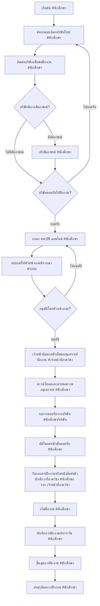

# Flow การทำงานของระบบฝึกงานบนเว็บไซต์

## 2. Flow การทำงานบนเว็บไซต์ (พร้อมระบุผู้ดำเนินการ)

## 3. รายละเอียดแต่ละขั้นตอน

### ขั้นตอนที่ 1-2: การค้นหาและเลือกบริษัท (ขั้นตอนที่สำคัญก่อนเข้าสู่ระบบ)
**หมายเหตุ: ขั้นตอนนี้ดำเนินการนอกระบบ (Offline) ทั้งหมด**

- **การค้นหาบริษัท:** นักศึกษาต้องค้นหาบริษัทที่เปิดรับนักศึกษาฝึกงานด้วยตนเอง ผ่านช่องทางต่างๆ เช่น:
  - เว็บไซต์ของบริษัท
  - การแนะนำจากอาจารย์หรือรุ่นพี่
  - Job Fair หรืองานแสดงสินค้า
  - การติดต่อโดยตรงกับบริษัท

- **การติดต่อขอฝึกงาน:** นักศึกษาติดต่อบริษัทเพื่อสอบถามโอกาสในการฝึกงาน ซึ่งอาจรวมถึง:
  - การส่งจดหมายสมัครงานหรืออีเมล
  - การโทรศัพท์สอบถาม
  - การเดินทางไปติดต่อที่บริษัทโดยตรง

- **กระบวนการสัมภาษณ์ (ถ้ามี):** บริษัทอาจมีการสัมภาษณ์นักศึกษาก่อนตัดสินใจรับฝึกงาน:
  - สัมภาษณ์แบบพบปะโดยตรง
  - สัมภาษณ์ทางโทรศัพท์หรือวิดีโอคอล
  - การทดสอบความรู้หรือทักษะพื้นฐาน

- **การได้รับการยอมรับ:** เมื่อบริษัทยอมรับให้นักศึกษาเข้าฝึกงาน นักศึกษาจึงสามารถดำเนินการต่อในระบบได้

**⚠️ สำคัญ:** นักศึกษาต้องได้รับการยอมรับจากบริษัทเรียบร้อยแล้วก่อน ถึงจะสามารถกรอกแบบฟอร์ม คพ.05 ในระบบได้

### ขั้นตอนที่ 3: การกรอกแบบฟอร์ม คพ.05 ออนไลน์
- กรอกแบบฟอร์ม คพ.05 ออนไลน์ โดยระบุข้อมูลบริษัทที่ยอมรับให้ฝึกงานแล้ว
- แนบผลการเรียนในรูปแบบ PDF
- แนบเอกสารยืนยันการยอมรับจากบริษัท (ถ้ามี)

### ขั้นตอนที่ 4-5: การอนุมัติ และการออกเอกสารขอความอนุเคราะห์
- ระบบส่งต่อให้หัวหน้าภาคพิจารณาคำร้อง คพ.05 ของนักศึกษา
- หัวหน้าภาคดำเนินการพิจารณาและอนุมัติ (หรือแจ้งให้แก้ไข) ผ่านระบบ
- ระบบแจ้งเตือนผลการพิจารณาให้นักศึกษาทราบทางอีเมล
- **กรณีอนุมัติ:** หลังจากหัวหน้าภาคอนุมัติแล้ว เจ้าหน้าที่จะดำเนินการออกหนังสือขอความอนุเคราะห์ฝึกงานในระบบ (หรือจัดเตรียมเอกสารเพื่อให้พร้อมสำหรับการดาวน์โหลดของนักศึกษา)
- **กรณีไม่อนุมัติ:** นักศึกษาสามารถตรวจสอบเหตุผลและดำเนินการแก้ไขข้อมูลในระบบ แล้วส่งคำร้อง คพ.05 เพื่อพิจารณาใหม่ได้

### ขั้นตอนที่ 6-8: การประสานงานกับบริษัท (การทำเอกสารเป็นทางการ)
- นักศึกษาดาวน์โหลดเอกสารขอความอนุเคราะห์ฝึกงาน (ที่ผ่านการอนุมัติจากหัวหน้าภาคและออกโดยเจ้าหน้าที่แล้ว) จากระบบ
- ส่งเอกสารทางการให้บริษัทเพื่อขอความอนุเคราะห์อย่างเป็นทางการ
- อัปโหลดหนังสือตอบรับจากบริษัท

### ขั้นตอนที่ 9: การบันทึกการฝึกงาน
- บันทึกเวลาเข้า-ออก
- บันทึกงานที่ได้รับมอบหมาย
- บันทึกปัญหาและการแก้ไข

### ขั้นตอนที่ 10: การสรุปผล
- สรุปชั่วโมงการฝึกงานทั้งหมด
- อัปโหลดใบประเมินจากพี่เลี้ยง
- ส่งรายงานสรุปการฝึกงาน

### ขั้นตอนที่ 11: ส่งรายงานสรุปผลการฝึกงาน
- นักศึกษาอัปโหลดรายงานสรุปผลการฝึกงานในระบบ
  - 1. รายงานสรุปผลการฝึกงาน (PDF)
    - แนบเอกสารที่เกี่ยวข้อง เช่น:
      - บันทึกฝึกงาน / ใบลงเวลางาน 240 ชั่วโมง (PDF)
  - 2. ใบประเมินผลการฝึกงานจากพี่เลี้ยง (PDF)
- เจ้าหน้าที่ภาควิชาตรวจสอบและอนุมัติรายงาน

### ขั้นตอนที่ 12: เจ้าหน้าที่ภาคส่งหนังสือรับรองการฝึกงาน

**การตรวจสอบความพร้อมอัตโนมัติ:**
- หลังจากนักศึกษาเสร็จสิ้นการฝึกงานและส่งรายงานสรุปผลแล้ว เจ้าหน้าที่ภาควิชาจะออกหนังสือรับรองการฝึกงานให้
- ขั้นตอนการส่งรายงานสรุปผล
  - จะแสดงสถานะว่า มีการประเมินผลการฝึกงานจากพี่เลี้ยงแล้วหรือไม่
  - หากมีการประเมินผลแล้ว เจ้าหน้าที่ภาควิชาจะออกหนังสือรับรองการฝึกงานให้
  - และจะแสดงสถานะให้นักศึกษาทราบว่า มีการส่งรายงานสรุปผลการฝึกงานและการประเมินผลการฝึกงานจากพี่เลี้ยงแล้ว เป็นสถานะ "รอการออกหนังสือรับรองจากเจ้าหน้าที่ภาควิชา"
  - 
- ระบบจะตรวจสอบความครบถ้วนของเอกสารอัตโนมัติ:
  - ✅ มีการส่งรายงานสรุปผลการฝึกงานแล้ว (จากขั้นตอนที่ 11)
  - ✅ มีการประเมินผลการฝึกงานจากพี่เลี้ยงแล้ว (จากระบบ Logbook)
  - ✅ ระยะเวลาฝึกงานครบถ้วนตามที่กำหนด (240 ชั่วโมง)

**การดำเนินการของเจ้าหน้าที่ภาควิชา:**
- เมื่อระบบตรวจสอบความครบถ้วนแล้ว จะแจ้งเตือนเจ้าหน้าที่ภาควิชา
- เจ้าหน้าที่ตรวจสอบข้อมูลและออกหนังสือรับรองการฝึกงาน
- ระบบจะสร้างหนังสือรับรองอัตโนมัติจากข้อมูลที่มีอยู่ในระบบ

**การแจ้งเตือนนักศึกษา:**
- ระบบแสดงสถานะ "รอการออกหนังสือรับรองจากเจ้าหน้าที่ภาควิชา"
- เมื่อเจ้าหน้าที่อนุมัติและหนังสือรับรองพร้อมแล้ว ระบบจะเปลี่ยนสถานะเป็น "หนังสือรับรองพร้อมดาวน์โหลด"
- นักศึกษาสามารถดาวน์โหลดหนังสือรับรองการฝึกงานได้ทันที

**ข้อมูลที่ระบบใช้ในการสร้างหนังสือรับรอง:**
- เป็นรูปแบบเดียวกับในไฟล์ C:\Users\chinn\CSLog\cslogbook\knowledge\334ชินกฤต_6404062630295.pdf

## 4. สถานะที่ต้องแสดงในระบบ
1. **รอการอนุมัติ คพ.05** - หลังจากนักศึกษากรอกแบบฟอร์มและส่งให้หัวหน้าภาคพิจารณา
2. **รอหนังสือตอบรับ** - หลังจากดาวน์โหลดเอกสารและส่งให้บริษัทแล้ว
3. **รอเริ่มฝึกงาน** - หลังจากได้รับหนังสือตอบรับจากบริษัทแล้ว
4. **อยู่ระหว่างฝึกงาน** - ระหว่างการฝึกงานและบันทึกกิจกรรมประจำวัน
5. **รอส่งเอกสารสรุป** - หลังจากฝึกงานเสร็จสิ้นแล้วรอส่งรายงาน
6. **เสร็จสิ้นการฝึกงาน** - ดำเนินการครบถ้วนทุกขั้นตอนแล้ว

## 5. ข้อควรระวังสำหรับนักศึกษา
- **ต้องได้รับการยอมรับจากบริษัทก่อน** ถึงจะกรอกแบบฟอร์ม คพ.05 ในระบบ
- **เตรียมเอกสารให้พร้อม** เช่น ใบแสดงผลการเรียน, Resume, Portfolio
- **วางแผนเวลาล่วงหน้า** เนื่องจากกระบวนการอนุมัติและออกเอกสารใช้เวลา
- **ติดตามสถานะในระบบสม่ำเสมอ** และตรวจสอบอีเมลแจ้งเตือน