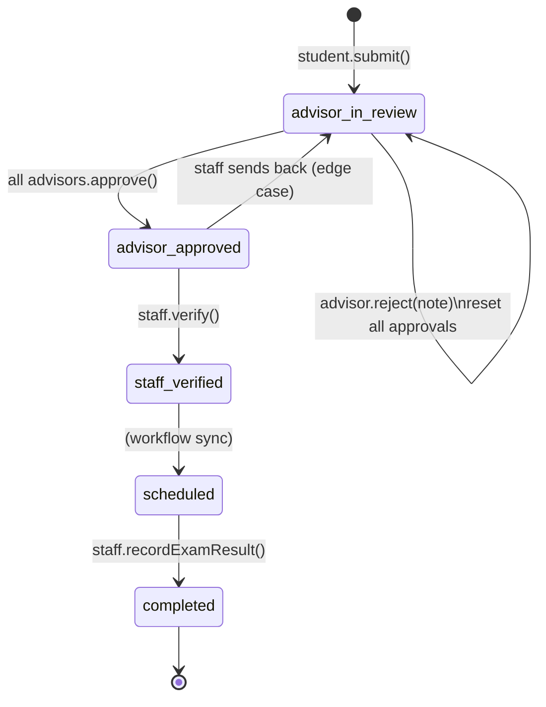

# บทที่ 4 — Pseudocode และอธิบาย Logic หลัก

> สรุปจาก source code จริง เพื่อใส่แทนตาราง source code ในเล่มปริญญานิพนธ์

---

## ตาราง 4-1: ฟังก์ชันตรวจสอบและนำเข้าข้อมูลนักศึกษา (processStudentCsvUpload)

**ไฟล์:** `backend/services/studentUploadService.js`

### Pseudocode

```
FUNCTION processStudentCsvUpload(filePath, originalName, uploader, curriculumId):

  BEGIN TRANSACTION

  // ขั้นที่ 1: ตรวจสอบและ resolve หลักสูตร
  IF curriculumId provided AND valid:
    resolvedCurriculumId ← Curriculum.findByPk(curriculumId)
    IF not found → ROLLBACK, RETURN fileError
  ELSE IF curriculumId not provided:
    currentAcademic ← Academic.findOne(isCurrent = true)
    resolvedCurriculumId ← currentAcademic.activeCurriculumId

  // ขั้นที่ 2: ตรวจสอบโครงสร้างไฟล์
  structureValidation ← validateFileStructure(filePath, extension)
  IF NOT structureValidation.isValid → ROLLBACK, RETURN fileError

  // ขั้นที่ 3: อ่านและประมวลผลแต่ละแถว
  FOR EACH row IN file (CSV or XLSX):
    normalizedRow ← normalizeRowKeys(row)
    validation ← validateCSVRowEnhanced(normalizedRow, processedStudentIDs)

    IF validation.isValid:
      // Create or Update User
      [user, created] ← User.findOrCreate(username = "s" + studentID)
      IF NOT created → user.update(email, firstName, lastName)

      // Create or Update Student
      [student, studentCreated] ← Student.findOrCreate(userId = user.userId)
      IF NOT studentCreated:
        updateData ← { studentCode }
        IF totalCredits provided → updateData.totalCredits
        IF majorCredits provided → updateData.majorCredits
        IF classroom provided → updateData.classroom
        IF resolvedCurriculumId AND (explicit OR student has no curriculum):
          updateData.curriculumId ← resolvedCurriculumId
        student.update(updateData)

      results.push({ status: created ? "Added" : "Updated" })
    ELSE:
      results.push({ status: "Invalid", errors: validation.errors })

    CATCH rowError:
      results.push({ status: "Error", error: rowError.message })
      // ไม่หยุด loop — ทำต่อแถวถัดไป

  // ขั้นที่ 4: อัปเดต eligibility flags
  FOR EACH result WHERE status IN ["Added", "Updated"]:
    student ← Student.findOne(studentCode)
    internshipOk ← student.checkInternshipEligibility()
    projectOk    ← student.checkProjectEligibility()
    student.update({ isEligibleInternship, isEligibleProject })

  // ขั้นที่ 5: บันทึกประวัติการอัปโหลด
  summary ← buildEnhancedSummary(results)
  UploadHistory.create({ uploadedBy, fileName, summary, ... })

  COMMIT TRANSACTION
  RETURN { results, summary }

  CATCH fatalError:
    ROLLBACK TRANSACTION
    THROW fatalError
```

### อธิบายภาษาไทย

ฟังก์ชันนี้รับไฟล์ CSV หรือ XLSX ที่มีข้อมูลนักศึกษา แล้วดำเนินการนำเข้าข้อมูลผ่าน transaction เดียวกันทั้งกระบวนการ โดยใช้ pattern `findOrCreate` เพื่อรองรับทั้งการเพิ่มนักศึกษาใหม่และการอัปเดตข้อมูลนักศึกษาเดิม เมื่อนำเข้าเสร็จจะอัปเดต eligibility flags ของทุกคนในชุดเดียว เพื่อให้ระบบรู้ว่าใครมีสิทธิ์เข้าถึงฝึกงานหรือโครงงานได้ทันที

### Edge Cases ที่ Handle

- **curriculumId ไม่ถูกต้อง:** คืน `fileError` ก่อนประมวลผลใดๆ
- **โครงสร้างไฟล์ผิด (headers ไม่ตรง):** คืน `fileError` ทันที
- **แถวข้อมูลผิด format (invalid):** บันทึกสถานะ `Invalid` แล้วไปต่อแถวถัดไป — ไม่ล้มทั้งไฟล์
- **Error ระดับ DB ต่อแถว:** บันทึก `Error` แล้วไปต่อ
- **curriculumId ของนักศึกษา:** อัปเดตเฉพาะเมื่อ explicit หรือนักศึกษายังไม่มี curriculum
- **Eligibility error:** log คำเตือนแต่ไม่ยกเลิก transaction

---

## ตาราง 4-5a: ฟังก์ชันตรวจสอบสิทธิ์การฝึกงาน (checkInternshipEligibility)

**ไฟล์:** `backend/models/Student.js`

### Pseudocode

```
METHOD Student.checkInternshipEligibility():

  // ขั้นที่ 1: ตรวจสอบชั้นปีจากรหัสนักศึกษา
  yearInfo ← calculateStudentYear(this.studentCode)
  IF yearInfo.error → RETURN { eligible: false, reason: "คำนวณชั้นปีไม่ได้" }
  IF yearInfo.year < 3 → RETURN { eligible: false, reason: "ต้องเป็นปี 3 ขึ้นไป" }

  // ขั้นที่ 2: โหลดเกณฑ์หน่วยกิตจากหลักสูตรที่ผูกกับนักศึกษา
  curriculum ← this.getStudentCurriculum()
  IF curriculum found:
    requiredTotal ← curriculum.internshipBaseCredits
    requiredMajor ← curriculum.internshipMajorBaseCredits
  ELSE:
    // Fallback: ใช้ active curriculum ของระบบ
    academic ← Academic.findOne(latest)
    IF academic.activeCurriculumId:
      activeCurriculum ← Curriculum.findOne(id, active=true)
      IF found:
        requiredTotal ← activeCurriculum.internshipBaseCredits
        requiredMajor ← activeCurriculum.internshipMajorBaseCredits

  IF requiredTotal undefined → RETURN { eligible: false, reason: "กำหนดเกณฑ์ไม่ได้" }

  // ขั้นที่ 3: ตรวจสอบหน่วยกิตรวม
  IF this.totalCredits < requiredTotal:
    RETURN { eligible: false, reason: "หน่วยกิตรวมไม่เพียงพอ" }

  // ขั้นที่ 4: ตรวจสอบหน่วยกิตวิชาภาค (ถ้ากำหนดไว้)
  IF requiredMajor defined AND this.majorCredits < requiredMajor:
    RETURN { eligible: false, reason: "หน่วยกิตวิชาภาคไม่เพียงพอ" }

  RETURN { eligible: true, reason: "ผ่านเกณฑ์หน่วยกิต" }
```

---

## ตาราง 4-5b: ฟังก์ชันตรวจสอบสิทธิ์โครงงาน (checkProjectEligibility)

### Pseudocode

```
METHOD Student.checkProjectEligibility():

  // ขั้นที่ 1: ตรวจสอบชั้นปี (ต้องเป็นปี 4 ขึ้นไป)
  yearInfo ← calculateStudentYear(this.studentCode)
  IF yearInfo.error → RETURN { eligible: false }
  IF yearInfo.year < 4 → RETURN { eligible: false, reason: "ต้องเป็นปี 4 ขึ้นไป" }

  // ขั้นที่ 2: โหลดเกณฑ์ (เหมือน Internship แต่ใช้ projectBaseCredits)
  curriculum ← this.getStudentCurriculum() OR fallback active curriculum
  requiredTotal       ← curriculum.projectBaseCredits
  requiredMajor       ← curriculum.projectMajorBaseCredits
  requiresInternship  ← curriculum.requireInternshipBeforeProject

  // ขั้นที่ 3: ตรวจสอบหน่วยกิต
  IF this.totalCredits < requiredTotal → RETURN { eligible: false }
  IF requiredMajor defined AND this.majorCredits < requiredMajor → RETURN { eligible: false }

  // ขั้นที่ 4: ตรวจสอบการผ่านฝึกงาน (เฉพาะหลักสูตรที่กำหนด)
  IF requiresInternship:
    completedInternship ← InternshipDocument.findOne(studentId, status="completed")
    IF NOT found → RETURN { eligible: false, reason: "ต้องผ่านฝึกงานก่อน" }

  RETURN { eligible: true, canAccessFeature: true, canRegister: true }
```

### อธิบายภาษาไทย — เงื่อนไข unlock ต่างกันอย่างไร

| เงื่อนไข | Internship | Special Project |
|---------|-----------|-----------------|
| ชั้นปีขั้นต่ำ | ปี 3 | ปี 4 |
| หน่วยกิตรวม | `internshipBaseCredits` | `projectBaseCredits` |
| หน่วยกิตวิชาภาค | `internshipMajorBaseCredits` | `projectMajorBaseCredits` |
| ต้องผ่านฝึกงานก่อน | ไม่มี | ขึ้นอยู่กับ `requireInternshipBeforeProject` |

เกณฑ์ทั้งหมดอ่านมาจาก `Curriculum` ที่ผูกกับนักศึกษาแต่ละคน ทำให้รองรับนักศึกษาหลายหลักสูตรที่มีเกณฑ์แตกต่างกันในระบบเดียวกัน

### ตัวอย่าง Scenario

> **นักศึกษาชั้นปี 3 มี 75 หน่วยกิตรวม, 40 วิชาภาค** — หลักสูตรกำหนด internshipBaseCredits = 70, internshipMajorBaseCredits = 35
>
> → `checkInternshipEligibility()`: ปี 3 ✓, totalCredits 75 ≥ 70 ✓, majorCredits 40 ≥ 35 ✓ → **eligible: true**
>
> → `checkProjectEligibility()`: ปี 3 < 4 → **eligible: false** (ต้องเป็นปี 4 ขึ้นไป)

---

## ตาราง 4-6: ฟังก์ชันยื่นคำร้องขอฝึกงาน คพ.05 (submitCS05 / submitCS05WithTranscript)

**ไฟล์:** `backend/services/internship/document.service.js`

### Pseudocode

```
FUNCTION submitCS05WithTranscript(userId, fileData, formData, deadlineInfo):

  // ขั้นที่ 1: ตรวจสอบไฟล์ transcript
  IF fileData is null → THROW "กรุณาแนบไฟล์ Transcript"
  IF fileData.mimetype ≠ "application/pdf" → THROW "ต้องเป็น PDF เท่านั้น"

  BEGIN TRANSACTION

  // ขั้นที่ 2: ตรวจ duplicate pending
  existingPending ← Document.findOne(userId, documentName="CS05", status="pending")
  IF found → THROW "มีคำร้อง CS05 รอการพิจารณาอยู่แล้ว"

  // ขั้นที่ 3: ตรวจว่าเคย reject หรือไม่
  rejectedDocument ← Document.findOne(userId, documentName="CS05", status="rejected")

  IF rejectedDocument found:
    // Resubmit — อัปเดตเอกสารเดิม (ไม่สร้างใหม่ เพื่อเก็บ audit trail)
    DocumentLog.create({ actionType:"update", previousStatus:"rejected", newStatus:"pending" })
    rejectedDocument.update({
      status: "pending",
      filePath, fileSize, mimeType,
      isLate, lateMinutes,          // บันทึกว่าส่งช้าหรือไม่
      submittedAt: now,
      reviewerId: null,             // รีเซ็ต reviewer
    })
    // อัปเดต InternshipDocument เดิม
    rejectedDocument.internshipDocument.update({ companyName, startDate, endDate, ... })
    document    ← rejectedDocument
    internshipDoc ← rejectedDocument.internshipDocument

  ELSE:
    // New submission
    document ← Document.create({
      userId, documentType:"INTERNSHIP", documentName:"CS05",
      category:"proposal", status:"pending", filePath
    })
    internshipDoc ← InternshipDocument.create({
      documentId, companyName, companyAddress, internshipPosition,
      startDate, endDate, supervisorName, supervisorPhone, supervisorEmail,
      academicYear, semester, status:"pending"
    })

  // ขั้นที่ 4: อัปเดต Student status
  student ← Student.findOne(userId)
  student.update({
    internshipStatus: "pending_approval",
    isEnrolledInternship: true,
    classroom,            // อัปเดตห้อง
    phoneNumber           // อัปเดตเบอร์โทร
  })

  COMMIT TRANSACTION
  RETURN { documentId, internshipDocId, status:"pending" }
```

### อธิบายภาษาไทย

เมื่อนักศึกษากดยื่น คพ.05 ระบบจะตรวจสอบก่อนว่ามีคำร้องที่ค้างอยู่หรือไม่ ถ้ายังมีคำร้อง pending อยู่จะไม่อนุญาตให้ยื่นซ้ำ แต่ถ้าเคยถูก reject มาก่อน ระบบจะอัปเดตเอกสารเดิมแทนการสร้างใหม่ เพื่อรักษา audit trail สำหรับตรวจสอบย้อนหลัง

### State Transitions

```
[ไม่มีคำร้อง] ──submit──► pending_approval (ใน Student)
                            Document.status = "pending"

[rejected] ──resubmit──► Document.status = "pending" (เอกสารเดิม)
                          DocumentLog บันทึก "resubmit"
```

---

## ตาราง 4-9: ฟังก์ชันสร้าง PDF หนังสือรับรองการฝึกงาน (createCertificatePDF)

**ไฟล์:** `backend/services/internship/certificate.service.js`

### Pseudocode

```
FUNCTION createCertificatePDF(certificateData):

  RETURN Promise((resolve, reject) =>

    // ขั้นที่ 1: สร้าง PDFDocument (A4, margins)
    doc ← new PDFDocument({ size:"A4", margins:{top:50,...} })

    // ขั้นที่ 2: Stream buffer
    buffers ← []
    doc.on("data", chunk → buffers.push(chunk))
    doc.on("end", () → resolve(Buffer.concat(buffers)))

    // ขั้นที่ 3: ลงทะเบียน Thai font
    doc.registerFont("Thai",      FONT_REGULAR)   // Sarabun Regular
    doc.registerFont("Thai-Bold", FONT_BOLD)       // Sarabun Bold

    // ขั้นที่ 4: วาง layout เอกสาร
    // — หัวเรื่อง
    doc.font("Thai-Bold").fontSize(20).text("หนังสือรับรองการฝึกงาน", align:"center")

    // — เลขที่เอกสาร / วันที่ (formatThaiDate → พ.ศ.)
    doc.text("เลขที่: " + certNumber, align:"left")
    doc.text("วันที่: " + formatThaiDate(issueDate), align:"right")

    // — เนื้อหาหลัก (ชื่อนักศึกษา, รหัส, สาขา, มหาวิทยาลัย)
    doc.font("Thai-Bold").text(studentFullName, underline:true)
    doc.font("Thai-Bold").text("รหัสนักศึกษา " + studentId, underline:true)
    doc.text(faculty)
    doc.text(university)

    // — รายละเอียดการฝึกงาน
    doc.font("Thai-Bold").text("ได้เข้าฝึกงาน ณ " + companyName, underline:true)
    doc.text("ตั้งแต่ " + formatThaiDate(startDate) + " ถึง " + formatThaiDate(endDate))
    doc.text("รวม " + approvedDays + " วัน เป็นเวลา " + approvedHours + " ชั่วโมง")
    doc.text("โดยมีผลการปฏิบัติงานในระดับที่น่าพอใจ")

    // — ลงนาม
    doc.text("ออกให้ ณ วันที่ " + formatThaiDate(issueDate), align:"center")
    doc.font("Thai-Bold").text(approvedBy OR departmentHead.name, align:"center")
    doc.text(approverTitle OR departmentHead.title, align:"center")

    // ขั้นที่ 5: ปิด document (trigger "end" event)
    doc.end()
  )
```

### อธิบายภาษาไทย

เอกสาร PDF ประกอบด้วย 4 ส่วนหลัก: (1) หัวเอกสาร ชื่อ เลขที่ วันที่ออก (2) ข้อมูลนักศึกษา ชื่อ-นามสกุล รหัส สาขา มหาวิทยาลัย (3) รายละเอียดการฝึกงาน ชื่อบริษัท วันเริ่ม-สิ้นสุด จำนวนวัน/ชั่วโมง และผลการปฏิบัติงาน (4) ส่วนลงนาม ชื่อหัวหน้าภาควิชาจาก `DEPARTMENT_INFO`

### Technical Challenges ที่แก้ไข

- **Thai font:** PDFKit ไม่รองรับ Thai font by default — แก้โดย register Sarabun TTF ผ่าน `doc.registerFont()` ก่อนใช้งาน
- **วันที่ภาษาไทย:** ใช้ `formatThaiDate()` แปลง JS Date → ปี พ.ศ. ชื่อเดือนภาษาไทย
- **Layout positioning:** ใช้ `doc.moveDown()` จัดระยะห่างแทน absolute coordinates ทำให้ responsive กับ content ยาว-สั้น
- **Buffer streaming:** สร้าง PDF ใน memory (buffer array) ไม่เขียนไฟล์ชั่วคราว — ส่ง buffer กลับโดยตรงเพื่อความเร็ว

---

## ตาราง 4-11: ฟังก์ชันยื่นเสนอหัวข้อโครงงานพิเศษ (createProject + activateProject)

**ไฟล์:** `backend/services/projectDocumentService.js`

### Pseudocode — ขั้นที่ 1: สร้างหัวข้อ (createProject)

```
FUNCTION createProject(studentId, payload):

  BEGIN TRANSACTION

  // ขั้นที่ 1: ตรวจสอบนักศึกษา
  student ← Student.findByPk(studentId)
  IF NOT student → THROW "ไม่พบนักศึกษา"

  // ขั้นที่ 2: ตรวจสอบ block conditions
  // กรณีสอบหัวข้อไม่ผ่านและ acknowledge แล้ว หรือถูกยกเลิก → รอรอบใหม่
  blockExisting ← ProjectMember.findOne(studentId,
    project.status IN [failed+archived+acknowledged, cancelled])
  IF found → THROW "รอรอบยื่นหัวข้อถัดไป"

  // ขั้นที่ 3: ตรวจ eligibility (ปี 4+, หน่วยกิตผ่านเกณฑ์)
  projCheck ← student.checkProjectEligibility()
  IF NOT projCheck.eligible → THROW "ยังไม่มีสิทธิ์สร้างโครงงาน: {reason}"

  // ขั้นที่ 4: กันโครงงาน active ซ้ำ
  existing ← ProjectMember.findOne(studentId, project.status NOT IN [archived, cancelled])
  IF found → THROW "มีโครงงานที่ยังไม่เสร็จสิ้นอยู่แล้ว"

  // ขั้นที่ 5: ตรวจช่วงเวลาลงทะเบียน
  academic ← Academic.findOne(isCurrent = true)
  IF academic.projectRegistration defined:
    IF now < startDate → THROW "ช่วงลงทะเบียนยังไม่เปิด"
    IF now > endDate   → THROW "ช่วงลงทะเบียนปิดแล้ว"

  // ขั้นที่ 6: ตรวจสอบสมาชิกคนที่ 2 (REQUIRED)
  IF NOT payload.secondMemberStudentCode → THROW "ต้องมีสมาชิก 2 คน"
  secondMember ← Student.findOne(studentCode)
  IF NOT found         → THROW "ไม่พบนักศึกษา"
  IF same as actor     → THROW "ไม่สามารถเพิ่มตัวเองซ้ำ"
  IF NOT isEligibleProject → THROW "สมาชิกคนที่ 2 ยังไม่ผ่านเกณฑ์"
  IF secondMember has active project → THROW "สมาชิกมีโครงงานอยู่แล้ว"
  IF secondMember blocked (failed/cancelled) → THROW "ต้องรอรอบถัดไป"

  // ขั้นที่ 7: สร้าง ProjectDocument (status = "draft")
  project ← ProjectDocument.create({
    projectNameTh, projectNameEn, projectType,
    advisorId: null,        // ยังไม่กำหนดอาจารย์
    objective, background, scope, tools, ...
    academicYear, semester,
    createdByStudentId: studentId,
    status: "draft"
  })

  // สร้าง ProjectTrack (ถ้า payload.tracks มี)
  IF payload.tracks.length > 0:
    ProjectTrack.bulkCreate(tracks.map → { projectId, trackCode })

  // ขั้นที่ 8: เพิ่มสมาชิก
  ProjectMember.create({ projectId, studentId, role: "leader" })
  ProjectMember.create({ projectId, studentId: secondMember.studentId, role: "member" })

  // ขั้นที่ 9: สร้าง workflow state เริ่มต้น (phase = "DRAFT")
  ProjectWorkflowState.createForProject(projectId, { phase:"DRAFT" })
  syncProjectWorkflowState(projectId)

  COMMIT TRANSACTION
  RETURN getProjectById(projectId)
```

### Pseudocode — ขั้นที่ 2: ยืนยันส่งหัวข้อ (activateProject)

```
FUNCTION activateProject(projectId, actorStudentId):

  BEGIN TRANSACTION

  // ขั้นที่ 1: ตรวจสอบ project และ membership
  project ← ProjectDocument.findByPk(projectId)
  IF NOT project → THROW "ไม่พบโครงงาน"
  member  ← ProjectMember.findOne(projectId, studentId = actorStudentId)
  IF NOT member → THROW 403 "อนุญาตเฉพาะสมาชิก"

  // ขั้นที่ 2: ตรวจสอบความพร้อมก่อนส่ง
  members ← ProjectMember.findAll(projectId)
  IF members.length ≠ 2          → THROW "ต้องมีสมาชิกครบ 2 คน"
  IF NOT project.advisorId       → THROW "ต้องเลือกอาจารย์ที่ปรึกษาก่อน"
  IF NOT projectNameTh/En        → THROW "กรอกชื่อโครงงานให้ครบ"
  IF NOT projectType OR track    → THROW "กรอกประเภทและ track ให้ครบ"

  // Idempotent guard
  IF project.status = "in_progress" → RETURN (ไม่ทำซ้ำ)
  IF status IN ["completed","archived"] → THROW "ไม่สามารถเปิดได้"

  // ขั้นที่ 3: คำนวณ late submission
  lateStatus ← calculateTopicSubmissionLate(now, { academicYear, semester })

  // ขั้นที่ 4: เปลี่ยน status เป็น "in_progress" (หัวข้อถูกส่งแล้ว)
  ProjectDocument.update({
    status: "in_progress",
    submittedLate: lateStatus.submitted_late,
    submissionDelayMinutes: lateStatus.submission_delay_minutes
  }, where: projectId)

  syncProjectWorkflowState(projectId)

  COMMIT TRANSACTION
  RETURN getProjectById(projectId)
```

### อธิบายภาษาไทย

กระบวนการยื่นเสนอหัวข้อโครงงานพิเศษแบ่งเป็น 2 ขั้นตอน ขั้นแรก `createProject` ใช้สร้างหัวข้อในสถานะ `draft` ระบบตรวจสอบสิทธิ์ของนักศึกษาทั้ง 2 คนก่อน ได้แก่ ชั้นปีและหน่วยกิต ตรวจว่าแต่ละคนไม่มีโครงงาน active อยู่ และอยู่ในช่วงเวลาที่เปิดรับ ขั้นที่สอง `activateProject` ใช้ยืนยันการส่ง โดยตรวจสอบว่ากรอกข้อมูลครบถ้วน (ชื่อ ประเภท track อาจารย์) แล้วจึงเปลี่ยนสถานะเป็น `in_progress` ซึ่งหมายถึงหัวข้อถูกส่งให้เจ้าหน้าที่พิจารณาแล้ว

### State Transitions

```
[ไม่มีโครงงาน]
     │
     │ createProject()
     ▼
  [draft]  ← นักศึกษากรอกข้อมูล เลือกอาจารย์
     │
     │ activateProject()  (ตรวจสอบ 4 เงื่อนไขครบ)
     ▼
 [in_progress]  ← หัวข้อถูกส่งแล้ว รอผลสอบหัวข้อ
     │
     ├── examResult = "passed"  → unlock โครงงานพิเศษ 1 (phase1)
     └── examResult = "failed"  → [archived] รอรอบใหม่
```

### Edge Cases ที่ Handle

- **Idempotent activate:** ถ้า status = `in_progress` อยู่แล้ว return ทันทีโดยไม่ error
- **Block after fail:** นักศึกษาที่รับทราบผลสอบหัวข้อไม่ผ่านแล้วไม่สามารถสร้างหัวข้อใหม่ได้จนกว่าจะถึงรอบถัดไป
- **Block cancelled:** โครงงานที่ถูก admin ยกเลิก ทั้งผู้สร้างและสมาชิกคนที่ 2 ต้องรอรอบใหม่
- **Late submission tracking:** บันทึกว่าส่งช้าหรือไม่เทียบกับ deadline ที่ตั้งไว้ในระบบ

---

## ตาราง 4-12: ฟังก์ชันสร้างการนัดพบอาจารย์ (createMeeting)

**ไฟล์:** `backend/services/meeting/meetingCoreService.js`

### Pseudocode

```
FUNCTION createMeeting(projectId, actor, payload):

  // ขั้นที่ 1: ตรวจสิทธิ์เข้าถึงโครงงาน
  context ← ensureProjectAccess(projectId, actor, includeMembers:true)

  // ขั้นที่ 2: Validate payload
  IF NOT payload.meetingTitle → THROW 400 "กรุณาระบุหัวข้อการประชุม"
  IF NOT payload.meetingDate  → THROW 400 "กรุณาระบุวันเวลา"
  IF meetingMethod NOT IN ["onsite","online","hybrid"] → THROW 400

  // ขั้นที่ 3: กำหนด phase (phase1 หรือ phase2)
  meetingPhase ← payload.phase IN MEETING_PHASES ? payload.phase : "phase1"

  IF meetingPhase === "phase2":
    // Phase 2 = ปริญญานิพนธ์ — ต้องผ่านสอบโครงงาน 1 ก่อน
    IF project.examResult ≠ "passed" → THROW 400
    IF project.status NOT IN ["in_progress","completed"] → THROW 400

  BEGIN TRANSACTION

  // ขั้นที่ 4: สร้าง Meeting record
  meeting ← Meeting.create({
    meetingTitle, meetingDate, meetingMethod,
    meetingLocation, meetingLink,
    status: payload.status OR "scheduled",
    projectId, createdBy: actor.userId,
    phase: meetingPhase
  })

  // ขั้นที่ 5: สร้าง Participants (advisor + members)
  participants ← buildParticipants({
    meetingId, project, members, actor,
    additionalParticipantIds
  })
  IF participants.length = 0 → THROW 400 "ต้องมีผู้เข้าร่วมอย่างน้อย 1 คน"
  MeetingParticipant.bulkCreate(participants, ignoreDuplicates:true)

  COMMIT TRANSACTION

  // ขั้นที่ 6: ดึง Meeting พร้อม relations และส่ง notification
  result ← Meeting.findByPk(meetingId, include:[participants, logs])
  IF NOT payload.suppressNotifications:
    notificationService.notifyNewMeeting(result, notificationNote)

  RETURN serializeMeeting(result)
```

### อธิบายภาษาไทย

การสร้าง Meeting แยก logic ตาม phase ชัดเจน: phase1 ใช้สำหรับโครงงานพิเศษ 1 ไม่มีเงื่อนไขพิเศษ แต่ phase2 (ปริญญานิพนธ์) ต้องตรวจสอบก่อนว่าโครงงานผ่านการสอบ phase1 แล้ว (`examResult = "passed"`) ป้องกันนักศึกษาสร้าง meeting phase2 ก่อนถึงเวลา

### Data Model ที่เกี่ยวข้อง

```
Meeting (meetingId, projectId, phase, meetingTitle, meetingDate, meetingMethod, status, createdBy)
  └── MeetingParticipant (meetingId, userId, role)
  └── MeetingLog (meetingId, discussionTopic, currentProgress, approvalStatus)
       └── MeetingActionItem (logId, actionDescription, assignedTo, dueDate)
       └── MeetingAttachment (logId, filePath)
```

---

## ตาราง 4-14: ฟังก์ชันอนุมัติ/ปฏิเสธบันทึกการพบ (updateLogApproval)

**ไฟล์:** `backend/services/meeting/meetingApprovalService.js`

### Pseudocode

```
FUNCTION updateLogApproval(projectId, meetingId, logId, actor, payload):

  // ขั้นที่ 1: ตรวจสิทธิ์ — เฉพาะ admin หรือ teacher
  IF actor.role NOT IN ["admin","teacher"] → THROW 403

  IF actor.role === "teacher":
    teacher ← Teacher.findOne(userId=actor.userId)
    IF NOT (teacher.teacherId IN [project.advisorId, project.coAdvisorId]):
      THROW 403 "อาจารย์ไม่ได้รับมอบหมายโครงงานนี้"

  // ขั้นที่ 2: ค้นหา MeetingLog
  log ← MeetingLog.findOne(logId, meetingId)
  IF NOT found → THROW 404

  // ขั้นที่ 3: ตรวจสอบ decision value
  decision ← payload.status OR payload.decision (default "approved")
  IF decision NOT IN ["pending","approved","rejected"] → THROW 400

  // ขั้นที่ 4: อัปเดต approval
  update = {
    approvalStatus: decision,
    approvalNote: payload.approvalNote,
    advisorComment: payload.advisorComment
  }
  IF decision = "pending":
    update.approvedBy = null; update.approvedAt = null
  ELSE:
    update.approvedBy = actor.userId; update.approvedAt = now

  MeetingLog.update(update, where: logId)

  // ขั้นที่ 5: ส่ง notification เมื่อ reject
  IF decision = "rejected":
    notificationService.createAndNotify(log.recordedBy, {
      title: "บันทึกการพบอาจารย์ถูกส่งกลับ",
      message: payload.approvalNote
    })

  RETURN serializeLog(updated)
```

### อธิบายภาษาไทย

Pattern นี้ใช้ซ้ำในระบบทุกจุดที่ต้องการ Advisor approval โดยหลักการคือ: ตรวจสิทธิ์ → ตรวจ entity → update status → notify เมื่อ reject คล้ายกับ `submitAdvisorDecision` แต่ระดับ granularity ต่างกัน (MeetingLog เป็นระดับ record, DefenseRequest เป็นระดับ workflow)

### State Diagram

```
[pending] ──advisor approve──► [approved]  (นับเป็น 1 ครั้ง สำหรับเงื่อนไข ≥ 4 ครั้ง)
[pending] ──advisor reject──►  [rejected]  (notify นักศึกษา + ต้องแก้ไขแล้วส่งใหม่)
[rejected] ──student edit──►   [pending]   (รีเซ็ต approvedBy, approvedAt อัตโนมัติ)
[approved] ──ห้ามแก้ไข──────►  (ล็อก — นักศึกษาแก้ไม่ได้)
```

---

## ตาราง 4-15: ฟังก์ชันยื่นคำขอสอบโครงงานพิเศษ 1 (submitProject1Request)

**ไฟล์:** `backend/services/projectDefenseRequestService.js`

### Pseudocode

```
FUNCTION submitProject1Request(projectId, actorStudentId, payload):

  BEGIN TRANSACTION (with SELECT FOR UPDATE)

  // ขั้นที่ 1: ตรวจสอบ project และ membership
  project ← ProjectDocument.findByPk(projectId, lock:UPDATE)
  IF NOT project → THROW "ไม่พบโครงงาน"
  IF actorStudentId NOT IN project.members → THROW 403

  // ขั้นที่ 2: ตรวจ project status
  IF project.status NOT IN ["in_progress","completed"] → THROW "โครงงานต้องอยู่ใน in_progress"

  // ขั้นที่ 3: ตรวจสอบบันทึกพบอาจารย์ ≥ 4 ครั้ง (approved)
  meetingMetrics ← buildProjectMeetingMetrics(projectId, students, phase:"phase1")
  actorMetrics   ← meetingMetrics.perStudent[actorStudentId]
  IF actorMetrics.approvedLogs < REQUIRED_MEETING_LOGS:
    THROW "ต้องมีบันทึกพบอาจารย์ที่อนุมัติแล้วอย่างน้อย N ครั้ง"

  // ขั้นที่ 4: Validate และ normalize payload (วันสอบ, กรรมการ, สถานที่)
  cleanedPayload ← normalizeProject1Payload(payload, project)
  validateProject1Payload(cleanedPayload)

  // ขั้นที่ 5: ตรวจ existing request
  record ← ProjectDefenseRequest.findOne(projectId, defenseType:"PROJECT1", lock:UPDATE)
  IF record AND status IN ["scheduled","completed"] → THROW "ไม่สามารถแก้ไขได้"

  // คำนวณ late submission
  lateStatus ← calculateDefenseRequestLate(now, "PROJECT1", { academicYear, semester })

  basePayload = {
    formPayload: cleanedPayload,
    status: "advisor_in_review",
    submittedByStudentId: actorStudentId,
    submittedAt: now,
    submittedLate: lateStatus.submitted_late,
    submissionDelayMinutes: lateStatus.submission_delay_minutes
  }

  IF record exists:
    record.update(basePayload)          // resubmit
  ELSE:
    record ← ProjectDefenseRequest.create({ projectId, defenseType:"PROJECT1", ...basePayload })

  // ขั้นที่ 6: สร้าง advisor approval rows (หนึ่ง row ต่ออาจารย์)
  advisorAssignments ← getAdvisorAssignments(project)  // [main, co-advisor]
  ProjectDefenseRequestAdvisorApproval.destroy({ requestId })  // reset ก่อน
  IF advisorAssignments.length > 0:
    bulkCreate approval rows (status: "pending") per advisor
  ELSE:
    // ไม่มีอาจารย์ → ข้ามขั้น advisor
    record.update({ status: "advisor_approved" })

  // ขั้นที่ 7: อัปเดต workflow state
  ProjectWorkflowState.updateFromDefenseRequest(projectId, "PROJECT1", requestId, "submitted")
  projectDocumentService.syncProjectWorkflowState(projectId)

  COMMIT TRANSACTION
  RETURN getProject1Request(projectId, withMetrics:true)
```

### อธิบายภาษาไทย

ฟังก์ชันนี้เป็น core workflow ของการสอบโครงงานพิเศษ มี prerequisite checks 3 ชั้น: (1) membership ในโครงงาน (2) status โครงงาน และ (3) จำนวนบันทึกพบอาจารย์ที่ผ่านการอนุมัติแล้วครบตามเกณฑ์ เมื่อผ่านจะสร้าง approval record แยกต่อหัวอาจารย์แต่ละคน ทำให้ระบบรองรับกรณีที่มีทั้ง advisor หลักและ co-advisor

### Approval Chain

```
Student submit
   └─► status: "advisor_in_review"
           └─► [each advisor approves]
                   └─► ALL approved? → status: "advisor_approved"
                   └─► ANY rejected? → status: "advisor_in_review" (กลับไปแก้ไข)
                           └─► staff.verify()
                                   └─► status: "staff_verified" (รอนัดสอบ)
```

---

## ตาราง 4-18: ฟังก์ชันตัดสินใจของอาจารย์ (submitAdvisorDecision)

**ไฟล์:** `backend/services/projectDefenseRequestService.js`

### Pseudocode

```
FUNCTION submitAdvisorDecision(projectId, teacherId, {decision, note}, {defenseType}):

  // ขั้นที่ 1: Normalize decision value
  decision ← normalize("approve"→"approved", "reject"→"rejected")
  IF decision NOT IN ["approved","rejected"] → THROW "รูปแบบไม่ถูกต้อง"
  IF decision = "rejected" AND note.length < 5 → THROW "ต้องระบุหมายเหตุอย่างน้อย 5 ตัวอักษร"

  BEGIN TRANSACTION (with SELECT FOR UPDATE)

  // ขั้นที่ 2: ตรวจสอบ request
  request ← ProjectDefenseRequest.findOne(projectId, defenseType, lock:UPDATE)
  IF NOT request → THROW "ไม่พบคำขอสอบ"
  IF request.status IN ["scheduled","completed"] → THROW "ไม่สามารถเปลี่ยนแปลงได้"

  // ขั้นที่ 3: ตรวจสิทธิ์ของอาจารย์คนนี้
  approval ← ProjectDefenseRequestAdvisorApproval.findOne(requestId, teacherId, lock:UPDATE)
  IF NOT approval → THROW 403 "ไม่มีสิทธิ์"

  // ขั้นที่ 4: บันทึกการตัดสินใจ
  approval.update({ status: decision, note, approvedAt: now })

  // ขั้นที่ 5: Aggregate ทุกอาจารย์ — กำหนด request status ใหม่
  allApprovals ← ProjectDefenseRequestAdvisorApproval.findAll(requestId)
  hasRejected ← any approval.status = "rejected"
  allApproved ← all approvals.status = "approved"

  IF hasRejected:
    request.update({ status: "advisor_in_review", advisorApprovedAt: null })
  ELSE IF allApproved:
    request.update({ status: "advisor_approved", advisorApprovedAt: now })
  ELSE:  // บางคนยังไม่ตัดสินใจ
    request.update({ status: "advisor_in_review" })

  syncProjectWorkflowState(projectId)
  COMMIT TRANSACTION

  // ขั้นที่ 6: Notify นักศึกษาเมื่อ reject
  IF hasRejected:
    members ← ProjectMember.findAll(projectId)
    notificationService.createAndNotifyMany(memberUserIds, {
      title: "คำขอสอบถูกส่งกลับ",
      message: note OR "กรุณาตรวจสอบและแก้ไข"
    })

  RETURN serializeRequest(refreshed)
```

### อธิบายภาษาไทย

Logic สำคัญอยู่ที่การ aggregate ผลการตัดสินใจของอาจารย์หลายคน: ถ้าอาจารย์คนใดคนหนึ่ง reject ทั้ง request จะกลับสถานะเป็น `advisor_in_review` ทันที แม้คนอื่นจะ approve แล้ว แต่ถ้าทุกคน approve request จึงจะเลื่อนไปขั้นถัดไป

### Rejection Flow

```
advisor.reject(note)
   └─► approval.status = "rejected"
   └─► request.status  = "advisor_in_review"  (ยังไม่ผ่าน)
   └─► notify students (title, reason)
   └─► student แก้ไข form แล้ว resubmit ใหม่
         └─► approval rows ถูก destroy + recreate (reset ทุกอาจารย์)
```

---

## ตาราง 4-24: ฟังก์ชันคำขอทดสอบระบบและอัปโหลดหลักฐาน (System Test Flow)

**ไฟล์:** `backend/services/projectSystemTestService.js`

> flow นี้เป็น prerequisite บังคับของ `submitThesisRequest` — นักศึกษาต้องผ่านทุกขั้นก่อนถึงยื่นสอบปริญญานิพนธ์ได้

---

### Pseudocode — ขั้นที่ 1: ยื่นคำขอทดสอบระบบ (submitRequest)

```
FUNCTION submitRequest(projectId, actor, payload, fileMeta):

  BEGIN TRANSACTION

  // ขั้นที่ 1: ตรวจสิทธิ์
  { project } ← ensureProjectAccess(projectId, actor)
  IF actor.role ≠ "student" → THROW 403
  IF project.status NOT IN ["in_progress","completed"] → THROW "โครงงานต้องอยู่ใน in_progress"

  // ขั้นที่ 2: ตรวจ duplicate request
  latest ← findLatest(projectId)
  IF latest.status IN ["pending_advisor","pending_staff"]:
    THROW "มีคำขอที่อยู่ระหว่างพิจารณาอยู่แล้ว"
  IF latest.status = "staff_approved" AND NOT latest.evidenceSubmittedAt:
    THROW "กรุณาอัปโหลดหลักฐานคำขอเดิมก่อน"

  // ขั้นที่ 3: ตรวจช่วงวันทดสอบ (ต้องไม่น้อยกว่า 30 วัน)
  startDay ← normalizeDateInput(payload.testPeriodStart)
  dueDay   ← normalizeDateInput(payload.testPeriodEnd)
  IF NOT startDay OR NOT dueDay → THROW "ระบุช่วงเวลาให้ครบ"
  IF dueDay.isBefore(startDay)  → THROW "วันสิ้นสุดต้องอยู่หลังวันเริ่ม"
  durationDays ← dueDay.diff(startDay, "day")
  IF durationDays < 29          → THROW "ต้องทดสอบอย่างน้อย 30 วัน"
  IF startDay.isAfter(now + 30d) → THROW "วันเริ่มต้องอยู่ภายใน 30 วันข้างหน้า"

  // ขั้นที่ 4: ตรวจบันทึกพบอาจารย์ phase1 ≥ N ครั้ง
  meetingMetrics ← buildProjectMeetingMetrics(projectId, students, phase:"phase1")
  IF actorMetrics.approvedLogs < REQUIRED_LOGS → THROW "บันทึกพบอาจารย์ไม่ครบเกณฑ์"

  // ขั้นที่ 5: สร้าง ProjectTestRequest
  lateStatus ← calculateSystemTestRequestLate(now, { academicYear, semester })
  record ← ProjectTestRequest.create({
    projectId, submittedByStudentId: actor.studentId,
    status: "pending_advisor",
    requestFilePath: fileMeta?.path,
    testStartDate: startDay, testDueDate: dueDay,
    advisorTeacherId: project.advisorId,
    coAdvisorTeacherId: project.coAdvisorId,
    submittedLate: lateStatus.submitted_late,
    submissionDelayMinutes: lateStatus.submission_delay_minutes
  })

  COMMIT TRANSACTION
  RETURN serialize(findLatest(projectId))
```

---

### Pseudocode — ขั้นที่ 2: อาจารย์อนุมัติ/ปฏิเสธ (submitAdvisorDecision)

```
FUNCTION submitAdvisorDecision(projectId, actor, payload):

  BEGIN TRANSACTION

  // ตรวจสิทธิ์ — ต้องเป็นอาจารย์ที่ปรึกษาของโครงงานนี้
  IF actor.role ≠ "teacher" OR NOT isAdvisorOf(project, actor.teacherId) → THROW 403

  record ← findLatest(projectId)
  IF NOT record → THROW "ยังไม่มีคำขอ"
  IF record.status ≠ "pending_advisor" → THROW "คำขอไม่อยู่ในสถานะรออาจารย์"

  decision ← normalize(payload.decision)  // "approve" | "reject"

  // บันทึก decision ตาม role (advisor หรือ co-advisor)
  IF isAdvisor:
    update.advisorDecidedAt = now; update.advisorDecisionNote = note
  ELSE IF isCoAdvisor:
    update.coAdvisorDecidedAt = now; update.coAdvisorDecisionNote = note

  IF decision = "reject":
    update.status ← "advisor_rejected"   // reject คนเดียวก็จบทันที
  ELSE:  // approve
    advisorOk   ← isAdvisor    ? true : !!record.advisorDecidedAt
    coAdvisorOk ← isCoAdvisor  ? true : !!record.coAdvisorDecidedAt

    IF hasCoAdvisor:
      update.status ← (advisorOk AND coAdvisorOk) ? "pending_staff" : "pending_advisor"
    ELSE:
      update.status ← "pending_staff"   // ไม่มี co-advisor → ผ่านทันที

  record.update(update)
  COMMIT

  IF rejected: notify students({ title:"คำขอทดสอบระบบถูกส่งกลับ" })
  RETURN serialize(findLatest(projectId))
```

---

### Pseudocode — ขั้นที่ 3: เจ้าหน้าที่อนุมัติ/ปฏิเสธ (submitStaffDecision)

```
FUNCTION submitStaffDecision(projectId, actor, payload):

  BEGIN TRANSACTION

  IF NOT isStaff(actor) → THROW 403

  record ← findLatest(projectId)
  IF NOT record → THROW "ยังไม่มีคำขอ"
  IF record.status ≠ "pending_staff" → THROW "คำขอไม่อยู่ในสถานะรอเจ้าหน้าที่"

  decision ← normalize(payload.decision)  // "approve" | "reject"

  record.update({
    staffUserId: actor.userId,
    staffDecidedAt: now,
    staffDecisionNote: payload.note,
    status: decision = "approve" ? "staff_approved" : "staff_rejected"
  })

  COMMIT

  IF rejected: notify students({ title:"คำขอทดสอบระบบถูกส่งกลับจากเจ้าหน้าที่" })
  RETURN serialize(findLatest(projectId))
```

---

### Pseudocode — ขั้นที่ 4: อัปโหลดหลักฐานการประเมิน (uploadEvidence)

```
FUNCTION uploadEvidence(projectId, actor, fileMeta, { evidenceDriveLink }):

  // ตรวจสอบ input
  IF NOT fileMeta AND NOT evidenceDriveLink → THROW "ต้องแนบไฟล์หรือลิงก์ Drive"
  IF evidenceDriveLink AND NOT startsWith("http") → THROW "URL ไม่ถูกต้อง"

  BEGIN TRANSACTION

  IF actor.role ≠ "student" OR NOT isMember(project, actor.studentId) → THROW 403

  record ← findLatest(projectId)
  IF NOT record OR record.status ≠ "staff_approved":
    THROW "ต้องได้รับการอนุมัติจากเจ้าหน้าที่ก่อน"
  IF record.evidenceSubmittedAt:
    THROW "มีการอัปโหลดหลักฐานแล้ว"

  // อนุญาตให้อัปโหลดก่อน due date ได้ แต่บันทึก warning log ไว้
  IF now.isBefore(record.testDueDate):
    logger.warn("uploaded before due date", { projectId, dueDate })

  record.update({
    status: "evidence_submitted",
    evidenceSubmittedAt: now,
    evidenceFilePath: fileMeta?.path OR null,
    evidenceDriveLink: evidenceDriveLink OR null
  })

  COMMIT
  RETURN serialize(findLatest(projectId))
```

---

### อธิบายภาษาไทย

System Test flow ประกอบด้วย 4 ขั้นตอนต่อเนื่อง เริ่มจากนักศึกษายื่นคำขอพร้อมระบุช่วงวันทดสอบ (ต้องไม่น้อยกว่า 30 วัน) จากนั้นผ่าน 2 ชั้น approval คือ อาจารย์ที่ปรึกษา (รองรับ co-advisor) และเจ้าหน้าที่ เมื่อได้รับอนุมัติแล้ว นักศึกษาต้องรอให้ครบ 30 วันจึงอัปโหลดหลักฐานการประเมินได้ ซึ่งเป็นเงื่อนไขบังคับก่อนยื่นสอบปริญญานิพนธ์

### State Diagram

```
นักศึกษา submit
     │
     ▼
[pending_advisor]
     │
     ├── advisor reject ──────────────────► [advisor_rejected]
     │                                           (notify + resubmit)
     │ advisor approve
     ▼
[pending_advisor] ─── (รอ co-advisor ถ้ามี) ───┐
     │ ทุกคน approve                            │
     ▼                                          │
[pending_staff] ◄──────────────────────────────┘
     │
     ├── staff reject ───────────────────► [staff_rejected]
     │                                        (notify + resubmit)
     │ staff approve
     ▼
[staff_approved]  ← เริ่มนับ 30 วัน
     │
     │ ครบ 30 วัน + นักศึกษา uploadEvidence()
     ▼
[evidence_submitted]  ← unlock submitThesisRequest()
```

### ความสัมพันธ์กับ submitThesisRequest

`submitThesisRequest` (ตาราง 4-25) ตรวจสอบ 3 เงื่อนไขจาก flow นี้โดยตรง:
- `latestSystemTest.status IN ["staff_approved","evidence_submitted"]` — ได้รับอนุมัติแล้ว
- `latestSystemTest.evidenceSubmittedAt ≠ null` — มีหลักฐานแล้ว
- `latestSystemTest.testDueDate ≤ today` — ครบ 30 วันแล้ว

---

## ตาราง 4-25: ฟังก์ชันยื่นคำขอสอบปริญญานิพนธ์ (submitThesisRequest)

**ไฟล์:** `backend/services/projectDefenseRequestService.js`

### Pseudocode

```
FUNCTION submitThesisRequest(projectId, actorStudentId, payload):

  BEGIN TRANSACTION (with SELECT FOR UPDATE)

  // ขั้นที่ 1: ตรวจ membership (เหมือน Project1)
  project ← ProjectDocument.findByPk(projectId, include:[members, examResults])
  IF actorStudentId NOT IN members → THROW 403

  // ขั้นที่ 2: ตรวจ project status
  IF project.status NOT IN ["in_progress","completed"] → THROW

  // *** เงื่อนไขเพิ่มเติมเทียบกับ Project1 ***

  // ขั้นที่ 3: ต้องผ่านการสอบโครงงานพิเศษ 1 ก่อน
  project1Result ← examResults.find(examType = "PROJECT1")
  hasProject1Pass ← project1Result.result = "PASS"
  legacyPass      ← project.examResult = "passed"
  IF NOT (hasProject1Pass OR legacyPass):
    THROW "ต้องผ่านการสอบโครงงานพิเศษ 1 ก่อน"

  // ขั้นที่ 4: ตรวจบันทึกพบอาจารย์ phase2 ≥ N ครั้ง
  meetingMetrics ← buildProjectMeetingMetrics(projectId, students, phase:"phase2")
  IF actorMetrics.approvedLogs < THESIS_REQUIRED_APPROVED_MEETING_LOGS → THROW

  // ขั้นที่ 5: ตรวจสอบการทดสอบระบบ 30 วัน
  latestSystemTest ← ProjectTestRequest.findOne(projectId, order:submittedAt DESC)
  IF NOT latestSystemTest → THROW "ยังไม่ได้รับการอนุมัติคำขอทดสอบระบบ"
  IF latestSystemTest.status NOT IN ["staff_approved","evidence_submitted"]:
    THROW "ยังไม่ได้รับการอนุมัติครบ 30 วัน"

  // ขั้นที่ 6: ต้องอัปโหลดหลักฐานทดสอบระบบ
  IF NOT latestSystemTest.evidenceSubmittedAt:
    THROW "กรุณาอัปโหลดหลักฐานการประเมินก่อนยื่น"

  // ขั้นที่ 7: ตรวจว่าครบ 30 วันจริงหรือไม่
  IF latestSystemTest.testDueDate > today:
    THROW "ยังไม่ครบกำหนด 30 วัน"

  // ขั้นที่ 8-10: เหมือน Project1
  //   normalizeThesisPayload → validateThesisPayload
  //   upsert ProjectDefenseRequest (defenseType:"THESIS")
  //   bulkCreate advisor approval rows
  //   updateFromDefenseRequest → syncProjectWorkflowState

  COMMIT
  RETURN getThesisRequest(projectId, withMetrics:true)
```

### เปรียบเทียบกับ submitProject1Request

| Prerequisite | Project1 | Thesis |
|---|---|---|
| Membership ✓ | ✓ | ✓ |
| Project status ✓ | ✓ | ✓ |
| Meeting logs (approved) | phase1 ≥ N ครั้ง | phase2 ≥ N ครั้ง |
| ผ่านสอบ Project1 | ✗ | **✓ (เพิ่มมา)** |
| System Test 30 วัน | ✗ | **✓ (เพิ่มมา)** |
| หลักฐานทดสอบระบบ | ✗ | **✓ (เพิ่มมา)** |
| ระยะ 30 วันครบ | ✗ | **✓ (เพิ่มมา)** |

### อธิบายภาษาไทย

`submitThesisRequest` เป็น flow ที่ซับซ้อนที่สุดในระบบ เพราะต้องผ่าน prerequisite chain 4 ขั้นเพิ่มเติม ได้แก่ (1) ผ่านสอบโครงงานพิเศษ 1 แล้ว (2) มีบันทึกพบอาจารย์ phase2 ครบ (3) มีคำขอทดสอบระบบที่ได้รับอนุมัติแล้ว พร้อมหลักฐาน และ (4) ระยะเวลาทดสอบ 30 วันครบสมบูรณ์ ทำให้ครอบคลุมทั้ง academic requirements และ technical validation requirements

---

## ตาราง 4-27: ฟังก์ชันเจ้าหน้าที่ตรวจสอบและอนุมัติ (verifyDefenseRequest)

**ไฟล์:** `backend/services/projectDefenseRequestService.js`

### Pseudocode

```
FUNCTION verifyDefenseRequest(projectId, {note}, actorUser, defenseType):

  BEGIN TRANSACTION (with SELECT FOR UPDATE)

  // ขั้นที่ 1: ค้นหาและตรวจสอบ request
  request ← ProjectDefenseRequest.findOne(projectId, defenseType, lock:UPDATE)
  IF NOT request → THROW "ไม่พบคำขอสอบ"
  IF request.status IN ["completed","scheduled"] → THROW "ดำเนินการเรียบร้อยแล้ว"
  IF request.status NOT IN ["advisor_approved","staff_verified"]:
    THROW "คำขอยังไม่ได้รับการอนุมัติจากอาจารย์ครบ"

  // ขั้นที่ 2: อัปเดตสถานะเป็น staff_verified
  request.update({
    status: "staff_verified",
    staffVerifiedAt: now,
    staffVerifiedByUserId: actorUser.userId,
    staffVerificationNote: note
  })

  // ขั้นที่ 3: อัปเดต workflow state → "scheduled"
  ProjectWorkflowState.updateFromDefenseRequest(
    projectId, defenseType, requestId, "scheduled"
  )
  projectDocumentService.syncProjectWorkflowState(projectId)

  COMMIT TRANSACTION
  RETURN serializeRequest(request.reload())
```

### อธิบายภาษาไทย

`verifyDefenseRequest` เป็นขั้นตอนสุดท้ายของ approval chain ก่อนที่จะนัดสอบได้จริง เจ้าหน้าที่ทำหน้าที่ตรวจสอบความถูกต้องของข้อมูล (วันสอบ กรรมการ สถานที่) หลังจากที่ผ่าน advisor แล้ว เมื่อ verify สำเร็จ workflow state จะเปลี่ยนเป็น `scheduled` ซึ่ง unlock การมองเห็นข้อมูลวันสอบในฝั่ง frontend ของนักศึกษา

### Complete Approval Chain Diagram

```
┌─────────────┐
│   Student   │ ──submit──────────────────────────────┐
└─────────────┘                                        ▼
                                           [advisor_in_review]
                                                  │
                                    ┌─────────────┴─────────────┐
                                    │  ทุกอาจารย์ approve?       │
                                    │                           │
                                  Yes ▼                       No ▼
                           [advisor_approved]          [advisor_in_review]
                                    │                  (notify, แก้ไขใหม่)
                    ┌───────────────┘
                    │ Staff verify
                    ▼
            [staff_verified]
                    │
                    │ (เจ้าหน้าที่นัดสอบ)
                    ▼
               [scheduled]
                    │
                    │ (บันทึกผลสอบ)
                    ▼
              [completed]
```

---

## Prompt พิเศษ — Approval Pattern รวมทั้งระบบ

### Design Pattern: Multi-Stage Approval Chain

Pattern นี้ใช้ซ้ำใน 3 use cases หลัก:

| Use Case | Flow |
|---|---|
| คำขอสอบโครงงานพิเศษ 1 | submit → advisor_in_review → advisor_approved → staff_verified → scheduled |
| คำขอทดสอบระบบ (System Test) | submit → staff_approved → evidence_submitted |
| คำขอสอบปริญญานิพนธ์ | submit → advisor_in_review → advisor_approved → staff_verified → scheduled |

### Mermaid State Diagram (รวม)



### อธิบาย Pattern

ระบบใช้ตาราง `ProjectDefenseRequestAdvisorApproval` เก็บ approval ของอาจารย์แยกต่อ row ต่อคน ทำให้รองรับ multi-advisor (advisor หลัก + co-advisor) โดยเมื่อใดก็ตามที่มีการ resubmit ระบบจะ destroy approval rows เดิมทั้งหมดแล้วสร้างใหม่ เพื่อให้ทุกคนต้องอนุมัติใหม่อีกครั้ง

---

## ย่อหน้าสรุป (สำหรับต่อท้ายตารางในเล่ม)

นอกจากฟังก์ชันหลักที่แสดงข้างต้น ระบบยังประกอบด้วยฟังก์ชันสนับสนุน ได้แก่ การตั้งค่าหลักสูตรและปีการศึกษา การบันทึกรายละเอียดการฝึกงานรายวัน การดึงข้อมูลคำขอ การอัปโหลดหลักฐาน ซึ่งใช้ design pattern เดียวกันกับฟังก์ชันหลักที่นำเสนอ กล่าวคือ ทุกการดำเนินการที่แก้ไขข้อมูลจะทำภายใน database transaction พร้อมกับส่ง real-time notification ผ่าน Socket.io ไปยังผู้ที่เกี่ยวข้องทันที
