# CSLogbook — All Diagrams Preview

> เปิด Markdown Preview ด้วย **Ctrl+Shift+V** เพื่อดู diagrams ทั้งหมด

---

## 1. ภาพรวมความสัมพันธ์ทั้งระบบ (Overview)

```mermaid
erDiagram
    User ||--o| Student : "has profile"
    User ||--o| Teacher : "has profile"
    User ||--o| Admin : "has profile"
    Student }o--|| Curriculum : "belongs to"
    Student }o--o| Teacher : "has advisor"
    Academic }o--|| Curriculum : "active curriculum"

    User ||--o{ Document : "owns"
    Document ||--o| ProjectDocument : "is project"
    Document ||--o| InternshipDocument : "is internship"
    Document ||--o{ DocumentLog : "has logs"

    ProjectDocument ||--o{ ProjectMember : "has members"
    ProjectMember }o--|| Student : "is student"
    ProjectDocument }o--o| Teacher : "advisor"
    ProjectDocument }o--o| Teacher : "co-advisor"
    ProjectDocument ||--o{ ProjectTrack : "has tracks"
    ProjectDocument ||--o{ ProjectDefenseRequest : "has defense"
    ProjectDocument ||--o{ ProjectExamResult : "has results"
    ProjectDocument ||--o| ProjectWorkflowState : "has state"
    ProjectDocument ||--o{ ProjectTestRequest : "has tests"
    ProjectDocument ||--o{ ProjectMilestone : "has milestones"
    ProjectDocument ||--o{ ProjectArtifact : "has artifacts"
    ProjectDocument ||--o{ ProjectEvent : "has events"
    ProjectDocument ||--o{ Meeting : "has meetings"

    ProjectDefenseRequest ||--o{ ProjectDefenseRequestAdvisorApproval : "has approvals"

    InternshipDocument ||--o{ InternshipLogbook : "has logbooks"
    InternshipLogbook ||--o{ InternshipLogbookAttachment : "has files"
    InternshipLogbook ||--o{ InternshipLogbookRevision : "has revisions"
    InternshipDocument ||--o{ InternshipEvaluation : "has evaluations"
    InternshipDocument ||--o{ InternshipCertificateRequest : "has certificates"

    Meeting ||--o{ MeetingParticipant : "has participants"
    Meeting ||--o{ MeetingLog : "has logs"
    MeetingLog ||--o{ MeetingAttachment : "has files"
    MeetingLog ||--o{ MeetingActionItem : "has actions"

    Student ||--o{ TimelineStep : "has timeline"
    Student ||--o{ StudentProgress : "has progress"
    Student ||--o{ StudentWorkflowActivity : "has workflow"
    Student ||--o{ StudentAcademicHistory : "has history"

    ImportantDeadline ||--o{ DeadlineWorkflowMapping : "maps to"
    ProjectWorkflowState }o--o| WorkflowStepDefinition : "current step"

    User ||--o{ ApprovalToken : "receives"
    User ||--o{ PasswordResetToken : "requests"
    User ||--o{ SystemLog : "generates"
    User ||--o{ UploadHistory : "uploads"
```

---

## 2. User & Authentication

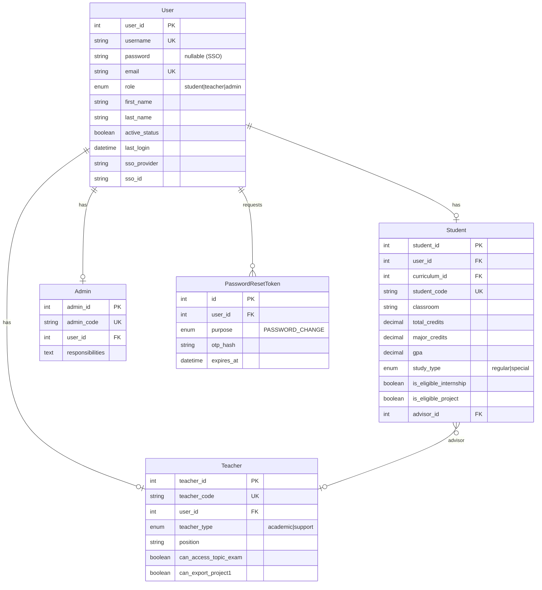

---

## 3. Academic & Curriculum

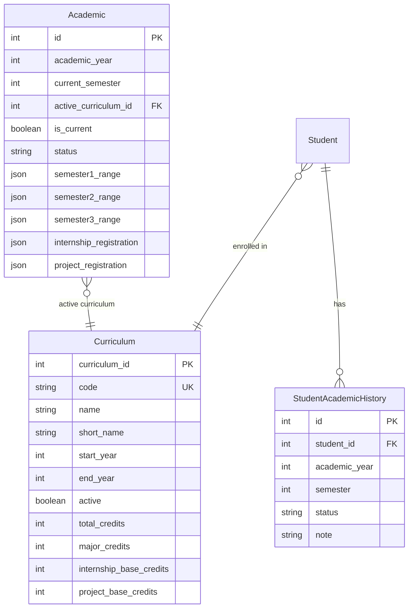

---

## 4. Document Management

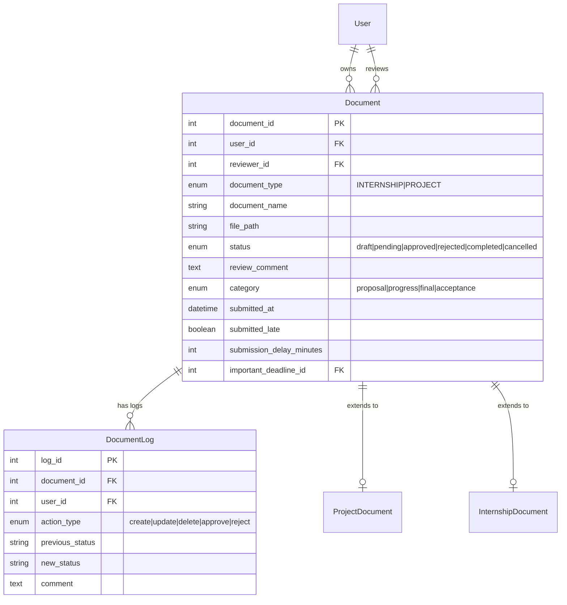

---

## 5. Project Core

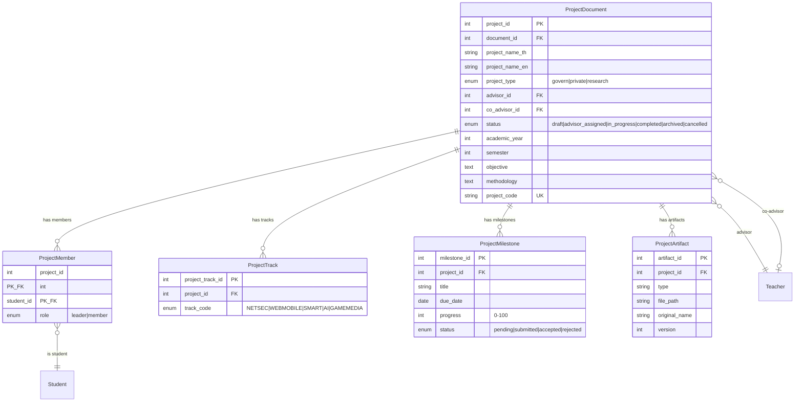

---

## 6. Project Exam & Defense

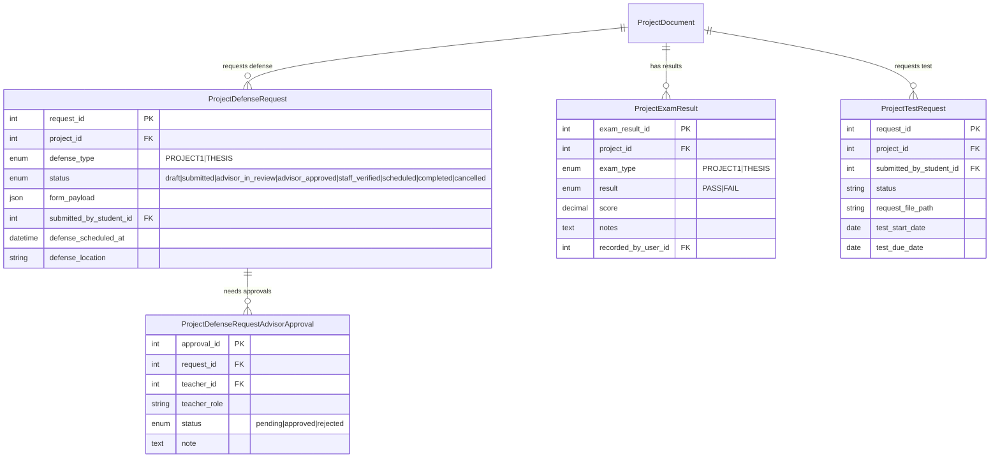

---

## 7. Project Workflow

```mermaid
erDiagram
    ProjectWorkflowState {
        int id PK
        int project_id FK_UK
        enum current_phase "DRAFT|ADVISOR_ASSIGNED|TOPIC_SUBMISSION|IN_PROGRESS|THESIS_SUBMISSION|COMPLETED|CANCELLED"
        int workflow_step_id FK
        boolean is_blocked
        text block_reason
        boolean is_overdue
        datetime last_activity_at
    }

    WorkflowStepDefinition {
        int step_id PK
        enum workflow_type "internship|project1|project2"
        string step_key UK
        int step_order
        string title
        string phase_key
    }

    StudentWorkflowActivity {
        int activity_id PK
        int student_id FK
        enum workflow_type "internship|project1|project2"
        string current_step_key
        enum current_step_status "pending|in_progress|completed|rejected|blocked"
        enum overall_workflow_status "not_started|eligible|enrolled|in_progress|completed|failed"
        json data_payload
    }

    ProjectWorkflowState }o--|| ProjectDocument : "state of"
    ProjectWorkflowState }o--o| WorkflowStepDefinition : "current step"
    StudentWorkflowActivity }o--|| Student : "activity of"
```

---

## 8. Internship System

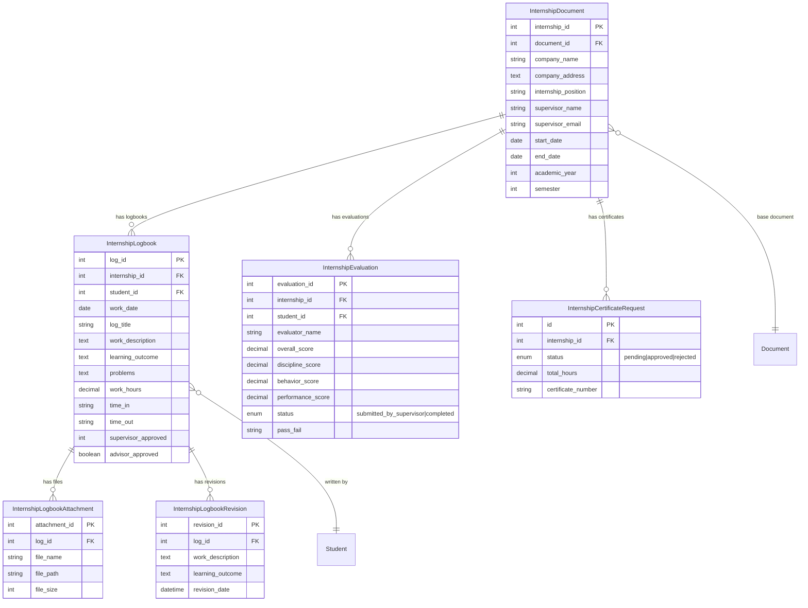

---

## 9. Meeting Management

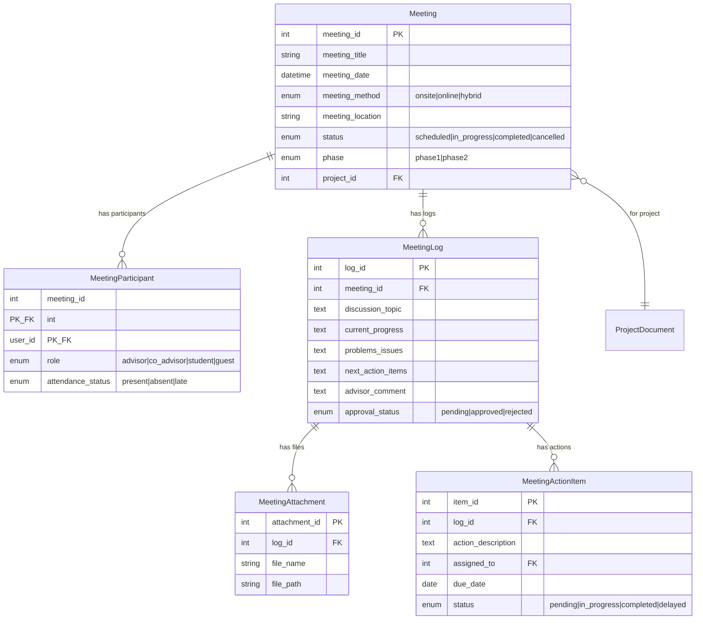

---

## 10. Deadline & Timeline

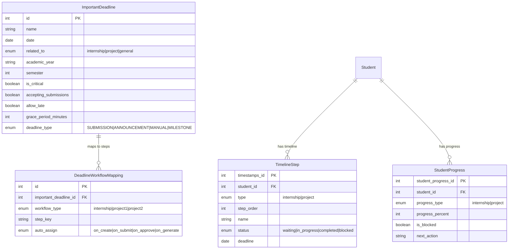

---

## 11. Token & Notification

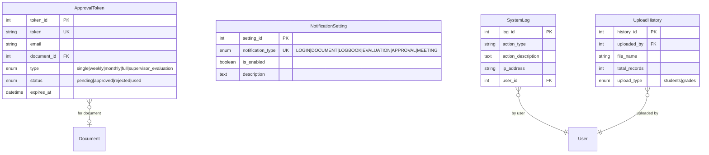

---

## 12. System Architecture

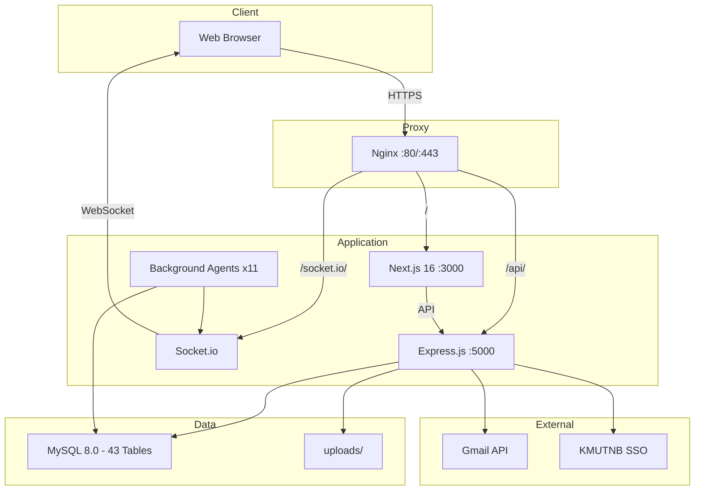

---

## 13. Project Workflow State Machine

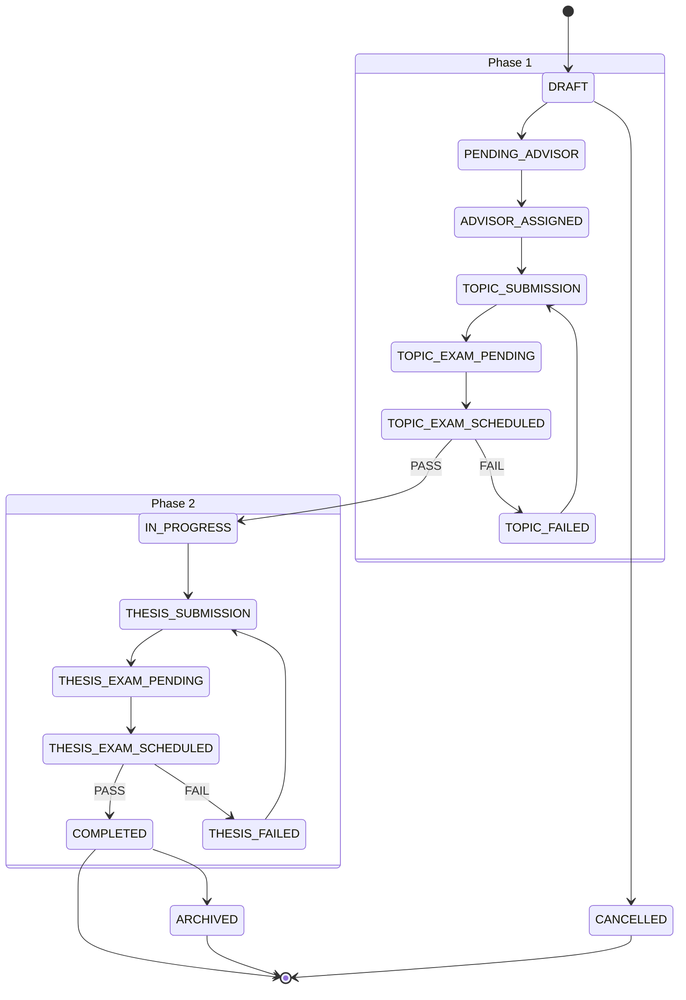

---

## 14. Defense Request Flow

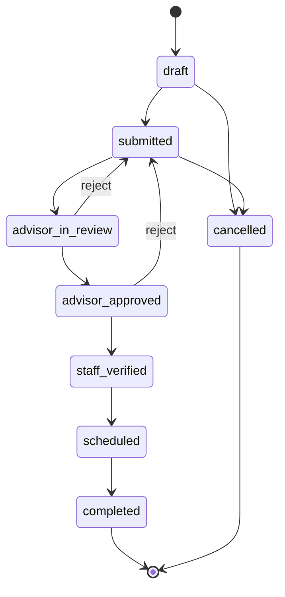

---

## 15. CI/CD & Deployment

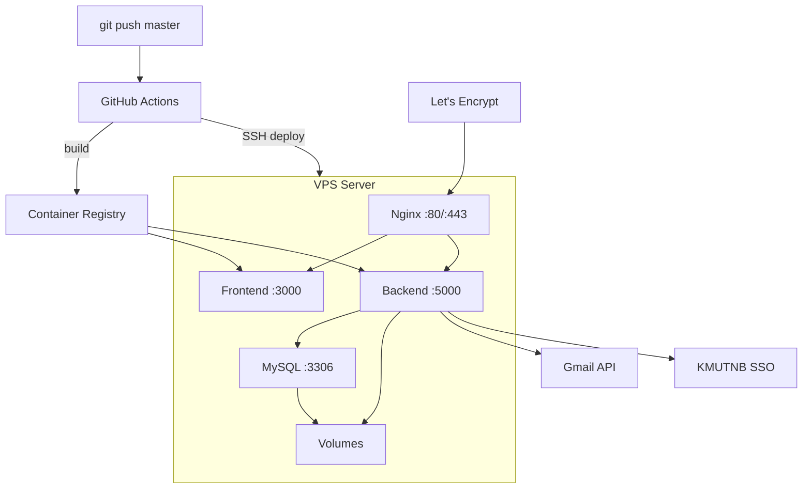
