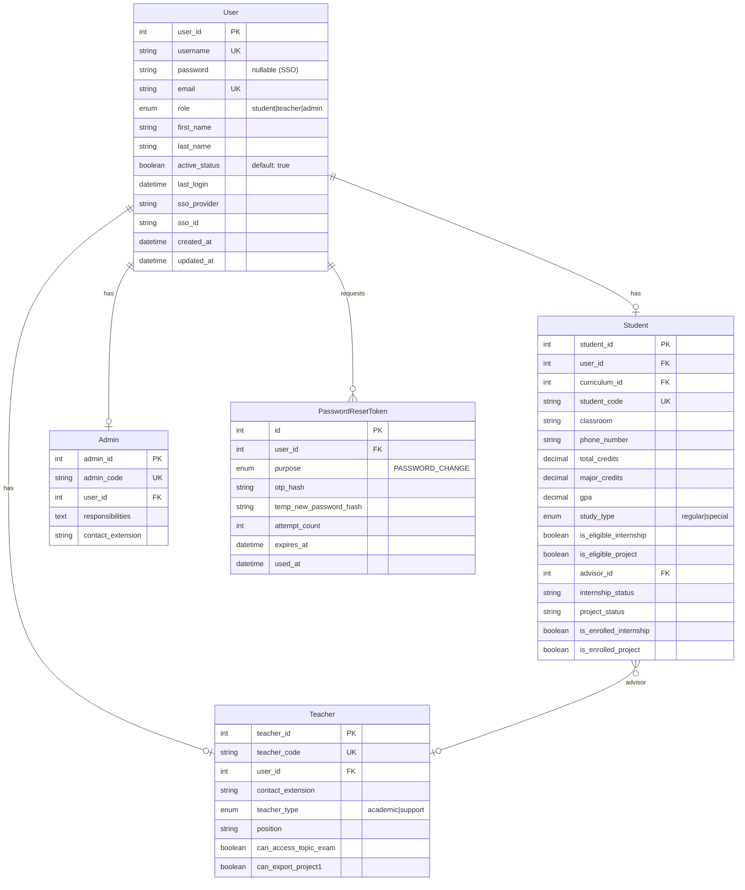
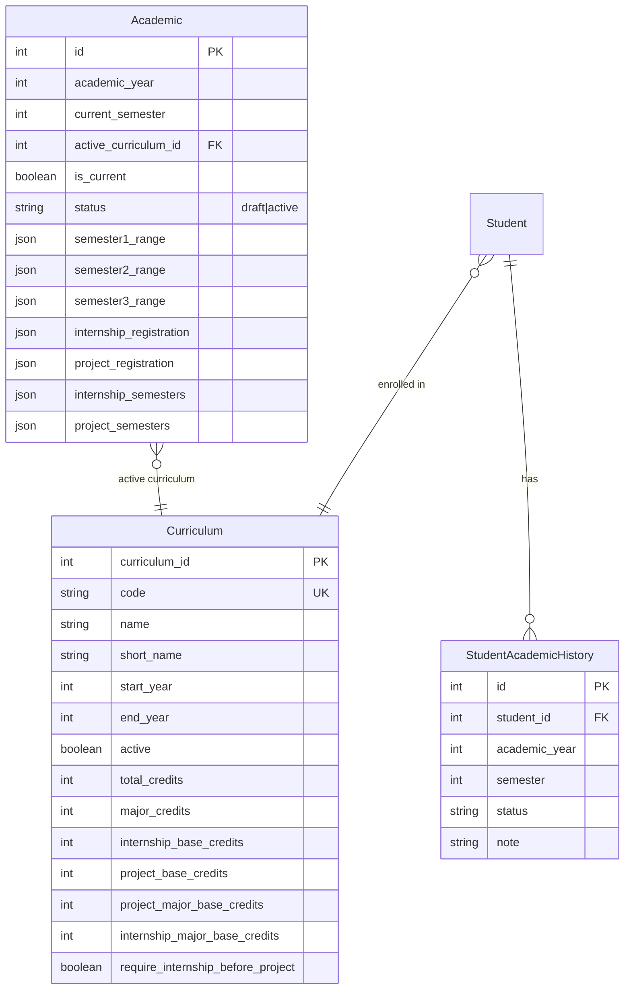
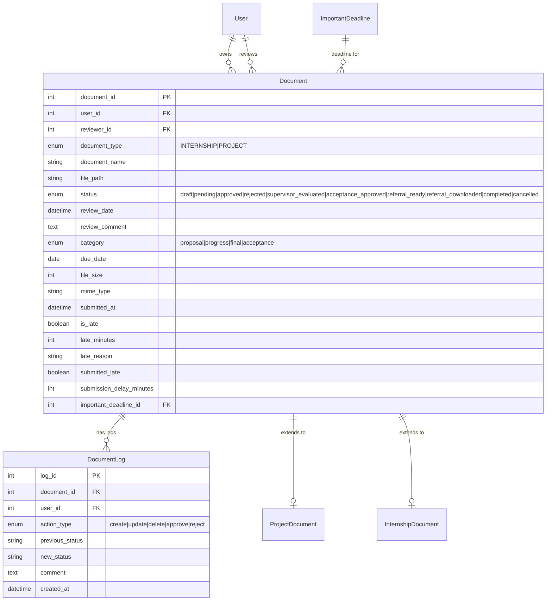
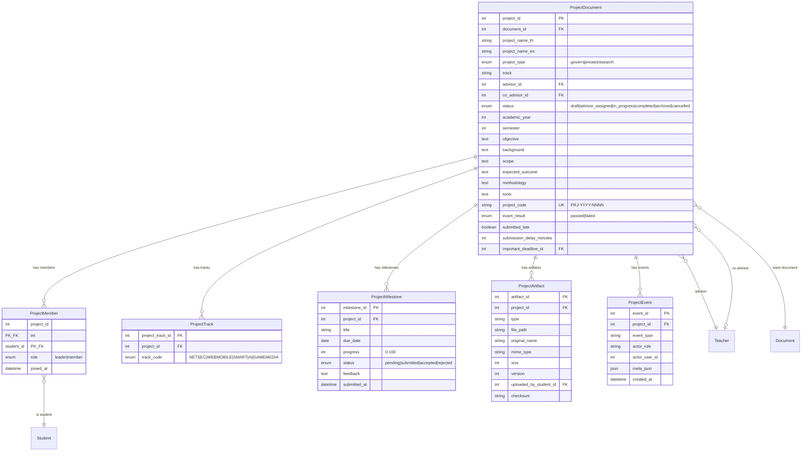
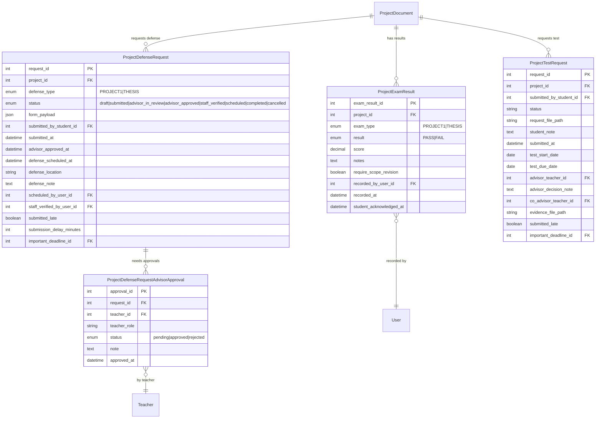
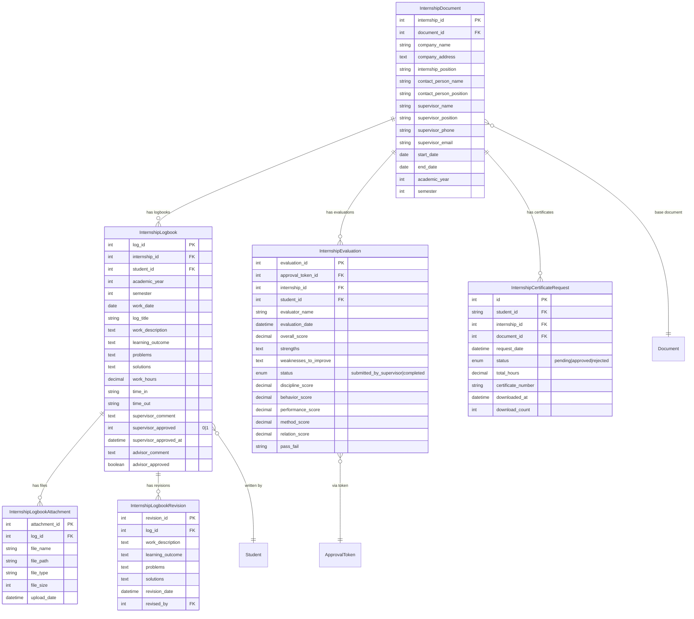
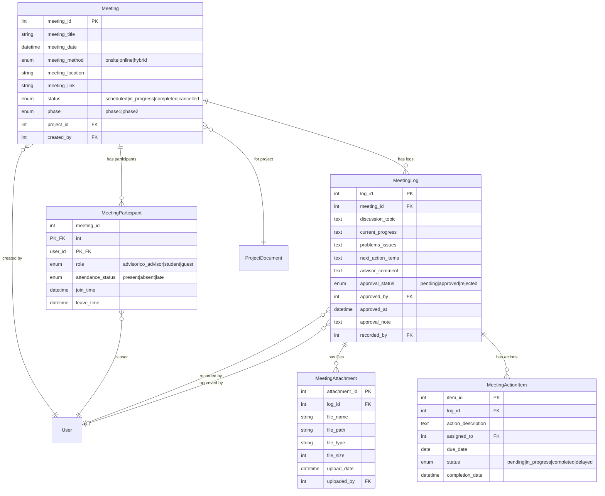
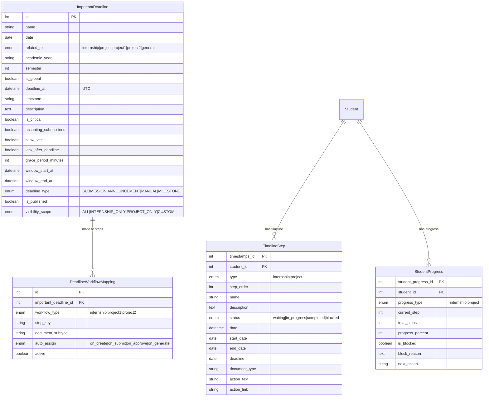
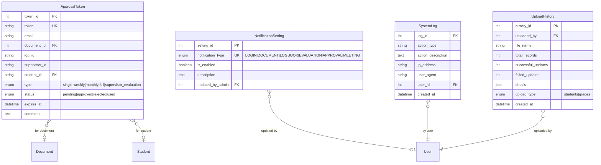

# CSLogbook — ER Diagrams (Mermaid)

> เปิดใน Mermaid Live Editor: https://mermaid.live หรือ VSCode extension "Markdown Preview Mermaid Support"

---

## 1. ภาพรวมทั้งระบบ (Overview — Relationships Only)

```mermaid
erDiagram
    User ||--o| Student : "has profile"
    User ||--o| Teacher : "has profile"
    User ||--o| Admin : "has profile"
    Student }o--|| Curriculum : "belongs to"
    Student }o--o| Teacher : "has advisor"
    Academic }o--|| Curriculum : "active curriculum"

    User ||--o{ Document : "owns"
    Document ||--o| ProjectDocument : "is project"
    Document ||--o| InternshipDocument : "is internship"
    Document ||--o{ DocumentLog : "has logs"

    ProjectDocument ||--o{ ProjectMember : "has members"
    ProjectMember }o--|| Student : "is student"
    ProjectDocument }o--o| Teacher : "advisor"
    ProjectDocument }o--o| Teacher : "co-advisor"
    ProjectDocument ||--o{ ProjectTrack : "has tracks"
    ProjectDocument ||--o{ ProjectDefenseRequest : "has defense"
    ProjectDocument ||--o{ ProjectExamResult : "has results"
    ProjectDocument ||--o| ProjectWorkflowState : "has state"
    ProjectDocument ||--o{ ProjectTestRequest : "has tests"
    ProjectDocument ||--o{ ProjectMilestone : "has milestones"
    ProjectDocument ||--o{ ProjectArtifact : "has artifacts"
    ProjectDocument ||--o{ ProjectEvent : "has events"
    ProjectDocument ||--o{ Meeting : "has meetings"

    ProjectDefenseRequest ||--o{ ProjectDefenseRequestAdvisorApproval : "has approvals"

    InternshipDocument ||--o{ InternshipLogbook : "has logbooks"
    InternshipLogbook ||--o{ InternshipLogbookAttachment : "has files"
    InternshipLogbook ||--o{ InternshipLogbookRevision : "has revisions"
    InternshipDocument ||--o{ InternshipEvaluation : "has evaluations"
    InternshipDocument ||--o{ InternshipCertificateRequest : "has certificates"

    Meeting ||--o{ MeetingParticipant : "has participants"
    Meeting ||--o{ MeetingLog : "has logs"
    MeetingLog ||--o{ MeetingAttachment : "has files"
    MeetingLog ||--o{ MeetingActionItem : "has actions"

    Student ||--o{ TimelineStep : "has timeline"
    Student ||--o{ StudentProgress : "has progress"
    Student ||--o{ StudentWorkflowActivity : "has workflow"
    Student ||--o{ StudentAcademicHistory : "has history"

    ImportantDeadline ||--o{ DeadlineWorkflowMapping : "maps to"
    ProjectWorkflowState }o--o| WorkflowStepDefinition : "current step"

    User ||--o{ ApprovalToken : "receives"
    User ||--o{ PasswordResetToken : "requests"
    User ||--o{ SystemLog : "generates"
    User ||--o{ UploadHistory : "uploads"
```



---

## 2. User & Authentication Module



---

## 3. Academic & Curriculum Module



---

## 4. Document Management Module



---

## 5. Project Management Module



---

## 6. Project Exam & Defense Module



---

## 7. Project Workflow & State Module

```mermaid
erDiagram
    ProjectWorkflowState {
        int id PK
        int project_id FK_UK
        enum current_phase "DRAFT|PENDING_ADVISOR|ADVISOR_ASSIGNED|TOPIC_SUBMISSION|TOPIC_EXAM_PENDING|TOPIC_EXAM_SCHEDULED|TOPIC_FAILED|IN_PROGRESS|THESIS_SUBMISSION|THESIS_EXAM_PENDING|THESIS_EXAM_SCHEDULED|THESIS_FAILED|COMPLETED|ARCHIVED|CANCELLED"
        string current_step
        int workflow_step_id FK
        string project_status
        string topic_exam_result
        date topic_exam_date
        string thesis_exam_result
        date thesis_exam_date
        int topic_defense_request_id FK
        int thesis_defense_request_id FK
        int system_test_request_id FK
        int final_document_id FK
        int meeting_count
        int approved_meeting_count
        boolean is_blocked
        text block_reason
        boolean is_overdue
        datetime last_activity_at
        string last_activity_type
        int last_updated_by FK
    }

    WorkflowStepDefinition {
        int step_id PK
        enum workflow_type "internship|project1|project2"
        string step_key UK
        int step_order
        string title
        text description_template
        string phase_key
        enum phase_variant "default|late|overdue"
    }

    StudentWorkflowActivity {
        int activity_id PK
        int student_id FK
        enum workflow_type "internship|project1|project2"
        string current_step_key
        enum current_step_status "pending|in_progress|awaiting_student_action|awaiting_admin_action|completed|rejected|skipped|blocked|cancelled"
        enum overall_workflow_status "not_started|eligible|enrolled|in_progress|completed|blocked|failed|archived|cancelled"
        json data_payload
        datetime started_at
        datetime completed_at
    }

    ProjectWorkflowState }o--|| ProjectDocument : "state of"
    ProjectWorkflowState }o--o| WorkflowStepDefinition : "current step"
    ProjectWorkflowState }o--o| ProjectDefenseRequest : "topic defense"
    ProjectWorkflowState }o--o| ProjectDefenseRequest : "thesis defense"
    StudentWorkflowActivity }o--|| Student : "activity of"
```

---

## 8. Internship Module



---

## 9. Meeting Module



---

## 10. Deadline & Timeline Module



---

## 11. Token & Notification Module



---

## สรุปจำนวน Tables แยกตาม Module

| Module | Tables | รายชื่อ |
|--------|--------|---------|
| User & Auth | 5 | User, Student, Teacher, Admin, PasswordResetToken |
| Academic | 3 | Academic, Curriculum, StudentAcademicHistory |
| Document | 2 | Document, DocumentLog |
| Project Core | 5 | ProjectDocument, ProjectMember, ProjectTrack, ProjectMilestone, ProjectArtifact |
| Project Events | 1 | ProjectEvent |
| Project Exam & Defense | 4 | ProjectDefenseRequest, ProjectDefenseRequestAdvisorApproval, ProjectExamResult, ProjectTestRequest |
| Project Workflow | 3 | ProjectWorkflowState, WorkflowStepDefinition, StudentWorkflowActivity |
| Internship | 6 | InternshipDocument, InternshipLogbook, InternshipLogbookAttachment, InternshipLogbookRevision, InternshipEvaluation, InternshipCertificateRequest |
| Meeting | 5 | Meeting, MeetingParticipant, MeetingLog, MeetingAttachment, MeetingActionItem |
| Deadline & Timeline | 4 | ImportantDeadline, DeadlineWorkflowMapping, TimelineStep, StudentProgress |
| Token & Notification | 2 | ApprovalToken, NotificationSetting |
| Logging | 3 | SystemLog, UploadHistory, TeacherProjectManagement |
| **Total** | **43** | |
