# บทที่ 3 การออกแบบระบบ

## 3.1 การออกแบบสถาปัตยกรรมระบบ (System Architecture Design)

### 3.1.1 ภาพรวมสถาปัตยกรรม

ระบบ CSLogbook ออกแบบตามสถาปัตยกรรมแบบ Client-Server Architecture โดยแบ่งออกเป็น 3 ส่วนหลัก ได้แก่ ส่วนหน้าบ้าน (Frontend) ส่วนหลังบ้าน (Backend API) และส่วนฐานข้อมูล (Database) โดยมี Reverse Proxy เป็นตัวกลางในการกระจายคำร้องขอ (Request) ไปยังส่วนต่าง ๆ ของระบบ

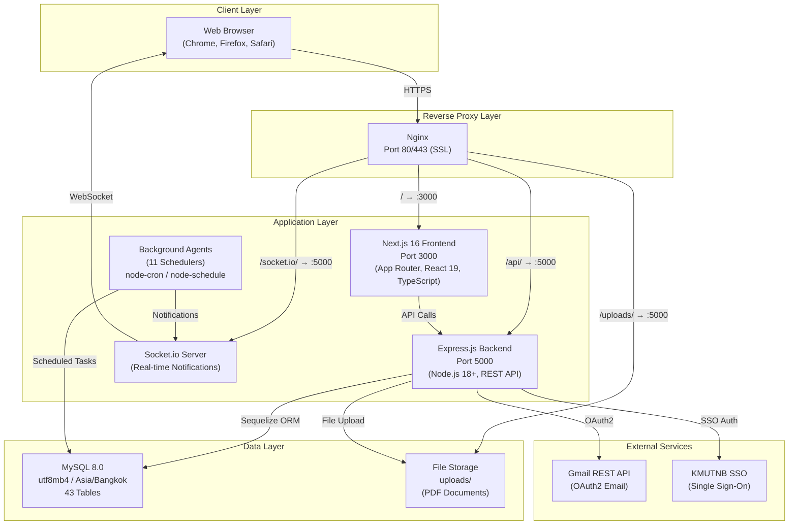

**รูปที่ 3.1** สถาปัตยกรรมภาพรวมของระบบ CSLogbook

### 3.1.2 สถาปัตยกรรมฝั่ง Backend (Backend Architecture)

Backend ออกแบบตามรูปแบบ Layered Architecture โดยแบ่งความรับผิดชอบออกเป็นชั้น (Layer) ดังนี้:

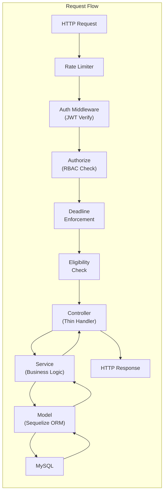

**รูปที่ 3.2** การไหลของ Request ผ่าน Middleware Chain

| Layer | หน้าที่ | ตัวอย่าง |
|-------|---------|---------|
| **Middleware** | ตรวจสอบ Token, สิทธิ์, Deadline, Rate Limit | authMiddleware.js, authorize.js |
| **Controller** | รับ Request, ตรวจสอบ Input, ส่งต่อให้ Service | projectDocumentController.js |
| **Service** | Business Logic ทั้งหมด | projectDocumentService.js |
| **Model** | นิยาม Schema, Associations, Hooks | ProjectDocument.js |
| **Database** | เก็บข้อมูล, Index, Constraints | MySQL 8.0 (utf8mb4) |

### 3.1.3 สถาปัตยกรรมฝั่ง Frontend (Frontend Architecture)

Frontend ใช้ Next.js 16 App Router ออกแบบตาม Component-Based Architecture ร่วมกับ Server State Management ผ่าน TanStack React Query v5

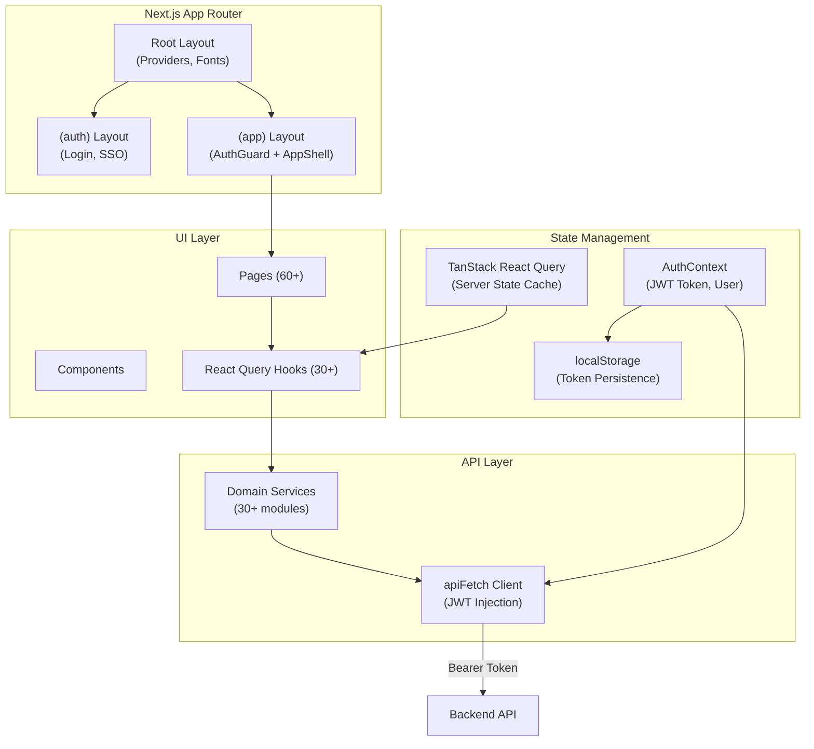

**รูปที่ 3.3** สถาปัตยกรรม Frontend

### 3.1.4 ระบบแจ้งเตือนแบบ Real-time (Real-time Notification)

ระบบใช้ Socket.io สำหรับการแจ้งเตือนแบบ Real-time โดยมีการออกแบบดังนี้:

1. **การเชื่อมต่อ:** Client ส่ง JWT Token ใน handshake → Server ตรวจสอบ → เข้าร่วม Room `user_{userId}`
2. **การส่งข้อความ:** Services/Agents ส่งข้อความไปยัง Room ของผู้ใช้ที่เกี่ยวข้อง
3. **กรณีใช้งาน:** แจ้งเตือนสถานะเอกสาร, การอนุมัติ, กำหนดส่ง, แจ้งเตือนจากระบบ

### 3.1.5 Background Agents

ระบบมี Background Agent 11 ตัว ทำงานอัตโนมัติตามกำหนดเวลา (Scheduled Tasks):

| Agent | หน้าที่ | รอบการทำงาน |
|-------|---------|-------------|
| Deadline Reminder | แจ้งเตือนกำหนดส่งที่ใกล้ถึง | ตามที่กำหนด (env) |
| Document Status Monitor | ตรวจสอบสถานะเอกสาร | ตามรอบ |
| Eligibility Checker | อัปเดตสิทธิ์นักศึกษา | ตามรอบ |
| Academic Semester Scheduler | เปลี่ยนภาคเรียนอัตโนมัติ | Cron |
| Project Deadline Monitor | ตรวจสอบกำหนดส่งโปรเจค | ทุกชั่วโมง |
| Internship Workflow Monitor | ติดตามสถานะฝึกงาน | ตามรอบ |
| Internship Status Monitor | อัปเดตสถานะเสร็จสิ้น | ตามรอบ |
| Project Purge Scheduler | Archive โปรเจคเก่า | Cron |
| Security Monitor | บันทึกเหตุการณ์ด้านความปลอดภัย | ตามรอบ |
| Logbook Quality Monitor | ตรวจสอบคุณภาพ Logbook | ตามรอบ |
| Eligibility Scheduler | อัปเดตสิทธิ์อัตโนมัติ | Cron |

---

## 3.2 การออกแบบฐานข้อมูล (Database Design)

### 3.2.1 ภาพรวมฐานข้อมูล

ระบบใช้ MySQL 8.0 เป็นระบบจัดการฐานข้อมูลเชิงสัมพันธ์ (RDBMS) โดยมีตารางทั้งหมด 43 ตาราง จัดกลุ่มตามโมดูลการทำงาน ดังนี้:

| กลุ่ม | จำนวนตาราง | ตาราง |
|-------|-----------|-------|
| ผู้ใช้งานและการยืนยันตัวตน | 5 | User, Student, Teacher, Admin, PasswordResetToken |
| ข้อมูลวิชาการ | 3 | Academic, Curriculum, StudentAcademicHistory |
| เอกสาร | 2 | Document, DocumentLog |
| ปริญญานิพนธ์ (หลัก) | 6 | ProjectDocument, ProjectMember, ProjectTrack, ProjectMilestone, ProjectArtifact, ProjectEvent |
| การสอบและป้องกัน | 4 | ProjectDefenseRequest, ProjectDefenseRequestAdvisorApproval, ProjectExamResult, ProjectTestRequest |
| Workflow โปรเจค | 3 | ProjectWorkflowState, WorkflowStepDefinition, StudentWorkflowActivity |
| ฝึกงาน | 6 | InternshipDocument, InternshipLogbook, InternshipLogbookAttachment, InternshipLogbookRevision, InternshipEvaluation, InternshipCertificateRequest |
| การประชุม | 5 | Meeting, MeetingParticipant, MeetingLog, MeetingAttachment, MeetingActionItem |
| กำหนดส่งและ Timeline | 4 | ImportantDeadline, DeadlineWorkflowMapping, TimelineStep, StudentProgress |
| Token และการแจ้งเตือน | 2 | ApprovalToken, NotificationSetting |
| บันทึกระบบ | 3 | SystemLog, UploadHistory, TeacherProjectManagement |
| **รวม** | **43** | |

**ตารางที่ 3.1** สรุปจำนวนตารางในฐานข้อมูลแยกตามกลุ่ม

### 3.2.2 แผนภาพ ER (Entity-Relationship Diagram)

> **หมายเหตุ:** ER Diagram ฉบับเต็มแยกตาม Module อยู่ในภาคผนวก (ดูไฟล์ [er-diagram.md](../diagrams/er-diagram.md))

#### ความสัมพันธ์หลักระหว่างกลุ่มตาราง

```mermaid
graph TB
    subgraph "User Management"
        User --> Student
        User --> Teacher
        User --> Admin
    end

    subgraph "Academic"
        Curriculum --> Academic
        Curriculum --> Student
    end

    subgraph "Document Hub"
        Document --> ProjectDocument
        Document --> InternshipDocument
    end

    subgraph "Project System"
        ProjectDocument --> ProjectMember
        ProjectDocument --> ProjectWorkflowState
        ProjectDocument --> ProjectDefenseRequest
        ProjectDocument --> ProjectExamResult
        ProjectDocument --> Meeting
    end

    subgraph "Internship System"
        InternshipDocument --> InternshipLogbook
        InternshipDocument --> InternshipEvaluation
        InternshipDocument --> InternshipCertificateRequest
    end

    subgraph "Workflow Engine"
        WorkflowStepDefinition --> ProjectWorkflowState
        WorkflowStepDefinition --> StudentWorkflowActivity
        ImportantDeadline --> DeadlineWorkflowMapping
    end

    Student --> ProjectMember
    Student --> InternshipLogbook
    Student --> StudentWorkflowActivity
    Teacher --> ProjectDocument
    Teacher --> Student
```

**รูปที่ 3.4** ความสัมพันธ์ระหว่างกลุ่มตารางหลัก

### 3.2.3 รายละเอียดตารางหลัก (Data Dictionary)

#### ตาราง users — ข้อมูลผู้ใช้งาน

| ชื่อ Field | ชนิดข้อมูล | Constraints | คำอธิบาย |
|-----------|-----------|-------------|---------|
| user_id | INT | PK, AUTO_INCREMENT | รหัสผู้ใช้ |
| username | VARCHAR(255) | UNIQUE, NOT NULL | ชื่อผู้ใช้สำหรับเข้าสู่ระบบ |
| password | VARCHAR(255) | NULLABLE | รหัสผ่าน (null สำหรับ SSO) |
| email | VARCHAR(255) | UNIQUE, NOT NULL | อีเมล |
| role | ENUM | NOT NULL | บทบาท: student, teacher, admin |
| first_name | VARCHAR(255) | NOT NULL | ชื่อจริง |
| last_name | VARCHAR(255) | NOT NULL | นามสกุล |
| active_status | BOOLEAN | DEFAULT true | สถานะใช้งาน |
| last_login | DATETIME | NULLABLE | วันที่เข้าสู่ระบบล่าสุด |
| sso_provider | VARCHAR(255) | NULLABLE | ผู้ให้บริการ SSO |
| sso_id | VARCHAR(255) | NULLABLE | รหัส SSO |
| created_at | DATETIME | AUTO | วันที่สร้าง |
| updated_at | DATETIME | AUTO | วันที่แก้ไขล่าสุด |

#### ตาราง students — ข้อมูลนักศึกษา

| ชื่อ Field | ชนิดข้อมูล | Constraints | คำอธิบาย |
|-----------|-----------|-------------|---------|
| student_id | INT | PK, AUTO_INCREMENT | รหัสนักศึกษา (internal) |
| user_id | INT | FK → users | รหัสผู้ใช้ |
| curriculum_id | INT | FK → curriculums | รหัสหลักสูตร |
| student_code | VARCHAR(255) | UNIQUE | รหัสนักศึกษา (เช่น 6504xxxxx) |
| classroom | VARCHAR(255) | | ห้องเรียน |
| total_credits | DECIMAL | | หน่วยกิตรวมที่ผ่าน |
| major_credits | DECIMAL | | หน่วยกิตวิชาเอกที่ผ่าน |
| gpa | DECIMAL | | เกรดเฉลี่ยสะสม |
| study_type | ENUM | | ประเภท: regular (ปกติ), special (พิเศษ) |
| is_eligible_internship | BOOLEAN | | มีสิทธิ์ฝึกงานหรือไม่ |
| is_eligible_project | BOOLEAN | | มีสิทธิ์ทำปริญญานิพนธ์หรือไม่ |
| advisor_id | INT | FK → teachers | อาจารย์ที่ปรึกษา |
| internship_status | VARCHAR(255) | | สถานะฝึกงาน |
| project_status | VARCHAR(255) | | สถานะปริญญานิพนธ์ |

#### ตาราง project_documents — ข้อมูลปริญญานิพนธ์

| ชื่อ Field | ชนิดข้อมูล | Constraints | คำอธิบาย |
|-----------|-----------|-------------|---------|
| project_id | INT | PK, AUTO_INCREMENT | รหัสปริญญานิพนธ์ |
| document_id | INT | FK → documents | รหัสเอกสารหลัก |
| project_name_th | VARCHAR(255) | | ชื่อโปรเจคภาษาไทย |
| project_name_en | VARCHAR(255) | | ชื่อโปรเจคภาษาอังกฤษ |
| project_type | ENUM | | ประเภท: govern, private, research |
| advisor_id | INT | FK → teachers | อาจารย์ที่ปรึกษาหลัก |
| co_advisor_id | INT | FK → teachers, NULLABLE | อาจารย์ที่ปรึกษาร่วม |
| status | ENUM | | สถานะ: draft → advisor_assigned → in_progress → completed |
| academic_year | INT | | ปีการศึกษา |
| semester | INT | | ภาคเรียน |
| project_code | VARCHAR(255) | UNIQUE | รหัสโปรเจค (auto: PRJ-YYYY-NNNN) |
| exam_result | ENUM | NULLABLE | ผลสอบ: passed/failed |

#### ตาราง internship_documents — ข้อมูลการฝึกงาน

| ชื่อ Field | ชนิดข้อมูล | Constraints | คำอธิบาย |
|-----------|-----------|-------------|---------|
| internship_id | INT | PK, AUTO_INCREMENT | รหัสฝึกงาน |
| document_id | INT | FK → documents | รหัสเอกสารหลัก |
| company_name | VARCHAR(255) | | ชื่อสถานประกอบการ |
| company_address | TEXT | | ที่อยู่สถานประกอบการ |
| internship_position | VARCHAR(255) | | ตำแหน่งฝึกงาน |
| supervisor_name | VARCHAR(255) | | ชื่อผู้ควบคุมการฝึก |
| supervisor_email | VARCHAR(255) | | อีเมลผู้ควบคุม |
| start_date | DATE | | วันเริ่มฝึกงาน |
| end_date | DATE | | วันสิ้นสุดฝึกงาน |

#### ตาราง project_workflow_states — สถานะ Workflow ปริญญานิพนธ์ (Single Source of Truth)

| ชื่อ Field | ชนิดข้อมูล | Constraints | คำอธิบาย |
|-----------|-----------|-------------|---------|
| id | INT | PK, AUTO_INCREMENT | รหัส |
| project_id | INT | FK → project_documents, UNIQUE | รหัสปริญญานิพนธ์ |
| current_phase | ENUM | | เฟสปัจจุบัน (15 สถานะ) |
| workflow_step_id | INT | FK → workflow_step_definitions | ขั้นตอนปัจจุบัน |
| topic_exam_result | ENUM | NULLABLE | ผลสอบหัวข้อ |
| thesis_exam_result | ENUM | NULLABLE | ผลสอบป้องกัน |
| meeting_count | INT | | จำนวนประชุมทั้งหมด |
| approved_meeting_count | INT | | จำนวนประชุมที่อนุมัติแล้ว |
| is_blocked | BOOLEAN | | ถูกบล็อกหรือไม่ |
| is_overdue | BOOLEAN | | เกินกำหนดหรือไม่ |

> **หมายเหตุ:** Data Dictionary ฉบับสมบูรณ์ครอบคลุมทั้ง 43 ตารางอยู่ในภาคผนวก

### 3.2.4 กฎเกณฑ์และข้อบังคับของฐานข้อมูล

1. **Character Set:** utf8mb4 รองรับภาษาไทยและ Emoji
2. **Collation:** utf8mb4_unicode_ci สำหรับการเปรียบเทียบข้อความ
3. **Timezone:** Asia/Bangkok (+07:00) เก็บเป็น UTC แสดงผลเป็นเวลาไทย
4. **Naming Convention:** snake_case สำหรับชื่อตารางและคอลัมน์
5. **Timestamps:** ทุกตารางมี created_at และ updated_at อัตโนมัติ
6. **Soft Delete:** ใช้สถานะ (status) แทนการลบจริง เพื่อรักษาประวัติ
7. **Cascading:** ON DELETE CASCADE สำหรับ child records ที่ไม่มีความหมายเมื่อ parent ถูกลบ

---

## 3.3 การออกแบบ Use Case

### 3.3.1 Use Case Diagram

```mermaid
graph TB
    subgraph "ผู้ใช้งานระบบ (Actors)"
        S["🎓 นักศึกษา<br/>(Student)"]
        TA["👨‍🏫 อาจารย์ที่ปรึกษา<br/>(Teacher: Academic)"]
        ST["👩‍💼 เจ้าหน้าที่<br/>(Teacher: Support)"]
        HD["👔 หัวหน้าภาค<br/>(Head of Department)"]
        AD["🔧 ผู้ดูแลระบบ<br/>(Admin)"]
        SV["🏢 ผู้ควบคุมฝึกงาน<br/>(Supervisor - External)"]
    end

    subgraph "ระบบฝึกงาน (Internship)"
        I1["ลงทะเบียนฝึกงาน"]
        I2["บันทึก Logbook รายวัน"]
        I3["อนุมัติ CS05"]
        I4["ประเมินนักศึกษา"]
        I5["ออกใบรับรอง"]
        I6["ออกหนังสือขอความอนุเคราะห์"]
    end

    subgraph "ระบบปริญญานิพนธ์ (Project)"
        P1["ยื่นหัวข้อปริญญานิพนธ์"]
        P2["บันทึกประชุม"]
        P3["ส่งทดสอบระบบ"]
        P4["ยื่นขอสอบป้องกัน"]
        P5["บันทึกผลสอบ"]
        P6["อนุมัติคำร้อง"]
    end

    subgraph "ระบบจัดการ (Management)"
        M1["จัดการผู้ใช้"]
        M2["ตั้งค่าปีการศึกษา"]
        M3["จัดการกำหนดส่ง"]
        M4["ดูรายงานสถิติ"]
        M5["Import CSV"]
    end

    S --> I1
    S --> I2
    S --> P1
    S --> P2
    S --> P3
    S --> P4

    TA --> P2
    TA --> P6
    TA --> M4

    ST --> I3
    ST --> I5
    ST --> P5
    ST --> P6
    ST --> M1
    ST --> M3
    ST --> M5

    HD --> I3
    HD --> I6

    AD --> M1
    AD --> M2
    AD --> M3
    AD --> M4

    SV --> I4
```

**รูปที่ 3.5** Use Case Diagram ของระบบ CSLogbook

### 3.3.2 รายละเอียด Use Case หลัก

#### UC-01: ลงทะเบียนฝึกงาน

| รายการ | รายละเอียด |
|--------|-----------|
| **Use Case** | ลงทะเบียนฝึกงาน (Internship Registration) |
| **ผู้กระทำ** | นักศึกษา (Student) |
| **เงื่อนไขก่อนหน้า** | 1) เข้าสู่ระบบแล้ว 2) ชั้นปี >= 3 3) หน่วยกิต >= เกณฑ์หลักสูตร |
| **ขั้นตอนหลัก** | 1) ตรวจสอบสิทธิ์อัตโนมัติ → 2) กรอก CS05 (ข้อมูลบริษัท) → 3) เจ้าหน้าที่ตรวจสอบ → 4) หัวหน้าภาคอนุมัติ → 5) ออกหนังสือขอความอนุเคราะห์ → 6) ส่งหนังสือตอบรับ → 7) ออกหนังสือส่งตัว |
| **เงื่อนไขหลัง** | สถานะเปลี่ยนเป็น "กำลังฝึกงาน" เปิดใช้งาน Logbook |
| **ทางเลือก** | เจ้าหน้าที่ปฏิเสธ → แจ้งเหตุผล → นักศึกษาแก้ไขและยื่นใหม่ |

#### UC-02: ยื่นหัวข้อปริญญานิพนธ์

| รายการ | รายละเอียด |
|--------|-----------|
| **Use Case** | ยื่นหัวข้อปริญญานิพนธ์ (Topic Submission) |
| **ผู้กระทำ** | นักศึกษา (Student) |
| **เงื่อนไขก่อนหน้า** | 1) เข้าสู่ระบบแล้ว 2) ชั้นปี >= 4 3) หน่วยกิต >= เกณฑ์ 4) ฝึกงานเสร็จแล้ว (ถ้าหลักสูตรกำหนด) |
| **ขั้นตอนหลัก** | 1) เข้า Topic Submit Wizard → 2) กรอกข้อมูลพื้นฐาน (ชื่อ TH/EN, ประเภท) → 3) กรอกรายละเอียด (วัตถุประสงค์, ขอบเขต) → 4) เลือก Track → 5) เพิ่มสมาชิก → 6) ตรวจสอบและยืนยัน |
| **เงื่อนไขหลัก** | สร้าง ProjectDocument + ProjectWorkflowState, สถานะ = DRAFT |
| **ทางเลือก** | บันทึกฉบับร่าง (Draft) ไว้แก้ไขภายหลัง |

#### UC-03: ขอสอบป้องกัน (KP02)

| รายการ | รายละเอียด |
|--------|-----------|
| **Use Case** | ยื่นขอสอบป้องกันปริญญานิพนธ์ (Defense Request — KP02) |
| **ผู้กระทำ** | นักศึกษา (Student) |
| **เงื่อนไขก่อนหน้า** | 1) ผ่านสอบหัวข้อแล้ว 2) ผ่านทดสอบระบบแล้ว 3) อยู่ในช่วงเปิดรับคำร้อง |
| **ขั้นตอนหลัก** | 1) กรอกแบบฟอร์ม KP02 → 2) อาจารย์ที่ปรึกษาอนุมัติ → 3) เจ้าหน้าที่ตรวจสอบ → 4) กำหนดวันสอบ → 5) สอบป้องกัน → 6) บันทึกผล |
| **สถานะ** | draft → submitted → advisor_in_review → advisor_approved → staff_verified → scheduled → completed |

#### UC-04: ประเมินนักศึกษาฝึกงาน (Supervisor)

| รายการ | รายละเอียด |
|--------|-----------|
| **Use Case** | ประเมินนักศึกษาฝึกงาน (Supervisor Evaluation) |
| **ผู้กระทำ** | ผู้ควบคุมฝึกงาน (Supervisor — External) |
| **เงื่อนไขก่อนหน้า** | ได้รับ Email พร้อม Approval Token |
| **ขั้นตอนหลัก** | 1) คลิกลิงก์ในอีเมล → 2) เข้าหน้าประเมิน (ไม่ต้อง Login) → 3) ให้คะแนน 5 หมวด (วินัย, พฤติกรรม, ผลงาน, วิธีการ, มนุษยสัมพันธ์) → 4) ส่งผลประเมิน |
| **เกณฑ์ผ่าน** | คะแนนรวม >= 70 (PASS_SCORE) |

---

## 3.4 การออกแบบ Sequence Diagram

### 3.4.1 Sequence Diagram: การเข้าสู่ระบบ (Login)

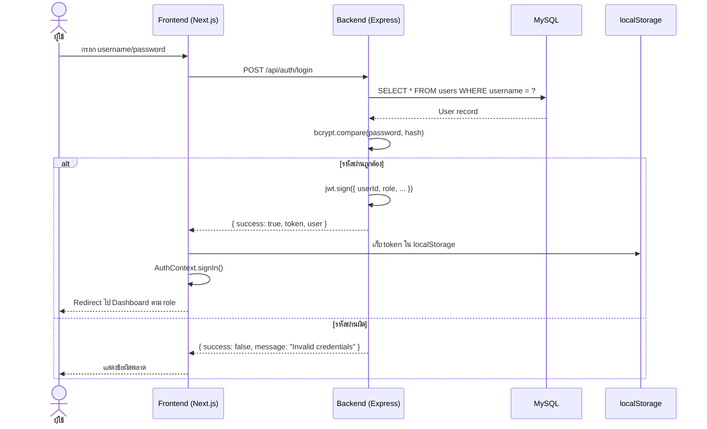

**รูปที่ 3.6** Sequence Diagram การเข้าสู่ระบบ

### 3.4.2 Sequence Diagram: การลงทะเบียนฝึกงาน

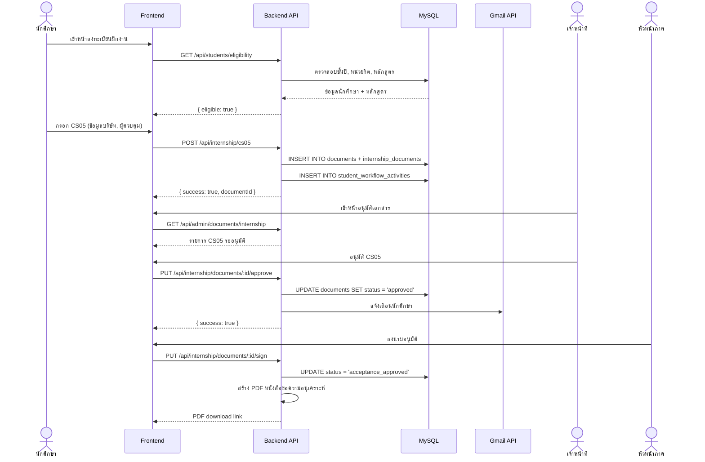

**รูปที่ 3.7** Sequence Diagram การลงทะเบียนฝึกงาน

### 3.4.3 Sequence Diagram: การยื่นขอสอบป้องกัน (KP02)

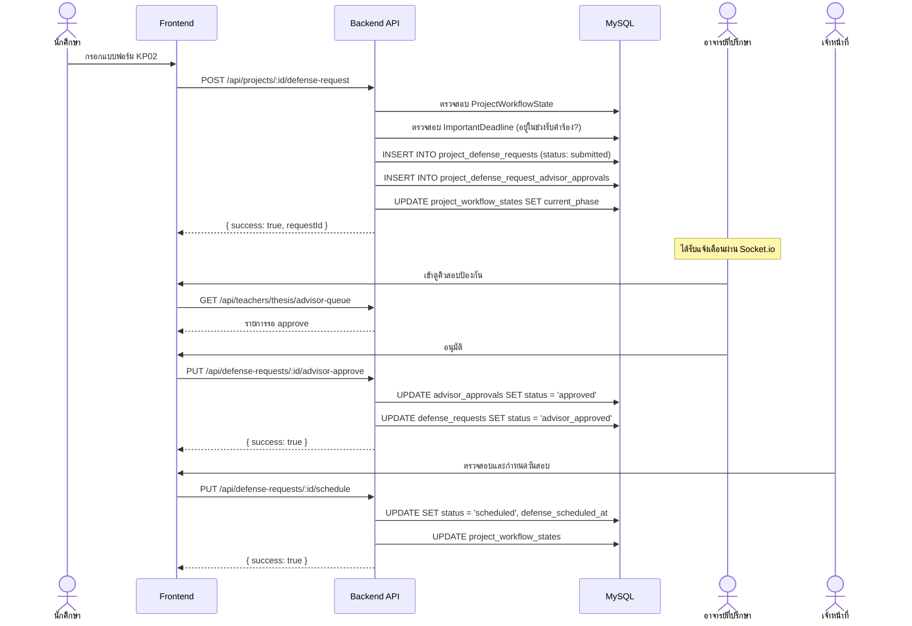

**รูปที่ 3.8** Sequence Diagram การยื่นขอสอบป้องกัน KP02

### 3.4.4 Sequence Diagram: Supervisor Evaluation (Token-based)

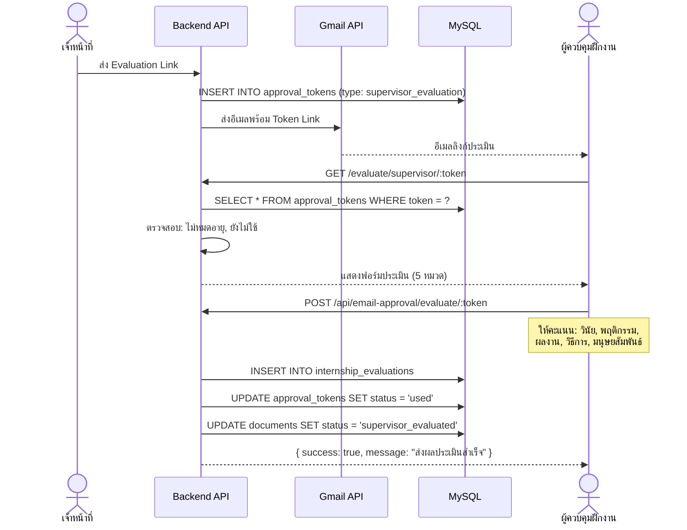

**รูปที่ 3.9** Sequence Diagram การประเมินนักศึกษาฝึกงาน

---

## 3.5 การออกแบบ Workflow และ State Machine

### 3.5.1 Workflow ปริญญานิพนธ์ (Project Workflow State Machine)

ระบบใช้ตาราง `project_workflow_states` เป็น Single Source of Truth สำหรับสถานะของปริญญานิพนธ์แต่ละโปรเจค โดยมี 15 สถานะ (Phase) ที่เปลี่ยนผ่านได้ตาม Transition Rules:

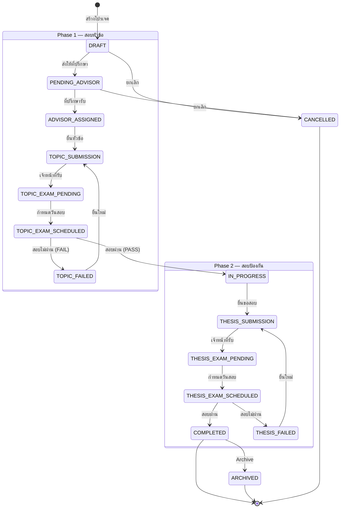

**รูปที่ 3.10** State Machine ของ Workflow ปริญญานิพนธ์

### 3.5.2 Workflow การฝึกงาน (Internship Workflow)

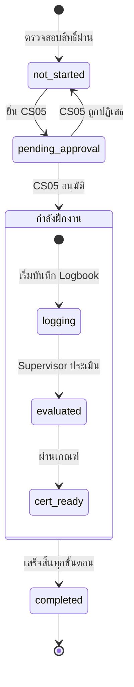

**รูปที่ 3.11** State Machine ของ Workflow ฝึกงาน

### 3.5.3 Workflow คำร้องสอบป้องกัน (Defense Request)

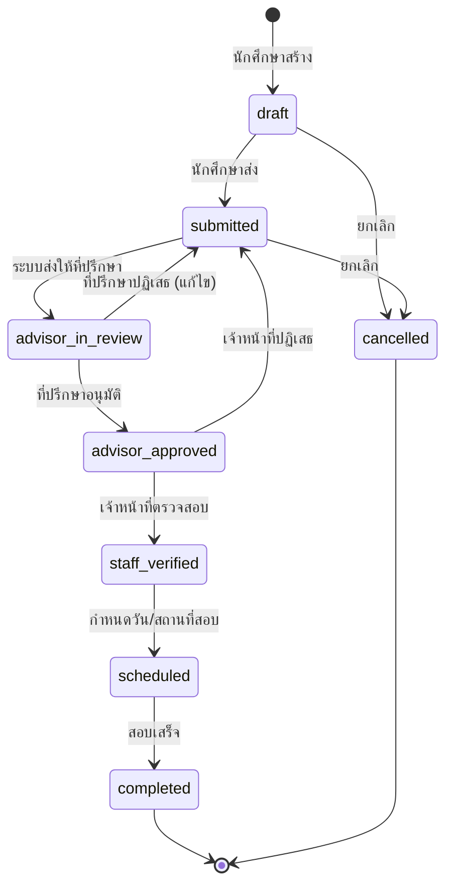

**รูปที่ 3.12** State Machine ของคำร้องสอบป้องกัน

---

## 3.6 การออกแบบระบบรักษาความปลอดภัย (Security Design)

### 3.6.1 การยืนยันตัวตน (Authentication)

ระบบรองรับ 2 วิธีการยืนยันตัวตน:

1. **Username/Password Authentication**
   - รหัสผ่านเข้ารหัสด้วย bcrypt (salt rounds: 10)
   - JWT Token มีอายุ 1 วัน (JWT_EXPIRES_IN=1d)
   - Secret key ความยาวอย่างน้อย 32 ตัวอักษร

2. **KMUTNB Single Sign-On (SSO)**
   - เชื่อมต่อกับระบบ SSO ของมหาวิทยาลัย
   - สร้าง/เชื่อมโยงบัญชีอัตโนมัติ
   - ไม่เก็บรหัสผ่าน (password = null)

### 3.6.2 การควบคุมสิทธิ์ (Authorization — RBAC)

ระบบใช้ Role-Based Access Control (RBAC) โดยสร้าง Permission Key จาก:

```
role + teacher_type + position + special_flags

ตัวอย่าง:
- student
- teacher:academic
- teacher:support
- teacher:position:หัวหน้าภาควิชา
- teacher:topic_exam_access
- admin
```

Middleware `authorize.js` ตรวจสอบ Permission Key กับ Policy ที่กำหนดใน `permissions.js` ก่อนอนุญาตเข้าถึง Endpoint

### 3.6.3 การป้องกันช่องโหว่

| ภัยคุกคาม | การป้องกัน |
|-----------|-----------|
| IDOR (Insecure Direct Object Reference) | ตรวจสอบ Ownership ก่อนเข้าถึงเอกสาร |
| SQL Injection | ใช้ Sequelize ORM (Parameterized Queries) |
| XSS | React auto-escapes, CSP headers |
| CSRF | JWT in Authorization header (ไม่ใช่ Cookie) |
| Brute Force | Rate Limiter middleware |
| File Upload | PDF only, ขนาดจำกัด 5MB, filename sanitization |

### 3.6.4 Token-based External Access

สำหรับผู้ใช้ภายนอก (Supervisor) ที่ไม่มีบัญชีในระบบ ใช้ Approval Token:
- Token unique สร้างแบบสุ่ม
- มีวันหมดอายุ (expires_at)
- ใช้ได้ครั้งเดียว (status: pending → used)
- ไม่ต้องเข้าสู่ระบบ

---

## 3.7 การออกแบบ Deployment (Deployment Design)

### 3.7.1 สถาปัตยกรรม Deployment

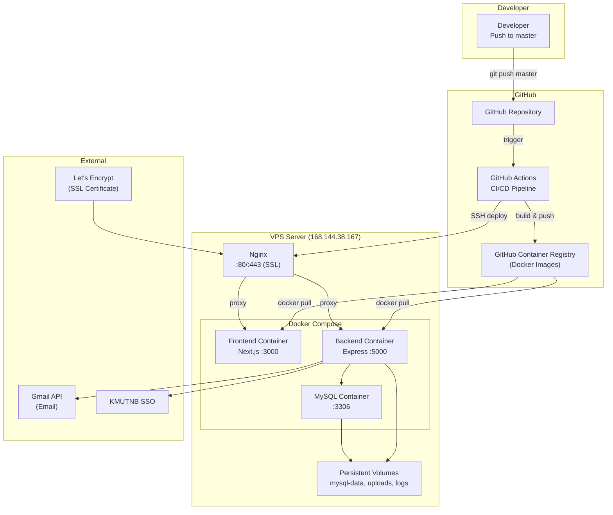

**รูปที่ 3.13** สถาปัตยกรรม Deployment

### 3.7.2 CI/CD Pipeline

| ขั้นตอน | รายละเอียด |
|---------|-----------|
| 1. Trigger | Push ไปยัง branch master |
| 2. Checkout | ดึงโค้ดล่าสุด |
| 3. Build Backend | สร้าง Docker image (tags: latest + SHA) |
| 4. Build Frontend | สร้าง Docker image (bake NEXT_PUBLIC_API_URL) |
| 5. Push Images | อัปโหลดไปยัง GitHub Container Registry |
| 6. Deploy | SSH เข้า VPS → docker compose up -d (zero-downtime) |
| 7. Cleanup | ลบ Docker image ที่ไม่ใช้ (prune) |

### 3.7.3 Nginx Reverse Proxy

| URL Pattern | ปลายทาง | คำอธิบาย |
|-------------|---------|---------|
| / | 127.0.0.1:3000 | Frontend (Next.js) |
| /api/ | 127.0.0.1:5000/api/ | Backend API |
| /socket.io/ | 127.0.0.1:5000/socket.io/ | WebSocket |
| /api-docs/ | 127.0.0.1:5000/api-docs/ | Swagger Documentation |
| /uploads/ | 127.0.0.1:5000/uploads/ | ไฟล์เอกสาร (PDF) |

---

## 3.8 การออกแบบส่วนติดต่อผู้ใช้ (User Interface Design)

### 3.8.1 โครงสร้างหน้าจอหลัก (Layout)

ระบบออกแบบ Layout แบบ Sidebar Navigation ประกอบด้วย:

```
┌─────────────────────────────────────────────────┐
│  Logo  │         Header (ข้อมูลปีการศึกษา)    🔔 │
├────────┼────────────────────────────────────────┤
│        │                                        │
│  Side  │          Main Content Area             │
│  bar   │                                        │
│        │   ┌──────────────────────────────┐     │
│  Menu  │   │   Page Content               │     │
│  Items │   │   (เปลี่ยนตาม Route)          │     │
│        │   │                              │     │
│  ----  │   │                              │     │
│  User  │   │                              │     │
│  Menu  │   └──────────────────────────────┘     │
│        │                                        │
└────────┴────────────────────────────────────────┘
```

- **Sidebar:** เมนูเปลี่ยนตาม role (Student/Teacher/Admin)
- **Responsive:** Sidebar ซ่อนได้บนมือถือ (toggle)
- **Theme:** Light mode, สีหลัก Blue (#2563eb)

### 3.8.2 หน้าจอแยกตามบทบาท

| บทบาท | หน้าจอหลัก | จำนวนหน้า |
|-------|-----------|----------|
| **นักศึกษา** | Dashboard, ฝึกงาน (8 หน้า), ปริญญานิพนธ์ Phase 1 (7 หน้า), Phase 2 (3 หน้า), ประชุม, Deadlines | ~25 |
| **อาจารย์** | Dashboard, คิวที่ปรึกษา (4 หน้า), อนุมัติประชุม, ปฏิทิน Deadline | ~8 |
| **เจ้าหน้าที่/Admin** | Dashboard, จัดการผู้ใช้ (2), เอกสาร (3), คิวสอบ (5), รายงาน (7), ตั้งค่า (4), Import | ~25 |
| **Supervisor (External)** | แบบประเมิน (Token-based, ไม่ต้อง Login) | 1 |
| **รวม** | | **~60** |

### 3.8.3 Design Patterns ที่ใช้

1. **Component-Based:** แยก UI เป็น Reusable Components (ConfirmDialog, Skeleton, DefenseRequestStepper, RequestTimeline, StudentTable)
2. **Guard Pattern:** AuthGuard (ตรวจ Login), RoleGuard (ตรวจ Role) ก่อนแสดงหน้า
3. **Service Pattern:** แยก API call ออกจาก Component ผ่าน Service Layer (30+ modules)
4. **Hook Pattern:** ใช้ Custom Hooks (30+) ครอบ React Query สำหรับ data fetching
5. **Shared CSS Module:** ใช้ CSS Module ร่วมกันระหว่างหน้าที่คล้ายกัน (requestPage.module.css)

### 3.8.4 การแสดงผลวันที่

ระบบแสดงวันที่เป็น **พุทธศักราช (พ.ศ.)** ตามมาตรฐานราชการไทย:
- **วันที่:** DD/MM/YYYY (พ.ศ.) เช่น 16/03/2569
- **วันเวลา:** DD/MM/YYYY HH:mm (พ.ศ.) เช่น 16/03/2569 14:30
- **Timezone:** Asia/Bangkok (+07:00)
- **ปีการศึกษา:** ปรับก่อนเดือนมิถุนายน (ปีปัจจุบัน - 1)

---

## 3.9 สรุปการออกแบบระบบ

ระบบ CSLogbook ออกแบบโดยคำนึงถึงหลักการสำคัญดังนี้:

1. **Separation of Concerns** — แยกชั้นการทำงานชัดเจน (Frontend / Backend API / Database)
2. **Single Source of Truth** — ใช้ `project_workflow_states` เป็นศูนย์กลางสถานะ Workflow
3. **Role-Based Access Control** — ควบคุมสิทธิ์ตามบทบาทผ่าน Middleware Chain
4. **Scalability** — Docker Compose ช่วยให้ขยายระบบได้ง่าย, Background Agents ทำงานอิสระ
5. **Security** — JWT Authentication, RBAC, IDOR Protection, Rate Limiting, Token-based External Access
6. **Real-time** — Socket.io สำหรับแจ้งเตือนทันที
7. **Thai Localization** — รองรับภาษาไทย (utf8mb4), วันที่ พ.ศ., UI ภาษาไทย

| องค์ประกอบ | เทคโนโลยี | จำนวน |
|-----------|----------|-------|
| ตารางฐานข้อมูล | MySQL 8.0 / Sequelize | 43 ตาราง |
| Backend Services | Express / Node.js | 42 services |
| API Routes | REST API | 20 route files |
| Frontend Pages | Next.js 16 / React 19 | 60+ pages |
| Frontend Services | TypeScript / apiFetch | 30+ modules |
| React Hooks | TanStack Query v5 | 30+ hooks |
| Background Agents | node-cron / node-schedule | 11 agents |
| Middleware | Express middleware | 8 files |

**ตารางที่ 3.2** สรุปองค์ประกอบของระบบ CSLogbook
